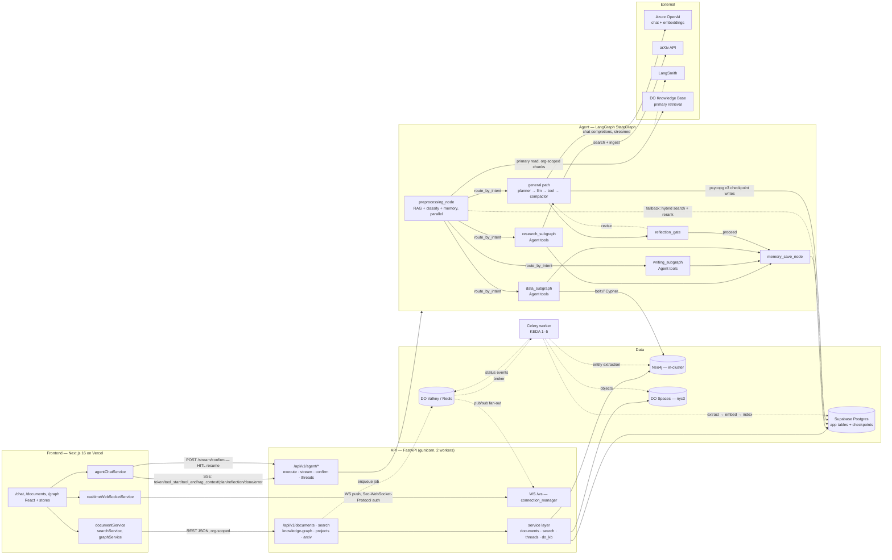

# NOUS — System Architecture

What the code actually wires up today, on the only live environment (`rag-dev`,
DOKS namespace, ArgoCD auto-sync from `develop`).

## Legend

- **Solid** — synchronous request/response or streamed response the caller awaits.
- **Dashed** — asynchronous, deferred, or conditionally-disabled paths.
- Subgraph boxes are process/deployment boundaries, except `Agent`, which runs
  in-process inside the FastAPI workers.

## Reading the diagram

Chat is **SSE, not WebSocket.** `agentChatService` POSTs to `/api/v1/agent/stream`
and reads a typed event union (`agentStreamEvents.ts`); the WebSocket layer is
push-only for document-processing status and notifications.

The agent graph has **one entry node, not three.** `preprocessing_node` runs
retrieval, intent classification, and memory fetch in parallel, then
`route_by_intent` picks a specialist subgraph or the general planner path. Each
subgraph carries its own planner/compactor/reflection loop, so they exit straight
to `memory_save_node`.

**Postgres is doing two unrelated jobs.** It holds the application tables *and*
the LangGraph checkpoints — the latter over a plain `psycopg` v3 URI, which is why
the checkpoint connection string must not be `postgresql+asyncpg://`.

**DO KB serves retrieval, Postgres backs it up.** `DO_KB_ENABLED` and
`DO_KB_PRIMARY_READ` are both `true` on the live backend pod — set via Infisical
(`/do-kb`), not `values-dev.yaml`, so the values file alone understates what runs.
`_try_primary_do_kb_read` is wrapped in a `DO_KB_RETRIEVE_TIMEOUT_SECONDS`
deadline; a timeout, an org with no KB, or an empty result all return `None` and
drop through to `_legacy_hybrid_search_fallback` (Postgres hybrid + rerank). DO KB
is org-scoped only, so project scoping is a post-filter over
`collection_documents`.

**Qdrant is absent.** The 24 `qdrant` hits under `backend/src/` are comments
recording its removal; nothing constructs a client.

## Drift found while drawing

`CLAUDE.md` describes the graph as
`rag_node → intent_classifier → memory_retrieval → [route] → tool_node → memory_save`
and names the entry point `compile_agent_graph`. The code has a single fused
`preprocessing_node`, and `backend/langgraph.json` points at
`graph.py:create_graph`. Worth reconciling.

`CLAUDE.md` also lists DO KB as "behind `DO_KB_ENABLED` (off)" and names
PostgreSQL fulltext as the retrieval layer. Both flags are `true` on `rag-dev`;
DO KB is the primary read and Postgres is the fallback.
