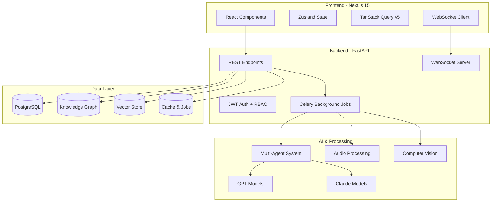

# Multimodal Enterprise RAG System - Claude Integration Guide

## Project Overview

This is a **production-ready, enterprise-grade Multimodal Retrieval-Augmented Generation (RAG) System** built with Next.js 15 and FastAPI. The system processes and analyzes multimodal content (text, images, audio, video) with advanced knowledge graph capabilities, hybrid search, and comprehensive evaluation frameworks.

## Architecture Overview



## Key Features for AI Integration

### Multi-Agent RAG System
- **CrewAI Integration**: Specialized agents for different RAG tasks
- **Agent Types**: Orchestrator, retrieval, graph navigation, vector search, QA synthesis
- **Workflow Routing**: Automatic query classification and agent selection
- **Claude Integration**: Uses Anthropic Claude for reasoning-heavy tasks

### Multimodal Content Processing
- **Text**: PDF and TXT ingestion with OCR capabilities
- **Images**: Object detection, scene recognition, text extraction  
- **Audio**: Speech-to-text with speaker diarization (Whisper)
- **Video**: Frame extraction and audio transcription

### Hybrid Search Capabilities
- **Vector Search**: Semantic similarity using sentence-transformers
- **Graph Search**: Knowledge graph traversal via Neo4j
- **Keyword Search**: Traditional full-text search
- **Cross-Modal**: Find related content across different file types
- **Reranking**: AI-powered result reranking for relevance

### Real-time Processing
- **WebSocket Infrastructure**: 10,000+ concurrent connections
- **Live Status Updates**: Real-time document processing visualization
- **Streaming Results**: Progressive search result delivery

## Technology Stack

### AI & ML Stack
| Component | Technology | Purpose |
|-----------|------------|---------|
| **LLM Integration** | OpenAI GPT-4, Anthropic Claude | Question answering, reasoning, synthesis |
| **Multi-Agent System** | CrewAI | Orchestrated AI workflows |
| **Embeddings** | sentence-transformers | Semantic vector generation |
| **Audio Processing** | OpenAI Whisper | Speech-to-text with diarization |
| **Computer Vision** | Custom CV models | Image analysis and text extraction |
| **NLP Processing** | spaCy | Entity extraction and text processing |

### Backend Technology
| Component | Technology | Version |
|-----------|------------|---------|
| **Framework** | FastAPI | 0.104.1 |
| **Runtime** | Python | 3.11+ |
| **Web Server** | Uvicorn/Gunicorn | Latest |
| **Background Jobs** | Celery + Redis | Latest |
| **Database ORM** | SQLAlchemy | Latest |

### Frontend Technology
| Component | Technology | Version |
|-----------|------------|---------|
| **Framework** | Next.js | 15.1.3 |
| **UI Components** | shadcn/ui + Radix | Latest |
| **State Management** | Zustand | 5.0.8 |
| **Data Fetching** | TanStack Query | v5 |
| **Visualizations** | Cytoscape, Recharts | Latest |

### Database Architecture
| Database | Purpose | Technology |
|----------|---------|------------|
| **Primary DB** | User data, documents, metadata | PostgreSQL |
| **Vector Store** | Semantic embeddings | Qdrant |
| **Graph DB** | Knowledge graph, relationships | Neo4j 5.15 |
| **Cache/Sessions** | Caching, job queue | Redis |

## Claude-Specific Integration

### Model Selection Strategy
| Task Type | Preferred Model | Reasoning |
|-----------|----------------|-----------|
| **Complex Reasoning** | Claude-3 Opus | Superior analytical capabilities |
| **Quick Responses** | Claude-3 Haiku | Fast, efficient for simple tasks |
| **Balanced Performance** | Claude-3 Sonnet | Good performance/cost ratio |
| **Document Analysis** | Claude-3 Opus | Strong multimodal understanding |

### Claude Integration Points

#### 1. Multi-Agent Orchestration
```python
# CrewAI agents using Claude for different RAG tasks
agents = {
    'orchestrator': Claude3Agent(model='opus'),
    'retrieval': Claude3Agent(model='sonnet'), 
    'synthesis': Claude3Agent(model='opus'),
    'qa': Claude3Agent(model='haiku')
}
```

#### 2. Document Processing Pipeline
- **Initial Analysis**: Claude analyzes document type and content structure
- **Chunk Strategy**: AI-determined optimal chunking based on document type
- **Entity Extraction**: Claude identifies key entities and relationships
- **Quality Assessment**: Evaluates processing quality and suggests improvements

#### 3. Query Understanding & Routing
- **Intent Classification**: Claude determines query type (factual, analytical, creative)
- **Agent Selection**: Routes queries to appropriate specialized agents
- **Context Enhancement**: Enriches queries with background context

#### 4. Response Synthesis
- **Multi-Source Integration**: Combines results from vector, graph, and keyword search
- **Answer Generation**: Claude synthesizes coherent responses from retrieved context
- **Fact Checking**: Validates responses against source material
- **Citation Generation**: Provides proper source attribution

## Development Setup for Claude Integration

### Prerequisites
- Python 3.11+
- Node.js 18.17+
- Docker & Docker Compose
- Anthropic API key

### Environment Configuration
```bash
# Required for Claude integration
ANTHROPIC_API_KEY=sk-ant-your-key-here

# Optional: Model preferences
CLAUDE_DEFAULT_MODEL=claude-3-sonnet-20240229
CLAUDE_REASONING_MODEL=claude-3-opus-20240229
CLAUDE_FAST_MODEL=claude-3-haiku-20240307

# RAG-specific settings
MAX_TOKENS_PER_CHUNK=2000
ENABLE_MULTIMODAL_CLAUDE=true
CLAUDE_TEMPERATURE=0.1
```

### Quick Start
```bash
# Clone and setup
git clone <repository-url>
cd multimodal-rag-system

# Configure environment
cp .env .env.local
# Add your ANTHROPIC_API_KEY to .env.local

# Start all services
docker-compose -f docker-compose.development.yml up -d

# Frontend development
cd frontend && npm install && npm run dev

# Backend development (optional - already running in Docker)
cd backend && uvicorn src.main:app --reload --port 8001
```

## RAG Quality Metrics

The system tracks comprehensive RAG quality using industry-standard metrics:

| Metric | Target | Description |
|--------|--------|-------------|
| **Answer Relevancy** | >70% | How relevant the response is to the user's query |
| **Faithfulness** | >90% | How well the response is grounded in retrieved context |
| **Context Relevancy** | >70% | How relevant the retrieved context is to the query |
| **Response Latency** | <2000ms | Time from query to complete response |
| **Hallucination Rate** | <10% | Percentage of unsupported claims in responses |

### Quality Monitoring
- **Real-time Metrics**: Live dashboards for RAG performance
- **A/B Testing**: Compare different Claude models and prompts
- **User Feedback**: Collect and analyze user satisfaction ratings
- **Automated Evaluation**: Continuous quality assessment using Claude itself

## API Usage Examples

### Basic Search
```bash
curl -X POST http://localhost:8000/api/v1/search/ \
  -H "Content-Type: application/json" \
  -H "Authorization: Bearer <jwt-token>" \
  -d '{
    "query": "What are the key findings about climate change?",
    "search_type": "hybrid",
    "max_results": 10
  }'
```

### Multimodal Query
```bash
curl -X POST http://localhost:8000/api/v1/search/multimodal \
  -H "Authorization: Bearer <jwt-token>" \
  -F "query=Explain what's shown in this image" \
  -F "image=@path/to/image.jpg"
```

### Document Upload
```bash
curl -X POST http://localhost:8000/api/v1/documents/upload \
  -H "Authorization: Bearer <jwt-token>" \
  -F "file=@research_paper.pdf" \
  -F "metadata={\"title\": \"Research Paper\", \"tags\": [\"AI\", \"ML\"]}"
```

## Monitoring & Observability

### Available Metrics
- **Application Metrics**: Request latency, error rates, throughput
- **RAG Metrics**: Search quality, retrieval accuracy, response relevance
- **AI Model Metrics**: Token usage, model latency, cost tracking
- **Infrastructure Metrics**: Database performance, queue lengths, resource usage

### Monitoring Endpoints
- `/api/v1/infrastructure/health` - Overall system health
- `/api/v1/infrastructure/metrics` - Prometheus metrics
- `/api/v1/quality/reports` - RAG quality reports

## Deployment

### Development
```bash
docker-compose -f docker-compose.development.yml up -d
```

### Production
- **Kubernetes**: Helm charts available in `/infrastructure/helm/`
- **Terraform**: AWS infrastructure as code in `/infrastructure/terraform/`
- **CI/CD**: GitHub Actions workflows for automated deployment

### Environment-Specific Configuration
| Environment | Database | AI Models | Logging | Monitoring |
|-------------|----------|-----------|---------|------------|
| **Development** | Local Docker | Claude Haiku | DEBUG | Basic |
| **Staging** | Managed PostgreSQL | Claude Sonnet | INFO | Full |
| **Production** | HA PostgreSQL | Claude Opus | WARNING | Full + Alerts |

## Security Considerations

### Authentication & Authorization
- **JWT-based Authentication**: Secure token-based auth
- **Role-Based Access Control (RBAC)**: Fine-grained permissions
- **API Rate Limiting**: Prevent abuse and manage costs

### Data Protection
- **Encryption at Rest**: All data encrypted in databases
- **Encryption in Transit**: TLS for all communications
- **Data Privacy**: GDPR/CCPA compliant data handling
- **Audit Logging**: Comprehensive security event logging

### AI Safety
- **Prompt Injection Prevention**: Input sanitization and validation
- **Content Filtering**: Automatic detection of harmful content
- **Usage Monitoring**: Track and limit AI model usage
- **Cost Controls**: Automatic spending limits and alerts

## Contributing

### Code Style
- **Backend**: Black formatting, mypy type checking, pytest
- **Frontend**: ESLint, Prettier, TypeScript strict mode
- **Documentation**: Markdown with Mermaid diagrams

### Testing Strategy
- **Unit Tests**: Comprehensive coverage for all components
- **Integration Tests**: End-to-end RAG workflow testing
- **Performance Tests**: Load testing for search and processing
- **Quality Tests**: RAG evaluation metric validation

### Development Workflow
1. Create feature branch from `develop`
2. Write tests for new functionality
3. Ensure all tests pass: `npm run validate` and `pytest`
4. Submit pull request with clear description

## Resources

### Documentation
- [Architecture Guide](docs/architecture/) - Detailed system design
- [API Documentation](docs/api/) - Complete API reference
- [Deployment Guide](docs/deployment/) - Production deployment strategies
- [Security Guide](docs/security/) - Security best practices

### External Links
- [FastAPI Documentation](https://fastapi.tiangolo.com/)
- [Next.js 15 Guide](https://nextjs.org/docs)
- [CrewAI Framework](https://docs.crewai.com/)
- [Anthropic Claude API](https://docs.anthropic.com/)

## License

MIT License - see [LICENSE](LICENSE) for details.

---

**Contact**: For questions about Claude integration or RAG system architecture, please create an issue or refer to the documentation in the `docs/` directory.