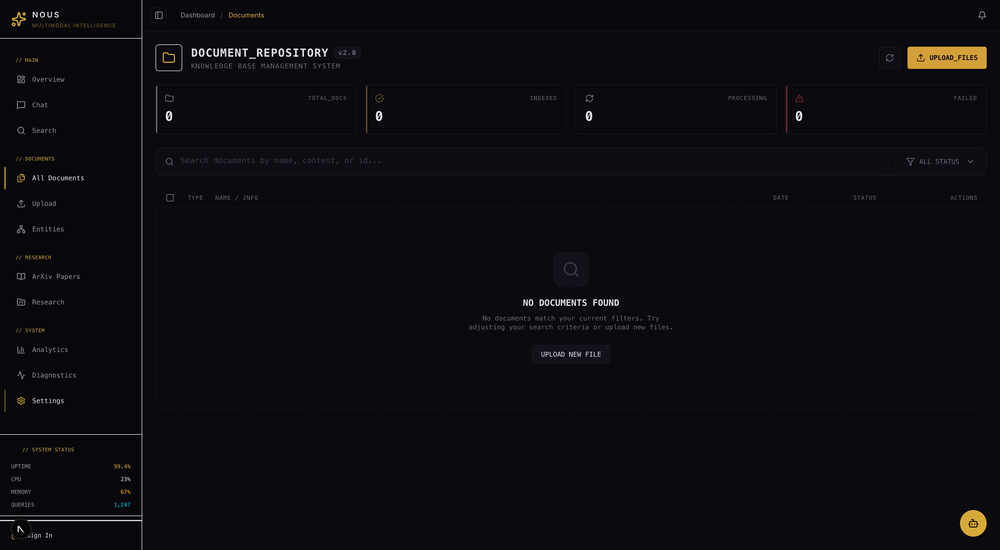
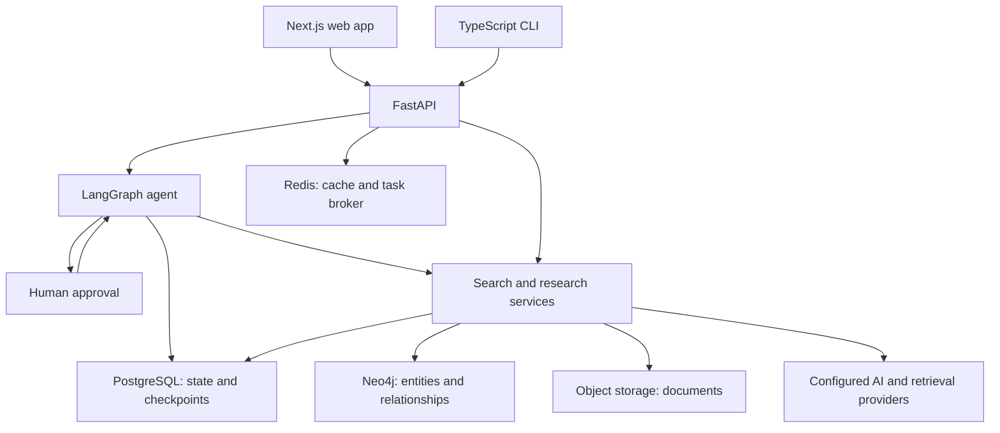

<div align="center">


# NOUS — AI Research Workspace

**Search your documents, inspect the sources, and organize research through an agent with human approval.**

[Showcase & screenshots](https://goodwiins.github.io/nous/) · [Source code](https://github.com/Goodwiinz/rag) · [Terminal client](https://github.com/Goodwiinz/nous-cli) · [Evaluation evidence](evals/README.md)

</div>

## What NOUS does

NOUS brings document search, cited answers, research projects, and agent actions into one workspace. It is built for working through a collection of papers or internal documents: find relevant material, inspect the supporting sources, and save useful documents and notes to a project.

The web application combines a Next.js / TypeScript frontend with a FastAPI / LangGraph backend. A separate [TypeScript CLI](https://github.com/Goodwiinz/nous-cli) connects to the same backend for streamed conversations and tool approvals.

Built by **Abdel El Bikha ([@goodwiins](https://github.com/goodwiins))** under [Goodwiinz](https://github.com/Goodwiinz), spanning the frontend, backend, agent orchestration, and evaluation work.

**Status:** actively developed. Feature availability depends on deployment configuration. The showcase is a product overview; recorded evaluations below describe specific source revisions and controlled environments, not a blanket guarantee of current production behavior.

## Core workflow

| Capability | User experience | Implementation |
| --- | --- | --- |
| Document Q&A | Ask a question and inspect citations and source documents. | Search services, answer rendering, and an interactive citation panel. |
| Agent actions | Ask the agent to create a project, attach documents, or save notes; approve gated actions before execution. | LangGraph tool orchestration, interrupts, and persisted project state. |
| Research workspace | Organize documents and notes; access bibliography and draft tools in one project. | Project APIs, document management, and frontend state reconciliation. |
| Streaming conversations | Follow the response and tool activity as a run progresses. | Server-sent events, thread state, and PostgreSQL checkpoints. |
| Terminal access | Use the shared agent backend from a CLI. | Browser-based authentication flow, streamed events, and confirmation handling in [nous-cli](https://github.com/Goodwiinz/nous-cli). |

Additional implementations include arXiv ingestion, knowledge-graph exploration, memory, multimodal processing, and writing workflows. Their presence in the repository does not establish end-to-end reliability; see [evaluation status](#evaluation-evidence).

## Demo walkthrough

Use a configured instance with two or three indexed documents and a signed-in account.

1. **Inspect the collection.** Open the documents you will use so the audience can see the available evidence.
2. **Ask a grounded question.** For example: “What retrieval methods do these documents describe? Cite the supporting sources.”
3. **Check the answer.** Open a citation and inspect the source document. Explain what supports the answer and what the documents do not establish.
4. **Approve an action.** Ask the agent to create a research project, then attach a selected document. Show the confirmation before execution.
5. **Verify the saved result.** Open the project and refresh it to demonstrate persisted state.
6. **Show the engineering evidence.** Open a recorded evaluation and explain which tool actions, database effects, or answer claims it checks.

The CLI is an optional second view of the shared backend. Rehearse the workflow against the actual deployment before presenting; the steps above are a suggested demonstration, not a fresh live test report.

## Screenshots

| Dashboard | Chat | Search |
| --- | --- | --- |
|  |  |  |

| Documents | Entity graph | Research |
| --- | --- | --- |
|  |  |  |

Screenshots capture particular UI versions. See the [showcase](https://goodwiins.github.io/nous/) for the broader product presentation.

## Architecture



| Layer | Technologies and responsibilities |
| --- | --- |
| Web | Next.js, React, TypeScript, Tailwind, Zustand, TanStack Query; chat, documents, projects, and citations. |
| API and agents | FastAPI, Pydantic, LangGraph; request validation, tool routing, approvals, streaming, and checkpoints. |
| Retrieval | PostgreSQL full-text search, optional DigitalOcean Knowledge Base integration, graph services, and configurable reranking. |
| Data and processing | PostgreSQL, Neo4j, Redis, Celery, and configurable object storage. |
| Operations | Docker Compose, Kubernetes / Helm, Terraform, GitHub Actions, structured logs, and tracing integrations. |

**Retrieval configuration matters.** The [operational notes](docs/engineering/gotchas.md) document the migration away from Qdrant and a development deployment using PostgreSQL full-text retrieval with DigitalOcean KB disabled. Vector retrieval and reranking should be described according to the enabled configuration, rather than assumed to run on every query.

### Engineering decisions

- **Explicit agent state:** LangGraph represents tool loops and approval boundaries, with PostgreSQL checkpoints for conversation execution state.
- **Visible side effects:** gated tools surface pending actions to the user. Evaluations inspect persisted effects as well as the agent's response.
- **Traceable answers:** citations let users inspect source material; their presence alone does not prove a claim is supported.
- **Clear frontend ownership:** the [frontend standards](docs/engineering/frontend.md) define chat state, request-backed caches, and reconciliation after agent mutations.
- **Enforced boundaries:** [architecture guards](docs/engineering/README.md) check router/service separation, identity requirements, and frontend dependency boundaries.

## Evaluation evidence

The [agent evaluation suite](evals/README.md) runs pinned production code against isolated infrastructure and controlled service doubles. Deterministic checks examine tool trajectories and persisted state; selected tasks also use an isolated semantic judge. Infrastructure failures are tracked separately.

The following are **historical recorded results**, not current-head scores or live-service availability measurements.

| Capability | Recorded result | Evidence |
| --- | --- | --- |
| Knowledge-base retrieval | **5/5 trials passed**; marked gated in the evaluation documentation. | [August 8 baseline](evals/baselines/agent-flow-2026-08-08-writing-kb.json) |
| Multi-step project management | **1/1 recorded trial passed**, including three approvals and project/document/note operations. | [Project-management baseline](evals/baselines/agent-flow-2026-08-07-tools.json) |
| Writing and document comparison | **0/5 trials passed**; semantic checks found unsupported claims and contradictions. Not gated. | [Failure analysis](evals/baselines/agent-flow-2026-08-08-writing-kb.json) |
| arXiv, code execution, and external connectors | Baseline placeholders await their first recorded runs. | [Baseline status](evals/baselines/agent-flow-2026-08-08-arxiv-code-connectors.json) |
| Knowledge graph and memory | Baseline placeholders await their first recorded runs. | [Baseline status](evals/baselines/agent-flow-2026-08-08-kg-memory.json) |

The [August 4 baseline](evals/baselines/agent-flow-2026-08-04.json) also records retrieval-safety and cancellation-persistence failures. Consult the [baseline notes](evals/AGENT_FLOW_BASELINE.md) for subsequent fixes and historical context; a code fix and a fresh passing evaluation are distinct evidence.

Small controlled samples establish behavior only within their tested conditions. Re-run the relevant tasks after source changes. Configured quality thresholds are targets, not measured success rates.

## Development setup

This is a multi-service application. Backend and integration features need a configured database, initialized schema, authentication, storage, and the relevant model/retrieval credentials.

### Frontend

Use **Node 24** and **pnpm 10.18.2**, as pinned in [package.json](package.json).

```bash
git clone --branch develop https://github.com/Goodwiinz/rag.git nous
cd nous
corepack enable
pnpm install --frozen-lockfile
cp frontend/.env.example frontend/.env.local
# Configure the frontend environment for your backend.
pnpm dev
```

The frontend starts at `http://localhost:3000`. A running frontend alone does not provide document search or agent execution.

### Backend and supporting services

Review these configuration sources before starting the backend:

- [Backend environment example](backend/.env.example)
- [Shared environment example](config/environments/.env.example)
- [Development Compose configuration](docker-compose.development.yml)
- [Database documentation](docs/database/)
- [Operational notes](docs/engineering/gotchas.md)

The development Compose file does **not** start PostgreSQL: its database service is commented out and its default database URL points to an externally managed local database. Configure a reachable database and initialize the schema first. The pinned evaluation environment also records a fresh Alembic upgrade limitation; do not assume its test schema bootstrap is a production migration procedure.

After preparing the environment, this starts the selected application services using an explicit environment file:

```bash
docker compose --env-file .env.local -f docker-compose.development.yml up -d backend redis neo4j minio celery-worker
```

Prepare the root `.env.local` from the configuration references above; Compose does not automatically load that filename without `--env-file`. Configure any additional provider variables required by the chosen features. Backend API documentation is available at `http://localhost:8000/docs` once startup succeeds.

These instructions describe the repository configuration; a clean installation has not been revalidated as part of this README update.

## Development checks

```bash
pnpm --dir frontend lint
pnpm --dir frontend type-check
pnpm --dir frontend test
```

See [engineering standards](docs/engineering/README.md) for the distinction between advisory checks and blocking quality ratchets, [testing standards](docs/engineering/testing.md) for backend and regression-test guidance, and [evals/README.md](evals/README.md) for the agent harness and its infrastructure requirements.

## Explore the code

| Location | Contents |
| --- | --- |
| [backend/](backend/) | FastAPI application, agent graph, search, research services, models, and tests. |
| [frontend/](frontend/) | Next.js routes, UI components, chat state, and API clients. |
| [evals/](evals/) | Agent tasks, verifiers, baseline results, and evaluation methodology. |
| [docs/engineering/](docs/engineering/) | Current engineering contracts and operational notes. |
| [docs/architecture/](docs/architecture/) | Architecture reports and design background. |
| [docs/deployment/](docs/deployment/) | Deployment configurations and runbooks. |
| [brand/](brand/) | Product identity, screenshots, and presentation assets. |
| [Goodwiinz/nous-cli](https://github.com/Goodwiinz/nous-cli) | Separate terminal client for the shared backend. |

Some older documents describe earlier implementations. Check their dates and compare operational claims with current code and configuration.
