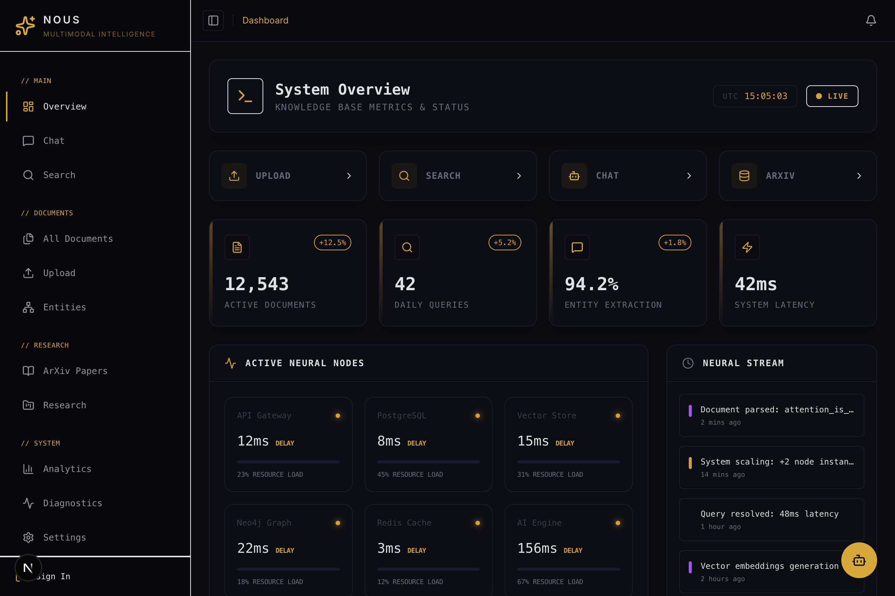
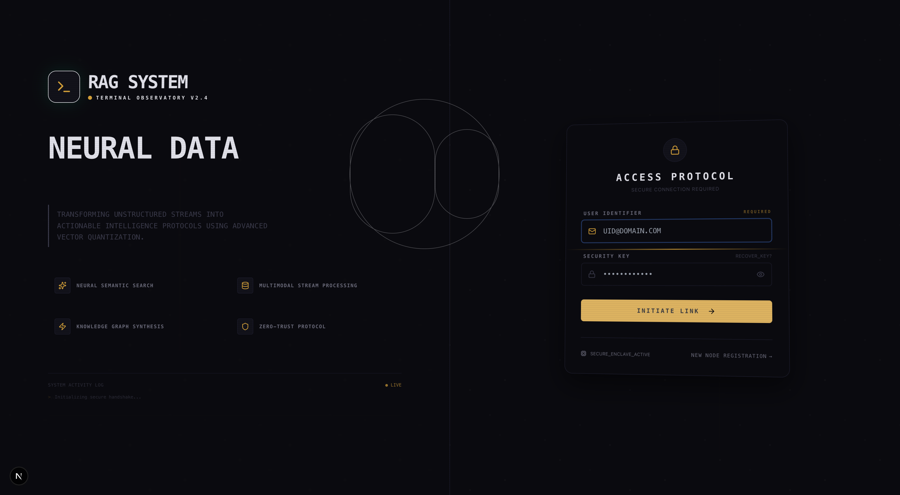
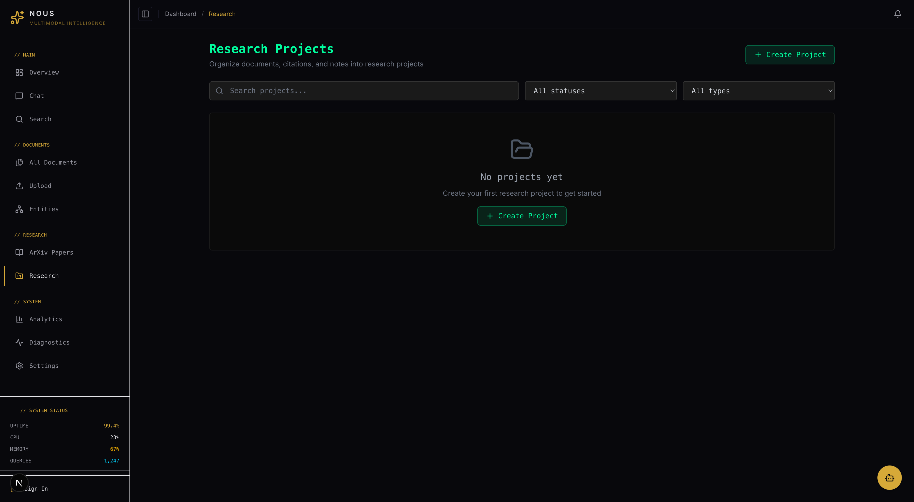
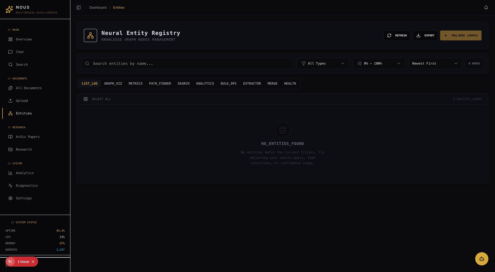
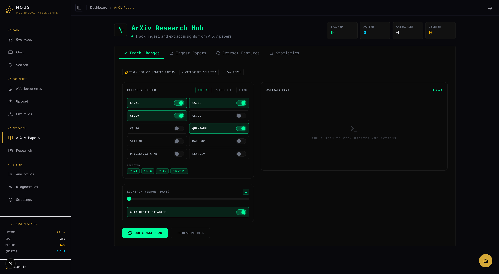

<div align="center">


# NOUS — Multimodal Intelligence Platform

**From scattered papers to grounded insights — an AI research assistant that reads, reasons, and writes with citations you can trust.**

[](https://goodwiins.github.io/nous/)
[](https://github.com/goodwiins/rag)
[](https://nextjs.org/)
[](https://fastapi.tiangolo.com/)
[](https://langchain-ai.github.io/langgraph/)

</div>

---

## Hackathon Submission — AI Software Track

| Deliverable   | Link                                                                   |
| ------------- | ---------------------------------------------------------------------- |
| Showcase Site | [goodwiins.github.io/nous](https://goodwiins.github.io/nous/)          |
| Source Code   | [github.com/goodwiins/rag](https://github.com/goodwiins/rag)           |
| Demo Video    | [`docs/paper/`](docs/paper/) _(see repo for the latest cut)_           |
| Pitch Deck    | [`brand/NOUS-Product-Overview.docx`](brand/NOUS-Product-Overview.docx) |

---

## The Problem

Researchers, analysts, and knowledge workers drown in unstructured information — PDFs, images, audio, citations scattered across tools. Traditional search returns keywords; LLM chatbots hallucinate without sources; note-taking apps don't reason.

**NOUS is a single, grounded workspace that ingests any modality, retrieves across a hybrid index, and generates literature reviews, drafts, and answers with inline citations — backed by a human-in-the-loop agent you can trust.**

### Who it's for

- **Academic researchers** drafting literature reviews across hundreds of papers
- **R&D teams** synthesizing internal docs, patents, and competitive intel
- **Analysts** who need audit-ready answers with traceable sources

### Value delivered

- Hours saved per literature review (arXiv → draft → LaTeX export)
- Every claim linked to a source chunk — no un-grounded generation
- Destructive actions gated behind `interrupt()` so the agent never goes rogue

---

## Highlights

<table>
<tr>
<td width="50%">

### Agent System — LangGraph with HITL

Intent-routed StateGraph with specialized subgraphs (research · writing · data · general), 12 tools, SSE streaming, and `interrupt()` gates on every destructive tool. Checkpointed in Postgres so threads survive restarts.

</td>
<td width="50%">

### Hybrid Retrieval

Vector (Qdrant) + keyword (Postgres FTS) + graph (Neo4j) fused and reranked (Cohere). Cross-modal: a query hits text chunks, image regions, audio segments, and citation edges in one call.

</td>
</tr>
<tr>
<td width="50%">

### Citation Pipeline

Hybrid extraction from arXiv API, Semantic Scholar, CrossRef, and PDF parsers. Interactive Cytoscape.js citation graph backed by Neo4j. BibTeX/APA/IEEE/MLA export with incomplete-metadata warnings.

</td>
<td width="50%">

### Multi-Agent Literature Reviews

Drafts generated by a writing subgraph: theme extraction → per-theme synthesis → inline citation injection → LaTeX + `.bib` export. Versioned so you can iterate.

</td>
</tr>
<tr>
<td width="50%">

### Multimodal Ingest

PDF + OCR, image object/scene detection, Whisper speech-to-text with speaker diarization, video frame+audio extraction. One pipeline, one index.

</td>
<td width="50%">

### Local AI (WebLLM)

In-browser inference with Llama, Phi, Gemma, Qwen for offline or privacy-sensitive workflows. No data leaves the client.

</td>
</tr>
</table>

---

## AI & Algorithmic Design

Why the stack looks this way:

- **LangGraph over a single prompt chain** — branching intents (research vs. writing vs. data) demand explicit state and retries. A StateGraph makes tool loops debuggable, checkpointable, and resumable mid-interrupt.
- **Hybrid retrieval over pure vector** — academic queries mix named entities, exact phrases, and semantic similarity. Fusing vector + BM25 + graph traversal then reranking with Cohere beats any single retriever on grounded-answer evals.
- **Human-in-the-loop by design** — ingests, draft creation, and note writes call `interrupt()`. The client sees the pending action, surfaces it to the user, and resumes via `Command(resume=...)`. No silent side effects.
- **Subgraph specialization** — the research subgraph gets arXiv + search tools (not drafting); the writing subgraph gets drafts + bibliography. Smaller tool sets = fewer hallucinated tool calls.
- **Eval-gated quality** — DeepEval thresholds in CI: >70% answer relevancy, >90% faithfulness, <10% hallucination. Regressions block merges.

See [`docs/architecture/`](docs/architecture/) for diagrams and [`backend/src/services/agent/graph.py`](backend/src/services/agent/graph.py) for the graph definition.

---

## Screenshots

|                Dashboard                |                  Chat                  |                Research                |
| :-------------------------------------: | :------------------------------------: | :------------------------------------: |
|  |      |  |
|            **Hybrid Search**            |            **Entity Graph**            |            **arXiv Ingest**            |
|     |  |     |

Full gallery at [goodwiins.github.io/nous](https://goodwiins.github.io/nous/).

---

## Architecture

```
┌─────────────────┐     ┌──────────────────────────────────────────┐     ┌────────────────┐
│  Next.js 15     │────▶│  FastAPI · LangGraph StateGraph          │────▶│  Postgres      │
│  React 18       │ SSE │  ┌──────────────────────────────────┐    │     │  Qdrant        │
│  Zustand + RQ   │◀────│  │ rag → intent → memory → route →  │    │     │  Neo4j         │
│  shadcn/ui      │     │  │ [research|writing|data|general]  │    │     │  Redis         │
└─────────────────┘     │  │ → tools → memory_save → END      │    │     │  MinIO         │
                        │  └──────────────────────────────────┘    │     └────────────────┘
                        │  interrupt() ── HITL ── Command(resume)  │
                        └──────────────────────────────────────────┘
```

- **Frontend**: Next.js 15 · React 18 · TS strict · Tailwind · shadcn/ui · Zustand · TanStack Query v5 · Cytoscape.js
- **Backend**: FastAPI · LangGraph · Celery · Whisper · spaCy · sentence-transformers · Cohere rerank
- **Data**: Postgres (metadata + checkpoints) · Qdrant (vectors) · Neo4j (KG + citations) · Redis (cache + broker) · MinIO (blobs)
- **Infra**: Docker Compose · Kubernetes + Helm · Terraform · GitHub Actions CI
- **Observability**: Prometheus · LangSmith · structlog

---

## Quick Start

```bash
# 1. Clone and configure
git clone https://github.com/goodwiins/rag.git nous
cd nous
cp .env.example .env.local     # add OPENAI_API_KEY / ANTHROPIC_API_KEY

# 2. Spin up services (Postgres, Qdrant, Neo4j, Redis, MinIO, backend)
docker-compose -f docker-compose.development.yml up -d

# 3. Start the frontend
cd frontend && npm install && npm run dev

# 4. Open:  http://localhost:3000   (API docs at :8000/docs)
```

**Prerequisites:** Node 18.17+, Python 3.11+, Docker 24+, 16 GB RAM, OpenAI or Anthropic key.

**Dev users:** `admin@multimodal-rag.com / REDACTED` · `demo@multimodal-rag.com / demo123`

---

## Engineering Practices

| Area          | What we do                                                                 |
| ------------- | -------------------------------------------------------------------------- |
| Types         | TS strict mode · Python mypy strict · Pydantic v2 everywhere               |
| Testing       | Jest · RTL · Playwright E2E · pytest (unit/integration/e2e/perf markers)   |
| AI evals      | DeepEval in CI — faithfulness, relevancy, hallucination thresholds         |
| Lint/format   | Prettier · ESLint · Black 88 · isort                                       |
| Validation    | `npm run validate` = lint + type-check + test                              |
| CI/CD         | GitHub Actions · Docker Bake · Helm deploys                                |
| Security      | JWT auth · RBAC · encrypted fields · SQL injection guards · CORS allowlist |
| Observability | Prometheus metrics · LangSmith traces · structured logs                    |

---

## API Overview

| Endpoint                            | Purpose                                   |
| ----------------------------------- | ----------------------------------------- |
| `POST /api/v1/auth/login`           | JWT authentication                        |
| `POST /api/v1/documents/upload`     | Multimodal ingest (PDF/image/audio/video) |
| `POST /api/v1/search/`              | Hybrid search (vector + keyword + graph)  |
| `POST /api/v1/agent/execute`        | Async agent execution (returns job_id)    |
| `POST /api/v1/agent/stream`         | SSE streaming (token, tool, rag_context)  |
| `POST /api/v1/agent/confirm/{id}`   | Resume HITL interrupt                     |
| `POST /api/v1/arxiv/import`         | Import arXiv papers into the KB           |
| `POST /api/v1/citations/export`     | Export bibliography (BibTeX/APA/IEEE/MLA) |
| `POST /api/v1/projects/{id}/drafts` | Generate versioned literature review      |
| `GET  /health`                      | System health                             |

Interactive docs at `http://localhost:8000/docs` when running.

---

## Quality Metrics

| Metric               | Threshold | Checked via   |
| -------------------- | --------- | ------------- |
| Answer Relevancy     | > 70%     | DeepEval (CI) |
| Faithfulness         | > 90%     | DeepEval (CI) |
| Contextual Relevancy | > 70%     | DeepEval (CI) |
| Hallucination Rate   | < 10%     | DeepEval (CI) |
| Latency (p95)        | < 2000ms  | Prometheus    |

---

## Project Structure

```
.
├── backend/          FastAPI app — api/, services/ (agent, research, search), models/, core/
├── frontend/         Next.js 15 — app/, src/ (components, hooks, store, services, types)
├── brand/            Logos, guidelines, screenshots, landing page
├── docs/             Architecture, deployment, security, testing, observability
├── infrastructure/   Terraform + K8s manifests
├── specs/            Feature specs
├── evals/            DeepEval suites
└── docker-compose.*  Dev / prod / CI stacks
```

---

## Documentation

| Area                                 | Description                              |
| ------------------------------------ | ---------------------------------------- |
| [Architecture](docs/architecture/)   | System design, LangGraph flow, data flow |
| [Database](docs/database/)           | Schema, Neo4j, Qdrant, migrations        |
| [Deployment](docs/deployment/)       | Docker, K8s, Helm, runbooks              |
| [Security](docs/security/)           | Auth, RBAC, encryption, audit            |
| [Testing](docs/testing/)             | Unit, integration, E2E, eval reports     |
| [Observability](docs/observability/) | Prometheus, LangSmith, tracing           |
| [API](docs/api/)                     | OpenAPI specs, endpoint reference        |

---

## Team & Credits

Built by **Abdel ([@goodwiins](https://github.com/goodwiins))** — NOUS (Greek: νοῦς, _mind_) is a solo-developed multimodal intelligence platform.

Brand system and landing assets in [`brand/`](brand/). Philosophy and design principles at [brand/philosophy.html](brand/philosophy.html).

## License

MIT — see [LICENSE](LICENSE).
