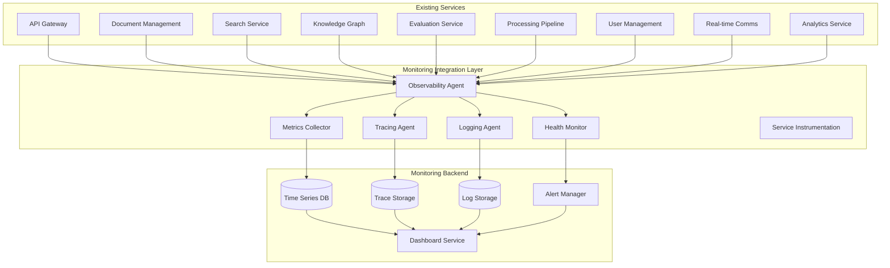

# Monitoring Integration Patterns with Existing Services

## Overview

This document outlines comprehensive integration patterns for incorporating the monitoring and observability system into the existing Multimodal RAG System services. The design ensures seamless integration with minimal disruption to current functionality while providing comprehensive monitoring capabilities.

## Integration Architecture



## 1. Service Instrumentation Framework

### Base Monitoring Decorator

```python
import functools
import time
import asyncio
import uuid
from typing import Callable, Any, Dict, Optional
from dataclasses import dataclass
from enum import Enum

class MetricType(Enum):
    COUNTER = "counter"
    GAUGE = "gauge"
    HISTOGRAM = "histogram"
    SUMMARY = "summary"

@dataclass
class MonitoringContext:
    """Context for monitoring operations"""
    service_name: str
    operation_name: str
    trace_id: str
    span_id: str
    correlation_id: str
    user_id: Optional[str] = None
    organization_id: Optional[str] = None
    additional_tags: Optional[Dict[str, str]] = None

class ServiceInstrumentation:
    """Base instrumentation for existing services"""

    def __init__(self, service_name: str, metrics_collector, tracer, logger):
        self.service_name = service_name
        self.metrics_collector = metrics_collector
        self.tracer = tracer
        self.logger = logger

    def monitor_endpoint(
        self,
        endpoint_name: str = None,
        include_args: bool = False,
        include_result: bool = False,
        custom_tags: Dict[str, str] = None
    ):
        """Decorator for monitoring API endpoints"""
        def decorator(func: Callable) -> Callable:
            @functools.wraps(func)
            async def wrapper(*args, **kwargs):
                # Generate monitoring context
                trace_id = str(uuid.uuid4())
                span_id = str(uuid.uuid4())
                correlation_id = kwargs.get('correlation_id', str(uuid.uuid4()))

                context = MonitoringContext(
                    service_name=self.service_name,
                    operation_name=endpoint_name or func.__name__,
                    trace_id=trace_id,
                    span_id=span_id,
                    correlation_id=correlation_id,
                    user_id=kwargs.get('user_id'),
                    organization_id=kwargs.get('organization_id'),
                    additional_tags=custom_tags or {}
                )

                # Start span
                span = await self.tracer.start_span(
                    operation_name=context.operation_name,
                    trace_id=trace_id,
                    span_id=span_id,
                    parent_span_id=kwargs.get('parent_span_id')
                )

                start_time = time.time()
                status_code = 200
                error_message = None

                try:
                    # Execute function
                    result = await func(*args, **kwargs)

                    # Record success metrics
                    duration_ms = (time.time() - start_time) * 1000
                    await self._record_success_metrics(context, duration_ms, result if include_result else None)

                    return result

                except Exception as e:
                    # Record error metrics
                    duration_ms = (time.time() - start_time) * 1000
                    status_code = getattr(e, 'status_code', 500)
                    error_message = str(e)

                    await self._record_error_metrics(context, duration_ms, e, status_code)

                    # Log error with context
                    self.logger.error(
                        f"Error in {context.operation_name}",
                        extra={
                            "trace_id": trace_id,
                            "span_id": span_id,
                            "correlation_id": correlation_id,
                            "error": error_message,
                            "duration_ms": duration_ms,
                            "service_name": self.service_name
                        }
                    )

                    raise

                finally:
                    # Finish span
                    await span.finish(
                        status_code=status_code,
                        error_message=error_message,
                        duration_ms=(time.time() - start_time) * 1000
                    )

            return wrapper
        return decorator

    async def _record_success_metrics(
        self,
        context: MonitoringContext,
        duration_ms: float,
        result: Any = None
    ):
        """Record metrics for successful operation"""
        tags = {
            "service": context.service_name,
            "operation": context.operation_name,
            "status": "success"
        }

        if context.additional_tags:
            tags.update(context.additional_tags)

        # Record duration histogram
        await self.metrics_collector.record_histogram(
            name="operation_duration_ms",
            value=duration_ms,
            tags=tags
        )

        # Record success counter
        await self.metrics_collector.increment_counter(
            name="operations_total",
            tags=tags
        )

        # Record custom business metrics
        if result and hasattr(result, '__dict__'):
            await self._record_business_metrics(context, result, tags)

    async def _record_error_metrics(
        self,
        context: MonitoringContext,
        duration_ms: float,
        error: Exception,
        status_code: int
    ):
        """Record metrics for failed operation"""
        tags = {
            "service": context.service_name,
            "operation": context.operation_name,
            "status": "error",
            "error_type": type(error).__name__,
            "status_code": str(status_code)
        }

        if context.additional_tags:
            tags.update(context.additional_tags)

        # Record duration histogram
        await self.metrics_collector.record_histogram(
            name="operation_duration_ms",
            value=duration_ms,
            tags=tags
        )

        # Record error counter
        await self.metrics_collector.increment_counter(
            name="operations_total",
            tags=tags
        )

        # Record error gauge
        await self.metrics_collector.set_gauge(
            name="last_error_timestamp",
            value=time.time(),
            tags=tags
        )

    async def _record_business_metrics(self, context: MonitoringContext, result: Any, tags: Dict[str, str]):
        """Record business-specific metrics"""
        # Example for search service
        if context.service_name == "search-service":
            if hasattr(result, 'results_count'):
                await self.metrics_collector.record_histogram(
                    name="search_results_count",
                    value=result.results_count,
                    tags=tags
                )

            if hasattr(result, 'query_time_ms'):
                await self.metrics_collector.record_histogram(
                    name="search_query_time_ms",
                    value=result.query_time_ms,
                    tags=tags
                )

        # Example for document management
        elif context.service_name == "document-service":
            if hasattr(result, 'document_id'):
                await self.metrics_collector.increment_counter(
                    name="documents_processed_total",
                    tags=tags
                )

            if hasattr(result, 'file_size_bytes'):
                await self.metrics_collector.record_histogram(
                    name="document_file_size_bytes",
                    value=result.file_size_bytes,
                    tags=tags
                )
```

## 2. Database Integration Patterns

### Enhanced Database Monitoring

```python
from sqlalchemy import event
from sqlalchemy.engine import Engine
import time
import asyncio

class DatabaseInstrumentation:
    """Instrumentation for database operations"""

    def __init__(self, metrics_collector, tracer, logger):
        self.metrics_collector = metrics_collector
        self.tracer = tracer
        self.logger = logger

    def instrument_engine(self, engine: Engine):
        """Instrument SQLAlchemy engine"""
        @event.listens_for(engine, "before_cursor_execute")
        def before_cursor_execute(conn, cursor, statement, parameters, context, executemany):
            context._query_start_time = time.time()
            context._statement = statement
            context._parameters = parameters

        @event.listens_for(engine, "after_cursor_execute")
        def after_cursor_execute(conn, cursor, statement, parameters, context, executemany):
            if hasattr(context, '_query_start_time'):
                duration_ms = (time.time() - context._query_start_time) * 1000

                # Record query metrics
                asyncio.create_task(self._record_query_metrics(
                    statement=statement,
                    duration_ms=duration_ms,
                    success=True
                ))

        @event.listens_for(engine, "handle_error")
        def handle_error(exception_context):
            if hasattr(exception_context.execution_context, '_query_start_time'):
                duration_ms = (time.time() - exception_context.execution_context._query_start_time) * 1000

                # Record error metrics
                asyncio.create_task(self._record_query_metrics(
                    statement=exception_context.execution_context._statement,
                    duration_ms=duration_ms,
                    success=False,
                    error=exception_context.exception
                ))

    async def _record_query_metrics(
        self,
        statement: str,
        duration_ms: float,
        success: bool,
        error: Exception = None
    ):
        """Record database query metrics"""
        tags = {
            "operation": self._extract_operation(statement),
            "table": self._extract_table(statement),
            "status": "success" if success else "error"
        }

        if error:
            tags["error_type"] = type(error).__name__

        # Record query duration
        await self.metrics_collector.record_histogram(
            name="db_query_duration_ms",
            value=duration_ms,
            tags=tags
        )

        # Record query counter
        await self.metrics_collector.increment_counter(
            name="db_queries_total",
            tags=tags
        )

        # Log slow queries
        if duration_ms > 1000:  # Queries over 1 second
            self.logger.warning(
                f"Slow database query detected: {duration_ms:.2f}ms",
                extra={
                    "statement": statement[:200],  # Truncate for logging
                    "duration_ms": duration_ms,
                    "operation": tags["operation"],
                    "table": tags["table"]
                }
            )

    def _extract_operation(self, statement: str) -> str:
        """Extract SQL operation type"""
        statement = statement.strip().upper()
        for op in ["SELECT", "INSERT", "UPDATE", "DELETE", "CREATE", "DROP", "ALTER"]:
            if statement.startswith(op):
                return op.lower()
        return "unknown"

    def _extract_table(self, statement: str) -> str:
        """Extract table name from statement"""
        # Simple table extraction - can be enhanced with SQL parsing
        statement = statement.upper()
        if "FROM" in statement:
            from_part = statement.split("FROM")[1].split()[0]
            return from_part.strip('"`[]')
        return "unknown"

# Integration with existing database.py
def enhance_database_with_monitoring(engine, metrics_collector, tracer, logger):
    """Enhance existing database with monitoring"""
    db_instrumentation = DatabaseInstrumentation(metrics_collector, tracer, logger)
    db_instrumentation.instrument_engine(engine)
    return db_instrumentation
```

### Performance Log Integration

```python
# Enhanced performance log model integration
class PerformanceLogService:
    """Service for managing performance logs with monitoring integration"""

    def __init__(self, db_session, metrics_collector, message_broker):
        self.db = db_session
        self.metrics_collector = metrics_collector
        self.message_broker = message_broker

    async def log_performance_metric(
        self,
        metric_name: str,
        value: float,
        category: str,
        organization_id: str = None,
        **kwargs
    ):
        """Log performance metric with enhanced monitoring"""
        # Create performance log entry
        perf_log = PerformanceLog.create_system_metric(
            metric_name=metric_name,
            value=value,
            organization_id=organization_id,
            metric_category=MetricCategory(category.upper()),
            **kwargs
        )

        # Save to database
        self.db.add(perf_log)
        await self.db.commit()

        # Send to metrics collector
        await self.metrics_collector.record_gauge(
            name=f"performance_{metric_name}",
            value=value,
            tags={
                "category": category,
                "organization_id": organization_id or "system"
            }
        )

        # Publish to message queue for real-time processing
        message = MetricsCollectionMessage(
            message_id=str(uuid.uuid4()),
            message_type="performance_metric",
            timestamp=time.time(),
            data={
                "metric_name": metric_name,
                "value": value,
                "category": category,
                "organization_id": organization_id
            },
            service_name="performance_service",
            metrics=[{
                "name": metric_name,
                "value": value,
                "category": category,
                "timestamp": time.time()
            }]
        )

        await self.message_broker.publish_message(
            QueueType.METRICS_COLLECTION,
            message
        )

    async def aggregate_and_report_metrics(self, time_window: str = "1h"):
        """Aggregate metrics and generate reports"""
        # Query performance logs for aggregation
        query = """
        SELECT
            metric_name,
            metric_category,
            AVG(value) as avg_value,
            MIN(value) as min_value,
            MAX(value) as max_value,
            COUNT(*) as sample_count,
            date_trunc('hour', timestamp) as time_bucket
        FROM performance_logs
        WHERE timestamp >= NOW() - INTERVAL '1 hour'
        GROUP BY metric_name, metric_category, time_bucket
        """

        result = await self.db.execute(query)
        aggregations = result.fetchall()

        # Process aggregations
        for row in aggregations:
            await self._process_metric_aggregation(row)

    async def _process_metric_aggregation(self, aggregation):
        """Process individual metric aggregation"""
        metric_data = {
            "metric_name": aggregation.metric_name,
            "category": aggregation.metric_category.value,
            "avg_value": float(aggregation.avg_value),
            "min_value": float(aggregation.min_value),
            "max_value": float(aggregation.max_value),
            "sample_count": aggregation.sample_count,
            "time_bucket": aggregation.time_bucket.isoformat()
        }

        # Send to time-series database
        await self.metrics_collector.record_gauge(
            name=f"{metric_data['metric_name']}_avg",
            value=metric_data["avg_value"],
            tags={
                "category": metric_data["category"],
                "aggregated": "true"
            }
        )

        # Log aggregation
        logger.info(f"Metric aggregated: {metric_data['metric_name']} = {metric_data['avg_value']}")
```

## 3. Service-Specific Integration Examples

### Search Service Integration

```python
# Enhanced search service with monitoring
class MonitoredSearchService:
    """Search service with comprehensive monitoring integration"""

    def __init__(self, base_search_service, instrumentation):
        self.base_service = base_search_service
        self.instrumentation = instrumentation

    @instrumentation.monitor_endpoint(
        endpoint_name="hybrid_search",
        include_result=True,
        custom_tags={"service": "search"}
    )
    async def hybrid_search(
        self,
        query: str,
        filters: Dict[str, Any] = None,
        user_id: str = None,
        organization_id: str = None,
        **kwargs
    ):
        """Enhanced hybrid search with monitoring"""
        # Add search-specific monitoring
        search_context = {
            "query_length": len(query),
            "has_filters": bool(filters),
            "filter_count": len(filters) if filters else 0
        }

        # Execute search
        result = await self.base_service.hybrid_search(
            query=query,
            filters=filters,
            **kwargs
        )

        # Add search-specific metrics to result
        if hasattr(result, '__dict__'):
            result.search_metrics = {
                "query_length": search_context["query_length"],
                "has_filters": search_context["has_filters"],
                "filter_count": search_context["filter_count"]
            }

        return result

    async def _record_search_quality_metrics(self, query: str, result: Any, context: MonitoringContext):
        """Record search quality metrics"""
        # Relevancy metrics
        if hasattr(result, 'relevancy_score'):
            await self.instrumentation.metrics_collector.record_histogram(
                name="search_relevancy_score",
                value=result.relevancy_score,
                tags={
                    "service": context.service_name,
                    "operation": context.operation_name
                }
            )

        # Results count metrics
        if hasattr(result, 'results_count'):
            await self.instrumentation.metrics_collector.record_histogram(
                name="search_results_count",
                value=result.results_count,
                tags={
                    "service": context.service_name,
                    "operation": context.operation_name,
                    "has_results": str(result.results_count > 0).lower()
                }
            )

        # Query complexity metrics
        query_complexity = self._calculate_query_complexity(query)
        await self.instrumentation.metrics_collector.record_histogram(
            name="search_query_complexity",
            value=query_complexity,
            tags={
                "service": context.service_name,
                "operation": context.operation_name
            }
        )

    def _calculate_query_complexity(self, query: str) -> float:
        """Calculate query complexity score"""
        # Simple complexity calculation based on query characteristics
        complexity = 0.0

        # Base complexity for query length
        complexity += len(query.split()) * 0.1

        # Add complexity for special operators
        special_operators = ["AND", "OR", "NOT", "NEAR", "WITHIN"]
        for operator in special_operators:
            complexity += query.upper().count(operator) * 0.5

        # Add complexity for quotes (exact phrases)
        complexity += query.count('"') * 0.2

        return min(complexity, 10.0)  # Cap at 10
```

### Document Management Integration

```python
class MonitoredDocumentService:
    """Document service with monitoring integration"""

    def __init__(self, base_document_service, instrumentation):
        self.base_service = base_document_service
        self.instrumentation = instrumentation

    @instrumentation.monitor_endpoint(
        endpoint_name="process_document",
        include_result=True,
        custom_tags={"service": "document"}
    )
    async def process_document(
        self,
        file_content: bytes,
        file_type: str,
        user_id: str = None,
        organization_id: str = None,
        **kwargs
    ):
        """Enhanced document processing with monitoring"""
        # Record document processing metrics
        file_size = len(file_content)

        # Execute processing
        result = await self.base_service.process_document(
            file_content=file_content,
            file_type=file_type,
            **kwargs
        )

        # Record document-specific metrics
        await self._record_document_metrics(
            file_size=file_size,
            file_type=file_type,
            result=result,
            user_id=user_id,
            organization_id=organization_id
        )

        return result

    async def _record_document_metrics(
        self,
        file_size: int,
        file_type: str,
        result: Any,
        user_id: str,
        organization_id: str
    ):
        """Record document processing metrics"""
        tags = {
            "file_type": file_type,
            "user_id": user_id,
            "organization_id": organization_id
        }

        # File size metrics
        await self.instrumentation.metrics_collector.record_histogram(
            name="document_file_size_bytes",
            value=file_size,
            tags=tags
        )

        # Processing time metrics (if available)
        if hasattr(result, 'processing_time_ms'):
            await self.instrumentation.metrics_collector.record_histogram(
                name="document_processing_time_ms",
                value=result.processing_time_ms,
                tags=tags
            )

        # Page count metrics (if available)
        if hasattr(result, 'page_count'):
            await self.instrumentation.metrics_collector.record_histogram(
                name="document_page_count",
                value=result.page_count,
                tags=tags
            )

        # Entity extraction metrics (if available)
        if hasattr(result, 'entities_extracted'):
            await self.instrumentation.metrics_collector.record_histogram(
                name="document_entities_extracted",
                value=len(result.entities_extracted),
                tags=tags
            )
```

### Knowledge Graph Integration

```python
class MonitoredKnowledgeGraphService:
    """Knowledge graph service with monitoring integration"""

    def __init__(self, base_kg_service, instrumentation):
        self.base_service = base_kg_service
        self.instrumentation = instrumentation

    @instrumentation.monitor_endpoint(
        endpoint_name="entity_extraction",
        include_result=True,
        custom_tags={"service": "knowledge_graph"}
    )
    async def extract_entities(
        self,
        text: str,
        user_id: str = None,
        organization_id: str = None,
        **kwargs
    ):
        """Enhanced entity extraction with monitoring"""
        # Execute entity extraction
        result = await self.base_service.extract_entities(
            text=text,
            **kwargs
        )

        # Record entity extraction metrics
        await self._record_entity_metrics(
            text_length=len(text),
            result=result,
            user_id=user_id,
            organization_id=organization_id
        )

        return result

    async def _record_entity_metrics(
        self,
        text_length: int,
        result: Any,
        user_id: str,
        organization_id: str
    ):
        """Record knowledge graph metrics"""
        tags = {
            "user_id": user_id,
            "organization_id": organization_id
        }

        # Text length metrics
        await self.instrumentation.metrics_collector.record_histogram(
            name="kg_text_length",
            value=text_length,
            tags=tags
        )

        # Entity count metrics
        if hasattr(result, 'entities'):
            entity_count = len(result.entities)
            await self.instrumentation.metrics_collector.record_histogram(
                name="kg_entities_extracted",
                value=entity_count,
                tags=tags
            )

            # Entity type distribution
            entity_types = {}
            for entity in result.entities:
                entity_type = entity.get('type', 'unknown')
                entity_types[entity_type] = entity_types.get(entity_type, 0) + 1

            for entity_type, count in entity_types.items():
                await self.instrumentation.metrics_collector.record_histogram(
                    name=f"kg_entities_by_type_{entity_type}",
                    value=count,
                    tags=tags
                )

        # Relationship metrics
        if hasattr(result, 'relationships'):
            relationship_count = len(result.relationships)
            await self.instrumentation.metrics_collector.record_histogram(
                name="kg_relationships_extracted",
                value=relationship_count,
                tags=tags
            )

    @instrumentation.monitor_endpoint(
        endpoint_name="graph_query",
        custom_tags={"service": "knowledge_graph"}
    )
    async def query_graph(
        self,
        query: str,
        user_id: str = None,
        organization_id: str = None,
        **kwargs
    ):
        """Enhanced graph querying with monitoring"""
        # Execute graph query
        result = await self.base_service.query_graph(
            query=query,
            **kwargs
        )

        # Record query metrics
        await self._record_graph_query_metrics(
            query=query,
            result=result,
            user_id=user_id,
            organization_id=organization_id
        )

        return result

    async def _record_graph_query_metrics(
        self,
        query: str,
        result: Any,
        user_id: str,
        organization_id: str
    ):
        """Record graph query metrics"""
        tags = {
            "user_id": user_id,
            "organization_id": organization_id
        }

        # Query complexity metrics
        query_complexity = self._calculate_cypher_complexity(query)
        await self.instrumentation.metrics_collector.record_histogram(
            name="kg_query_complexity",
            value=query_complexity,
            tags=tags
        )

        # Result count metrics
        if hasattr(result, 'data'):
            result_count = len(result.data)
            await self.instrumentation.metrics_collector.record_histogram(
                name="kg_query_result_count",
                value=result_count,
                tags=tags
            )

    def _calculate_cypher_complexity(self, query: str) -> float:
        """Calculate Cypher query complexity"""
        complexity = 0.0

        # Base complexity for query length
        complexity += len(query.split()) * 0.1

        # Add complexity for different clauses
        clauses = ["MATCH", "WHERE", "RETURN", "WITH", "ORDER BY", "LIMIT"]
        for clause in clauses:
            complexity += query.upper().count(clause) * 0.3

        # Add complexity for paths
        complexity += query.count("-[") * 0.5

        return min(complexity, 10.0)
```

## 4. Message Queue Integration

### Enhanced Message Broker Integration

```python
class MonitoredMessageBroker:
    """Message broker with monitoring integration"""

    def __init__(self, base_broker, instrumentation):
        self.base_broker = base_broker
        self.instrumentation = instrumentation

    async def publish_message(
        self,
        queue_type: QueueType,
        message: MonitoringMessage,
        **kwargs
    ):
        """Publish message with monitoring"""
        start_time = time.time()

        try:
            # Record publish metrics
            await self.instrumentation.metrics_collector.increment_counter(
                name="messages_published_total",
                tags={
                    "queue": queue_type.value,
                    "message_type": message.message_type,
                    "priority": str(message.priority.value)
                }
            )

            # Publish message
            result = await self.base_broker.publish_message(queue_type, message, **kwargs)

            # Record success metrics
            duration_ms = (time.time() - start_time) * 1000
            await self.instrumentation.metrics_collector.record_histogram(
                name="message_publish_duration_ms",
                value=duration_ms,
                tags={
                    "queue": queue_type.value,
                    "status": "success"
                }
            )

            return result

        except Exception as e:
            # Record error metrics
            duration_ms = (time.time() - start_time) * 1000
            await self.instrumentation.metrics_collector.record_histogram(
                name="message_publish_duration_ms",
                value=duration_ms,
                tags={
                    "queue": queue_type.value,
                    "status": "error",
                    "error_type": type(e).__name__
                }
            )

            await self.instrumentation.metrics_collector.increment_counter(
                name="message_publish_errors_total",
                tags={
                    "queue": queue_type.value,
                    "error_type": type(e).__name__
                }
            )

            raise

    async def consume_messages(
        self,
        queue_type: QueueType,
        handler: Callable,
        concurrency: int = 1
    ):
        """Consume messages with monitoring"""
        # Wrap handler with monitoring
        monitored_handler = self._create_monitored_handler(queue_type, handler)

        # Start consuming
        await self.base_broker.consume_messages(queue_type, monitored_handler, concurrency)

    def _create_monitored_handler(self, queue_type: QueueType, handler: Callable):
        """Create monitored message handler"""
        async def monitored_handler_func(message: MonitoringMessage):
            start_time = time.time()

            try:
                # Record consume metrics
                await self.instrumentation.metrics_collector.increment_counter(
                    name="messages_consumed_total",
                    tags={
                        "queue": queue_type.value,
                        "message_type": message.message_type
                    }
                )

                # Execute handler
                await handler(message)

                # Record success metrics
                duration_ms = (time.time() - start_time) * 1000
                await self.instrumentation.metrics_collector.record_histogram(
                    name="message_processing_duration_ms",
                    value=duration_ms,
                    tags={
                        "queue": queue_type.value,
                        "status": "success"
                    }
                )

            except Exception as e:
                # Record error metrics
                duration_ms = (time.time() - start_time) * 1000
                await self.instrumentation.metrics_collector.record_histogram(
                    name="message_processing_duration_ms",
                    value=duration_ms,
                    tags={
                        "queue": queue_type.value,
                        "status": "error",
                        "error_type": type(e).__name__
                    }
                )

                await self.instrumentation.metrics_collector.increment_counter(
                    name="message_processing_errors_total",
                    tags={
                        "queue": queue_type.value,
                        "error_type": type(e).__name__
                    }
                )

                raise

        return monitored_handler_func
```

## 5. Integration Configuration and Deployment

### Service Integration Configuration

```python
# config/monitoring_integration.py
class MonitoringIntegrationConfig:
    """Configuration for monitoring integration"""

    def __init__(self):
        self.enabled = True
        self.service_name = os.getenv("SERVICE_NAME", "unknown")
        self.organization_id = os.getenv("ORGANIZATION_ID")

        # Metrics configuration
        self.metrics_enabled = True
        self.metrics_endpoint = os.getenv("METRICS_ENDPOINT", "http://prometheus:9090")

        # Tracing configuration
        self.tracing_enabled = True
        self.tracing_endpoint = os.getenv("TRACING_ENDPOINT", "http://jaeger:14268")

        # Logging configuration
        self.logging_enabled = True
        self.log_level = os.getenv("LOG_LEVEL", "INFO")

        # Health check configuration
        self.health_checks_enabled = True
        self.health_check_interval = int(os.getenv("HEALTH_CHECK_INTERVAL", "30"))

def create_service_instrumentation(service_name: str) -> ServiceInstrumentation:
    """Create service instrumentation with configuration"""
    config = MonitoringIntegrationConfig()

    # Initialize components
    metrics_collector = PrometheusMetricsCollector(config.metrics_endpoint)
    tracer = JaegerTracer(config.tracing_endpoint, service_name)
    logger = setup_structured_logger(service_name, config.log_level)

    return ServiceInstrumentation(service_name, metrics_collector, tracer, logger)

# Integration helper for FastAPI apps
def integrate_monitoring(app: FastAPI, service_name: str):
    """Integrate monitoring into FastAPI application"""
    instrumentation = create_service_instrumentation(service_name)

    # Add monitoring middleware
    app.add_middleware(MonitoringMiddleware, instrumentation=instrumentation)

    # Add health check endpoint
    @app.get("/health")
    async def health_check():
        """Enhanced health check with monitoring"""
        health_status = await check_service_health()

        # Record health metrics
        await instrumentation.metrics_collector.set_gauge(
            name="service_health_status",
            value=1 if health_status["healthy"] else 0,
            tags={"service": service_name}
        )

        return health_status

    # Add metrics endpoint
    @app.get("/metrics")
    async def metrics_endpoint():
        """Prometheus metrics endpoint"""
        return await instrumentation.metrics_collector.get_metrics()

    return instrumentation
```

This comprehensive integration design ensures that monitoring capabilities are seamlessly incorporated into the existing Multimodal RAG System services with minimal disruption while providing rich observability and performance insights.