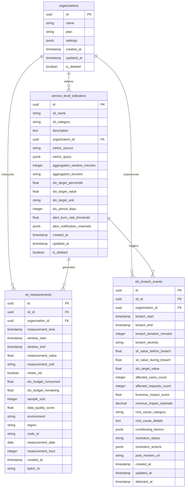
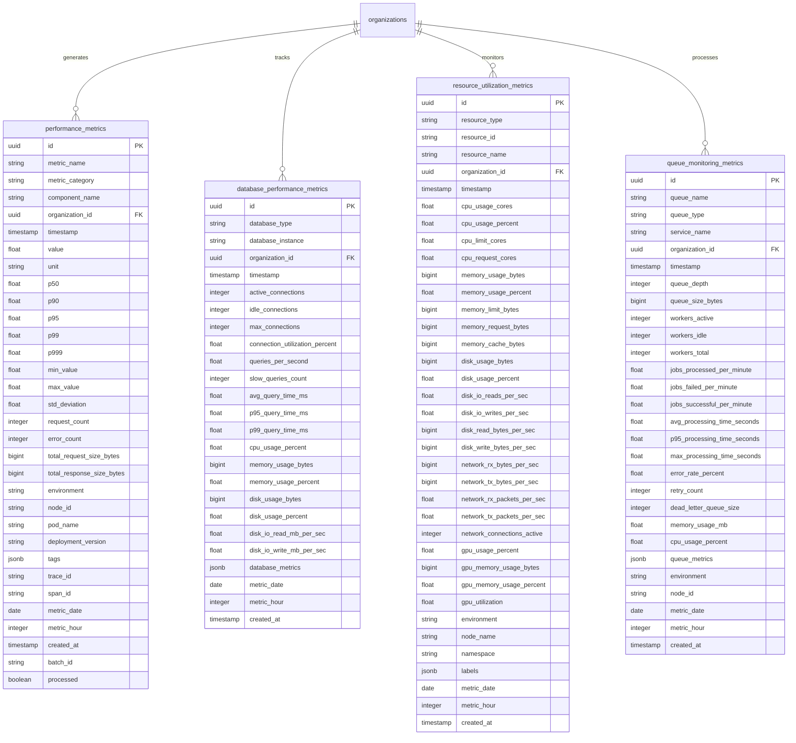
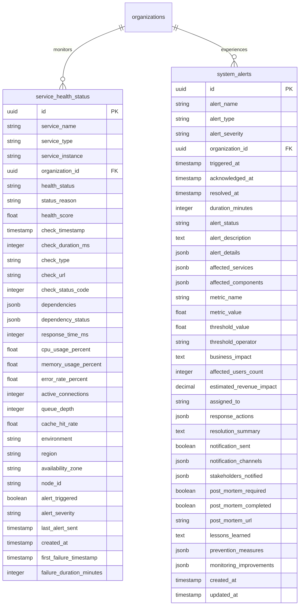
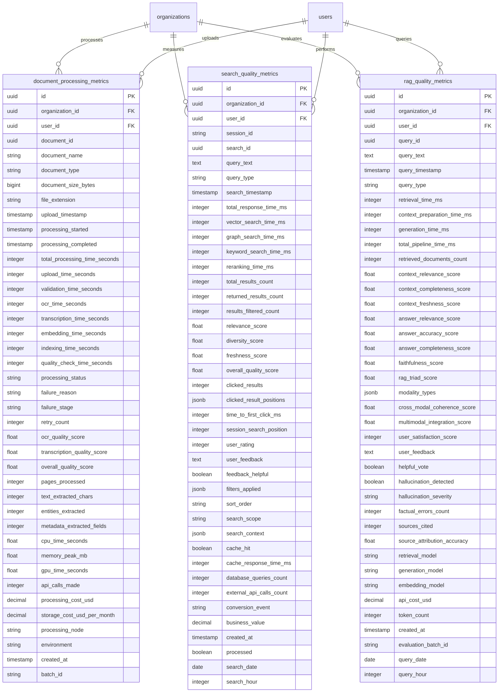
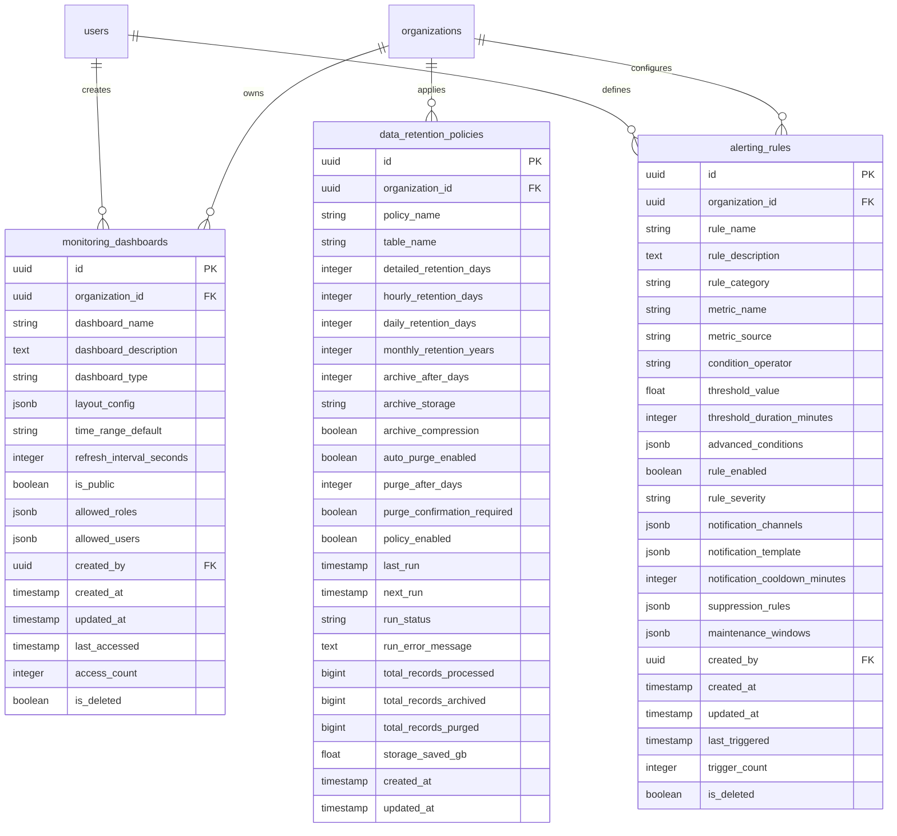

# Monitoring Database ERD (Entity Relationship Diagram)

## Overview
This ERD documents the comprehensive monitoring and observability database schema for the Multimodal Enterprise RAG System. The schema is designed to support SLI/SLO tracking, performance monitoring, user analytics, system health monitoring, and business metrics.

## Core Entity Groups

### 1. SLI/SLO Monitoring (Service Level Monitoring)

### 2. Performance Monitoring

### 3. User Analytics and Session Management

```mermaid
erDiagram
    organizations ||--o{ users : has
    organizations ||--o{ user_sessions : hosts
    organizations ||--o{ user_activity_events : generates
    organizations ||--o{ feature_usage_metrics : tracks
    users ||--o{ user_sessions : creates
    users ||--o{ user_activity_events : performs
    users ||--o{ feature_usage_metrics : uses
    user_sessions ||--o{ user_activity_events : contains

    users {
        uuid id PK
        string email
        string name
        uuid organization_id FK
        string role
        jsonb preferences
        timestamp created_at
        timestamp updated_at
        boolean is_deleted
    }

    user_sessions {
        uuid id PK
        uuid user_id FK
        uuid organization_id FK
        string session_id
        string session_token_hash
        timestamp session_start
        timestamp session_end
        integer session_duration_seconds
        timestamp last_activity
        string session_status
        string termination_reason
        text user_agent
        inet ip_address
        string country
        string city
        string device_type
        string browser
        string os
        string authentication_method
        boolean mfa_verified
        integer pages_viewed
        integer searches_performed
        integer documents_viewed
        integer api_requests_made
        float data_uploaded_mb
        float data_downloaded_mb
        jsonb security_flags
        float risk_score
        timestamp created_at
        timestamp updated_at
    }

    user_activity_events {
        uuid id PK
        uuid user_id FK
        uuid organization_id FK
        string session_id
        string event_type
        string event_category
        string event_action
        text event_description
        timestamp event_timestamp
        integer event_duration_ms
        text page_url
        string api_endpoint
        text referrer_url
        jsonb event_properties
        jsonb request_payload
        jsonb response_payload
        integer response_time_ms
        integer database_query_time_ms
        integer external_service_time_ms
        float business_value
        string conversion_step
        text user_agent
        inet ip_address
        string device_fingerprint
        date event_date
        integer event_hour
        timestamp created_at
        boolean processed
        string batch_id
    }

    feature_usage_metrics {
        uuid id PK
        uuid organization_id FK
        uuid user_id FK
        string feature_name
        string feature_category
        string feature_version
        timestamp usage_timestamp
        integer usage_duration_seconds
        jsonb usage_context
        jsonb feature_parameters
        integer user_satisfaction_score
        text user_feedback
        integer feature_response_time_ms
        boolean feature_error_occurred
        text feature_error_message
        jsonb business_outcome
        decimal revenue_impact
        string experiment_id
        string variant_name
        boolean is_control_group
        date usage_date
        timestamp created_at
    }
```

### 4. System Health and Status Monitoring

### 5. Business and Quality Metrics

### 6. Monitoring Configuration and Metadata

## Key Relationships and Data Flow

### Primary Data Flow Patterns

1. **SLI/SLO Flow**:
   - Organizations define SLIs → SLI measurements are collected → Breach events are triggered

2. **Performance Data Flow**:
   - Components generate metrics → Time-series aggregation → Alert rule evaluation → System alerts

3. **User Analytics Flow**:
   - Users create sessions → Activity events are logged → Feature usage is tracked → Business metrics are calculated

4. **Quality Metrics Flow**:
   - Documents are processed → Search queries are performed → RAG responses are generated → Quality scores are calculated

5. **System Health Flow**:
   - Services are monitored → Health status is updated → Alerts are triggered → Incidents are managed

### Critical Foreign Key Relationships

- `organization_id` appears in almost all tables for multi-tenancy
- `user_id` links user activities, sessions, and quality metrics
- Time-based partitioning through date/hour fields for performance optimization
- JSONB fields provide flexibility for evolving monitoring requirements

### Data Volume Considerations

- **High-Frequency Tables**: `performance_metrics`, `resource_utilization_metrics`, `sli_measurements`
- **Medium-Frequency Tables**: `user_activity_events`, `search_quality_metrics`, `queue_monitoring_metrics`
- **Low-Frequency Tables**: `slo_breach_events`, `system_alerts`, `document_processing_metrics`

## Performance Optimization Notes

1. **Time-series partitioning** on date/hour fields for large tables
2. **JSONB GIN indexes** for flexible tag and metadata queries
3. **Composite indexes** for common query patterns (org + time, metric + time)
4. **Separate alert tables** to avoid impacting monitoring query performance
5. **Archive and purge policies** to manage data growth over time