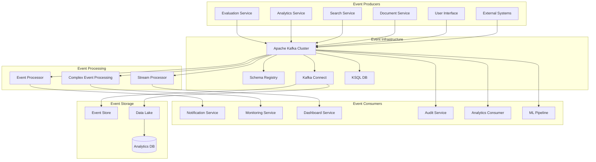

# Event-Driven Architecture for Async Processing

## Overview

This document defines the comprehensive event-driven architecture for the Multimodal Enterprise RAG System. The design implements an asynchronous, event-based communication pattern that enables scalable, resilient, and loosely coupled service interactions.

## Event Architecture



## Event Design Patterns

### 1. Event Types and Schema

#### Core Event Types

**Domain Events**
```typescript
// Evaluation Events
interface EvaluationCompletedEvent {
  eventType: 'EvaluationCompleted';
  eventId: string;
  timestamp: Date;
  version: '1.0';
  source: 'evaluation-service';
  data: {
    evaluationId: string;
    organizationId: string;
    userId: string;
    query: string;
    answer: string;
    metrics: {
      answerRelevancy: number;
      faithfulness: number;
      contextualRelevancy: number;
      overallScore: number;
    };
    responseTime: number;
    documentIds: string[];
    thresholds: ThresholdViolation[];
  };
  metadata: {
    correlationId: string;
    causationId: string;
    userId: string;
    organizationId: string;
    sessionId?: string;
    userAgent?: string;
    ipAddress?: string;
  };
}

interface QualityThresholdViolatedEvent {
  eventType: 'QualityThresholdViolated';
  eventId: string;
  timestamp: Date;
  version: '1.0';
  source: 'evaluation-service';
  data: {
    thresholdId: string;
    organizationId: string;
    metricType: string;
    actualValue: number;
    thresholdValue: number;
    severity: 'low' | 'medium' | 'high' | 'critical';
    evaluationId: string;
    query: string;
  };
  metadata: {
    correlationId: string;
    userId: string;
    alertChannel?: string[];
  };
}

// Analytics Events
interface UserBehaviorEvent {
  eventType: 'UserBehavior';
  eventId: string;
  timestamp: Date;
  version: '1.0';
  source: 'analytics-service';
  data: {
    userId?: string;
    organizationId: string;
    sessionId: string;
    eventType: 'search' | 'navigation' | 'interaction' | 'export';
    action: string;
    resource: string;
    properties: Record<string, any>;
    duration?: number;
  };
  metadata: {
    correlationId: string;
    userAgent: string;
    ipAddress: string;
    referrer?: string;
  };
}

interface DashboardViewedEvent {
  eventType: 'DashboardViewed';
  eventId: string;
  timestamp: Date;
  version: '1.0';
  source: 'analytics-service';
  data: {
    userId: string;
    organizationId: string;
    dashboardId: string;
    dashboardName: string;
    filters: Record<string, any>;
    timeRange: string;
    loadTime: number;
  };
  metadata: {
    correlationId: string;
    sessionId: string;
  };
}

// Document Events
interface DocumentProcessedEvent {
  eventType: 'DocumentProcessed';
  eventId: string;
  timestamp: Date;
  version: '1.0';
  source: 'document-service';
  data: {
    documentId: string;
    organizationId: string;
    fileName: string;
    fileType: string;
    fileSize: number;
    processingStatus: 'success' | 'failed' | 'partial';
    processingTime: number;
    extractedEntities: Entity[];
    extractedMetadata: Record<string, any>;
    qualityScore: number;
    error?: string;
  };
  metadata: {
    correlationId: string;
    userId: string;
    uploadSource: string;
  };
}

interface ContentIndexedEvent {
  eventType: 'ContentIndexed';
  eventId: string;
  timestamp: Date;
  version: '1.0';
  source: 'search-service';
  data: {
    contentId: string;
    organizationId: string;
    documentId: string;
    contentType: 'text' | 'image' | 'audio' | 'video';
    indexType: 'vector' | 'fulltext' | 'graph';
    embeddingModel?: string;
    vectorDimensions?: number;
    indexTime: number;
  };
  metadata: {
    correlationId: string;
    processingPipeline: string;
  };
}

// System Events
interface SystemHealthEvent {
  eventType: 'SystemHealth';
  eventId: string;
  timestamp: Date;
  version: '1.0';
  source: 'monitoring-service';
  data: {
    serviceName: string;
    status: 'healthy' | 'degraded' | 'unhealthy';
    metrics: {
      cpu: number;
      memory: number;
      disk: number;
      responseTime: number;
      errorRate: number;
    };
    alerts: Alert[];
  };
  metadata: {
    correlationId: string;
    environment: string;
    region: string;
  };
}

interface ServiceScalingEvent {
  eventType: 'ServiceScaling';
  eventId: string;
  timestamp: Date;
  version: '1.0';
  source: 'orchestration-service';
  data: {
    serviceName: string;
    scalingAction: 'scale_up' | 'scale_down';
    currentReplicas: number;
    targetReplicas: number;
    trigger: string;
    metrics: Record<string, number>;
  };
  metadata: {
    correlationId: string;
    autoScaling: boolean;
    reason: string;
  };
}
```

#### Event Schema Registry
```typescript
interface EventSchema {
  eventType: string;
  version: string;
  schema: JSONSchema;
  compatibility: 'BACKWARD' | 'FORWARD' | 'FULL' | 'NONE';
}

class SchemaRegistryManager {
  private schemas = new Map<string, EventSchema>();

  async registerSchema(eventType: string, version: string, schema: JSONSchema): Promise<void> {
    const schemaKey = `${eventType}:${version}`;
    this.schemas.set(schemaKey, {
      eventType,
      version,
      schema,
      compatibility: 'BACKWARD'
    });
  }

  async validateEvent(event: any): Promise<boolean> {
    const schemaKey = `${event.eventType}:${event.version}`;
    const schema = this.schemas.get(schemaKey);

    if (!schema) {
      throw new Error(`Schema not found for ${schemaKey}`);
    }

    return this.validateAgainstSchema(event, schema.schema);
  }

  private async validateAgainstSchema(data: any, schema: JSONSchema): Promise<boolean> {
    // Implement JSON Schema validation
    return true; // Simplified for example
  }
}
```

### 2. Event Producers

#### Evaluation Service Event Producer
```typescript
interface EventProducer {
  publish(event: DomainEvent): Promise<void>;
  publishBatch(events: DomainEvent[]): Promise<void>;
}

class EvaluationEventProducer implements EventProducer {
  constructor(
    private kafkaProducer: Producer,
    private schemaRegistry: SchemaRegistryManager
  ) {}

  async publish(event: EvaluationCompletedEvent): Promise<void> {
    try {
      // Validate event schema
      await this.schemaRegistry.validateEvent(event);

      // Serialize event
      const serializedEvent = await this.serializeEvent(event);

      // Publish to Kafka
      await this.kafkaProducer.send({
        topic: this.getTopicForEvent(event.eventType),
        messages: [{
          key: event.data.evaluationId,
          value: serializedEvent,
          headers: {
            eventType: event.eventType,
            version: event.version,
            correlationId: event.metadata.correlationId,
            organizationId: event.data.organizationId
          }
        }]
      });

      logger.info(`Published event ${event.eventType} for evaluation ${event.data.evaluationId}`);
    } catch (error) {
      logger.error(`Error publishing evaluation event:`, error);
      throw error;
    }
  }

  async publishBatch(events: EvaluationCompletedEvent[]): Promise<void> {
    const messages = events.map(event => ({
      key: event.data.evaluationId,
      value: JSON.stringify(event),
      headers: {
        eventType: event.eventType,
        version: event.version,
        correlationId: event.metadata.correlationId,
        organizationId: event.data.organizationId
      }
    }));

    await this.kafkaProducer.send({
      topic: 'evaluation-events',
      messages
    });
  }

  private async serializeEvent(event: DomainEvent): Promise<Buffer> {
    return Buffer.from(JSON.stringify(event));
  }

  private getTopicForEvent(eventType: string): string {
    const topicMap = {
      'EvaluationCompleted': 'evaluation-events',
      'QualityThresholdViolated': 'quality-alerts',
      'BatchEvaluationCompleted': 'batch-evaluation-events'
    };

    return topicMap[eventType] || 'general-events';
  }
}
```

### 3. Event Consumers

#### Analytics Event Consumer
```typescript
interface EventConsumer {
  subscribe(topics: string[]): Promise<void>;
  start(): Promise<void>;
  stop(): Promise<void>;
}

class AnalyticsEventConsumer implements EventConsumer {
  private consumer: Consumer;
  private isRunning = false;

  constructor(
    private kafkaConfig: any,
    private eventHandlers: Map<string, EventHandler>
  ) {
    this.consumer = new Consumer(kafkaConfig);
  }

  async subscribe(topics: string[]): Promise<void> {
    await this.consumer.subscribe({ topics, fromBeginning: false });
  }

  async start(): Promise<void> {
    if (this.isRunning) return;

    this.isRunning = true;

    await this.consumer.run({
      eachMessage: async ({ topic, partition, message }) => {
        try {
          await this.processMessage(topic, message);
        } catch (error) {
          logger.error(`Error processing message from topic ${topic}:`, error);
          await this.handleProcessingError(topic, message, error);
        }
      }
    });
  }

  async stop(): Promise<void> {
    this.isRunning = false;
    await this.consumer.disconnect();
  }

  private async processMessage(topic: string, message: any): Promise<void> {
    const event = JSON.parse(message.value?.toString() || '{}');
    const eventType = message.headers?.eventType as string;

    if (!eventType) {
      logger.warn(`Message missing eventType header from topic ${topic}`);
      return;
    }

    const handler = this.eventHandlers.get(eventType);
    if (!handler) {
      logger.warn(`No handler found for event type ${eventType}`);
      return;
    }

    await handler.handle(event);
  }

  private async handleProcessingError(
    topic: string,
    message: any,
    error: Error
  ): Promise<void> {
    // Send to dead letter queue
    await this.sendToDeadLetterQueue(topic, message, error);
  }

  private async sendToDeadLetterQueue(
    topic: string,
    message: any,
    error: Error
  ): Promise<void> {
    const deadLetterTopic = `${topic}-dead-letter`;

    await this.producer.send({
      topic: deadLetterTopic,
      messages: [{
        key: message.key,
        value: message.value,
        headers: {
          ...message.headers,
          originalTopic: topic,
          error: error.message,
          errorTimestamp: new Date().toISOString()
        }
      }]
    });
  }
}

interface EventHandler {
  handle(event: DomainEvent): Promise<void>;
}

class EvaluationCompletedHandler implements EventHandler {
  constructor(private analyticsService: AnalyticsService) {}

  async handle(event: EvaluationCompletedEvent): Promise<void> {
    // Update analytics metrics
    await this.analyticsService.updateEvaluationMetrics(event.data);

    // Update user behavior analytics
    if (event.metadata.userId) {
      await this.analyticsService.trackUserEvaluation(event.metadata.userId, event.data);
    }

    // Update organization analytics
    await this.analyticsService.updateOrganizationAnalytics(
      event.data.organizationId,
      event.data
    );
  }
}

class QualityThresholdViolatedHandler implements EventHandler {
  constructor(
    private alertService: AlertService,
    private notificationService: NotificationService
  ) {}

  async handle(event: QualityThresholdViolatedEvent): Promise<void> {
    // Create alert
    const alert = await this.alertService.createAlert({
      type: 'quality_threshold_violated',
      severity: event.data.severity,
      organizationId: event.data.organizationId,
      data: event.data
    });

    // Send notifications
    await this.notificationService.sendQualityAlert(alert, event.metadata.alertChannel);
  }
}
```

### 4. Stream Processing

#### Kafka Streams Configuration
```typescript
interface StreamProcessor {
  start(): Promise<void>;
  stop(): Promise<void>;
}

class RealTimeAnalyticsProcessor implements StreamProcessor {
  private streams: KafkaStreams;
  private isRunning = false;

  constructor(private config: any) {
    this.streams = new KafkaStreams(this.config);
  }

  async start(): Promise<void> {
    if (this.isRunning) return;

    // Real-time query analytics
    this.createQueryAnalyticsStream();

    // User behavior analytics
    this.createUserBehaviorStream();

    // System performance monitoring
    this.createPerformanceMonitoringStream();

    // Quality metrics aggregation
    this.createQualityMetricsStream();

    await this.streams.start();
    this.isRunning = true;
  }

  async stop(): Promise<void> {
    if (!this.isRunning) return;

    await this.streams.close();
    this.isRunning = false;
  }

  private createQueryAnalyticsStream(): void {
    this.streams
      .from('evaluation-events')
      .filter((event: any) => event.eventType === 'EvaluationCompleted')
      .map((event: any) => ({
        key: event.data.organizationId,
        value: {
          timestamp: event.timestamp,
          queryLength: event.data.query.length,
          responseTime: event.data.responseTime,
          overallScore: event.data.metrics.overallScore,
          documentCount: event.data.documentIds.length
        }
      }))
      .windowedBy(TimeWindows.of('5min'))
      .aggregate({
        'totalQueries': () => 0,
        'avgResponseTime': () => 0,
        'avgScore': () => 0,
        'avgQueryLength': () => 0
      }, (agg, event) => ({
        'totalQueries': agg.totalQueries + 1,
        'avgResponseTime': (agg.avgResponseTime * agg.totalQueries + event.value.responseTime) / (agg.totalQueries + 1),
        'avgScore': (agg.avgScore * agg.totalQueries + event.value.overallScore) / (agg.totalQueries + 1),
        'avgQueryLength': (agg.avgQueryLength * agg.totalQueries + event.value.queryLength) / (agg.totalQueries + 1)
      }))
      .to('query-analytics-5min');
  }

  private createUserBehaviorStream(): void {
    this.streams
      .from('user-behavior-events')
      .filter((event: any) => event.data.userId)
      .map((event: any) => ({
        key: `${event.data.organizationId}:${event.data.userId}`,
        value: {
          timestamp: event.timestamp,
          action: event.data.action,
          resource: event.data.resource,
          duration: event.data.duration,
          sessionId: event.data.sessionId
        }
      }))
      .groupByKey()
      .aggregate({
        'sessionCount': () => 0,
        'totalActions': () => 0,
        'avgSessionDuration': () => 0,
        'lastActivity': () => null
      }, (agg, event) => ({
        'sessionCount': agg.sessionCount + (event.value.sessionId !== agg.lastSession ? 1 : 0),
        'totalActions': agg.totalActions + 1,
        'avgSessionDuration': event.value.duration ?
          (agg.avgSessionDuration * agg.totalActions + event.value.duration) / (agg.totalActions + 1) :
          agg.avgSessionDuration,
        'lastActivity': event.value.timestamp,
        'lastSession': event.value.sessionId
      }))
      .to('user-behavior-aggregates');
  }

  private createPerformanceMonitoringStream(): void {
    this.streams
      .from('system-health-events')
      .filter((event: any) => event.eventType === 'SystemHealth')
      .map((event: any) => ({
        key: event.data.serviceName,
        value: {
          timestamp: event.timestamp,
          status: event.data.status,
          cpu: event.data.metrics.cpu,
          memory: event.data.metrics.memory,
          responseTime: event.data.metrics.responseTime,
          errorRate: event.data.metrics.errorRate
        }
      }))
      .windowedBy(TimeWindows.of('1min'))
      .aggregate({
        'statusCount': () => ({ healthy: 0, degraded: 0, unhealthy: 0 }),
        'avgCpu': () => 0,
        'avgMemory': () => 0,
        'avgResponseTime': () => 0,
        'avgErrorRate': () => 0
      }, (agg, event) => ({
        'statusCount': {
          healthy: agg.statusCount.healthy + (event.value.status === 'healthy' ? 1 : 0),
          degraded: agg.statusCount.degraded + (event.value.status === 'degraded' ? 1 : 0),
          unhealthy: agg.statusCount.unhealthy + (event.value.status === 'unhealthy' ? 1 : 0)
        },
        'avgCpu': (agg.avgCpu + event.value.cpu) / 2,
        'avgMemory': (agg.avgMemory + event.value.memory) / 2,
        'avgResponseTime': (agg.avgResponseTime + event.value.responseTime) / 2,
        'avgErrorRate': (agg.avgErrorRate + event.value.errorRate) / 2
      }))
      .to('performance-metrics-1min');
  }

  private createQualityMetricsStream(): void {
    this.streams
      .from('evaluation-events')
      .filter((event: any) => event.eventType === 'EvaluationCompleted')
      .map((event: any) => ({
        key: event.data.organizationId,
        value: {
          timestamp: event.timestamp,
          answerRelevancy: event.data.metrics.answerRelevancy,
          faithfulness: event.data.metrics.faithfulness,
          contextualRelevancy: event.data.metrics.contextualRelevancy
        }
      }))
      .windowedBy(TimeWindows.of('1hour'))
      .aggregate({
        'totalEvaluations': () => 0,
        'avgAnswerRelevancy': () => 0,
        'avgFaithfulness': () => 0,
        'avgContextualRelevancy': () => 0,
        'belowThresholdCount': () => 0
      }, (agg, event) => {
        const threshold = 0.7;
        const belowThreshold = event.value.answerRelevancy < threshold ||
                             event.value.faithfulness < threshold ||
                             event.value.contextualRelevancy < threshold;

        return {
          'totalEvaluations': agg.totalEvaluations + 1,
          'avgAnswerRelevancy': (agg.avgAnswerRelevancy * agg.totalEvaluations + event.value.answerRelevancy) / (agg.totalEvaluations + 1),
          'avgFaithfulness': (agg.avgFaithfulness * agg.totalEvaluations + event.value.faithfulness) / (agg.totalEvaluations + 1),
          'avgContextualRelevancy': (agg.avgContextualRelevancy * agg.totalEvaluations + event.value.contextualRelevancy) / (agg.totalEvaluations + 1),
          'belowThresholdCount': agg.belowThresholdCount + (belowThreshold ? 1 : 0)
        };
      })
      .to('quality-metrics-1hour');
  }
}
```

### 5. Complex Event Processing (CEP)

#### Event Pattern Detection
```typescript
interface EventPattern {
  id: string;
  name: string;
  description: string;
  conditions: EventCondition[];
  timeWindow: TimeWindow;
  actions: PatternAction[];
}

interface EventCondition {
  eventType: string;
  filter?: (event: any) => boolean;
  aggregation?: AggregationConfig;
}

interface TimeWindow {
  size: number;
  unit: 'seconds' | 'minutes' | 'hours';
  sliding: boolean;
}

interface PatternAction {
  type: 'alert' | 'notification' | 'webhook' | 'event';
  config: any;
}

class ComplexEventProcessor {
  private patterns = new Map<string, EventPattern>();
  private eventBuffer = new Map<string, any[]>();

  constructor(private eventBus: EventBus) {}

  registerPattern(pattern: EventPattern): void {
    this.patterns.set(pattern.id, pattern);
  }

  async processEvent(event: DomainEvent): Promise<void> {
    // Add event to buffer
    this.addToBuffer(event);

    // Check all patterns
    for (const pattern of this.patterns.values()) {
      if (await this.matchesPattern(pattern, event)) {
        await this.executePatternActions(pattern);
      }
    }
  }

  private addToBuffer(event: DomainEvent): void {
    const key = `${event.eventType}:${event.data.organizationId}`;

    if (!this.eventBuffer.has(key)) {
      this.eventBuffer.set(key, []);
    }

    const buffer = this.eventBuffer.get(key)!;
    buffer.push(event);

    // Clean old events based on time windows
    this.cleanBuffer(key);
  }

  private cleanBuffer(bufferKey: string): void {
    const buffer = this.eventBuffer.get(bufferKey);
    if (!buffer) return;

    const now = Date.now();
    const maxAge = Math.max(
      ...Array.from(this.patterns.values()).map(p =>
        this.getTimeWindowMs(p.timeWindow)
      )
    );

    // Remove events older than max window
    const filtered = buffer.filter(event =>
      (now - new Date(event.timestamp).getTime()) <= maxAge
    );

    this.eventBuffer.set(bufferKey, filtered);
  }

  private async matchesPattern(pattern: EventPattern, event: DomainEvent): Promise<boolean> {
    const bufferKey = `${event.eventType}:${event.data.organizationId}`;
    const buffer = this.eventBuffer.get(bufferKey) || [];

    const windowStart = Date.now() - this.getTimeWindowMs(pattern.timeWindow);
    const windowEvents = buffer.filter(e =>
      new Date(e.timestamp).getTime() >= windowStart
    );

    return this.evaluateConditions(pattern.conditions, windowEvents);
  }

  private evaluateConditions(conditions: EventCondition[], events: any[]): boolean {
    return conditions.every(condition => {
      const matchingEvents = events.filter(e => e.eventType === condition.eventType);

      if (condition.filter) {
        const filteredEvents = matchingEvents.filter(condition.filter);
        return this.evaluateAggregation(condition.aggregation, filteredEvents);
      }

      return matchingEvents.length > 0;
    });
  }

  private evaluateAggregation(aggregation: AggregationConfig | undefined, events: any[]): boolean {
    if (!aggregation) return events.length > 0;

    switch (aggregation.type) {
      case 'count':
        return this.compare(events.length, aggregation.operator, aggregation.value);
      case 'avg':
        const avg = events.reduce((sum, e) => sum + e.value, 0) / events.length;
        return this.compare(avg, aggregation.operator, aggregation.value);
      case 'sum':
        const sum = events.reduce((sum, e) => sum + e.value, 0);
        return this.compare(sum, aggregation.operator, aggregation.value);
      case 'min':
        const min = Math.min(...events.map(e => e.value));
        return this.compare(min, aggregation.operator, aggregation.value);
      case 'max':
        const max = Math.max(...events.map(e => e.value));
        return this.compare(max, aggregation.operator, aggregation.value);
      default:
        return false;
    }
  }

  private compare(actual: number, operator: string, expected: number): boolean {
    switch (operator) {
      case '==': return actual === expected;
      case '!=': return actual !== expected;
      case '>': return actual > expected;
      case '>=': return actual >= expected;
      case '<': return actual < expected;
      case '<=': return actual <= expected;
      default: return false;
    }
  }

  private getTimeWindowMs(window: TimeWindow): number {
    const multipliers = {
      seconds: 1000,
      minutes: 60 * 1000,
      hours: 60 * 60 * 1000
    };
    return window.size * multipliers[window.unit];
  }

  private async executePatternActions(pattern: EventPattern): Promise<void> {
    for (const action of pattern.actions) {
      await this.executeAction(action);
    }
  }

  private async executeAction(action: PatternAction): Promise<void> {
    switch (action.type) {
      case 'alert':
        await this.createAlert(action.config);
        break;
      case 'notification':
        await this.sendNotification(action.config);
        break;
      case 'webhook':
        await this.callWebhook(action.config);
        break;
      case 'event':
        await this.publishEvent(action.config);
        break;
    }
  }

  private async createAlert(config: any): Promise<void> {
    // Implementation for creating alerts
  }

  private async sendNotification(config: any): Promise<void> {
    // Implementation for sending notifications
  }

  private async callWebhook(config: any): Promise<void> {
    // Implementation for calling webhooks
  }

  private async publishEvent(config: any): Promise<void> {
    // Implementation for publishing events
  }
}
```

### 6. Event Sourcing

#### Event Store Implementation
```typescript
interface EventStore {
  appendEvent(streamId: string, event: DomainEvent): Promise<void>;
  getEvents(streamId: string, fromVersion?: number): Promise<DomainEvent[]>;
  getEventsByType(eventType: string, timeRange?: TimeRange): Promise<DomainEvent[]>;
  createSnapshot(streamId: string, state: any): Promise<void>;
  getSnapshot(streamId: string): Promise<Snapshot | null>;
}

interface Snapshot {
  streamId: string;
  version: number;
  state: any;
  timestamp: Date;
}

class KafkaEventStore implements EventStore {
  constructor(
    private producer: Producer,
    private consumer: Consumer,
    private snapshotStore: SnapshotStore
  ) {}

  async appendEvent(streamId: string, event: DomainEvent): Promise<void> {
    const eventWithMetadata = {
      ...event,
      streamId,
      streamVersion: await this.getNextVersion(streamId)
    };

    await this.producer.send({
      topic: `event-store-${streamId}`,
      messages: [{
        key: streamId,
        value: JSON.stringify(eventWithMetadata),
        headers: {
          eventType: event.eventType,
          streamId,
          version: eventWithMetadata.streamVersion.toString()
        }
      }]
    });
  }

  async getEvents(streamId: string, fromVersion?: number): Promise<DomainEvent[]> {
    const topic = `event-store-${streamId}`;
    const events: DomainEvent[] = [];

    // Check for snapshot first
    const snapshot = await this.getSnapshot(streamId);
    if (snapshot && (!fromVersion || snapshot.version >= fromVersion)) {
      // Load from snapshot and then get remaining events
      events.push(...snapshot.state.events);
      fromVersion = snapshot.version + 1;
    }

    // Consume events from Kafka
    await this.consumer.subscribe({ topics: [topic], fromBeginning: true });

    await this.consumer.run({
      eachMessage: async ({ message }) => {
        const event = JSON.parse(message.value?.toString() || '{}');
        const version = parseInt(message.headers?.version as string || '0');

        if (!fromVersion || version >= fromVersion) {
          events.push(event);
        }
      }
    });

    return events;
  }

  async getEventsByType(eventType: string, timeRange?: TimeRange): Promise<DomainEvent[]> {
    const topic = 'events-by-type';
    const events: DomainEvent[] = [];

    await this.consumer.subscribe({ topics: [topic], fromBeginning: true });

    await this.consumer.run({
      eachMessage: async ({ message }) => {
        const event = JSON.parse(message.value?.toString() || '{}');

        if (event.eventType === eventType) {
          if (!timeRange || this.isInTimeRange(event.timestamp, timeRange)) {
            events.push(event);
          }
        }
      }
    });

    return events;
  }

  async createSnapshot(streamId: string, state: any): Promise<void> {
    const snapshot: Snapshot = {
      streamId,
      version: state.version,
      state,
      timestamp: new Date()
    };

    await this.snapshotStore.save(snapshot);
  }

  async getSnapshot(streamId: string): Promise<Snapshot | null> {
    return await this.snapshotStore.getLatest(streamId);
  }

  private async getNextVersion(streamId: string): Promise<number> {
    // Get the current version by checking the latest event or snapshot
    const snapshot = await this.getSnapshot(streamId);
    if (snapshot) {
      return snapshot.version + 1;
    }

    // If no snapshot, query Kafka for latest version
    return 1; // Simplified implementation
  }

  private isInTimeRange(timestamp: Date, timeRange: TimeRange): boolean {
    return timestamp >= timeRange.start && timestamp <= timeRange.end;
  }
}
```

## Configuration

### Kafka Configuration
```yaml
# kafka-config.yml
kafka:
  bootstrapServers:
    - kafka-1:9092
    - kafka-2:9092
    - kafka-3:9092

  producer:
    acks: all
    retries: 3
    retryBackoffMs: 100
    batchSize: 16384
    lingerMs: 5
    compressionType: gzip
    maxInFlightRequestsPerConnection: 5
    enableIdempotence: true

  consumer:
    groupId: multimodal-rag-services
    autoOffsetReset: earliest
    enableAutoCommit: false
    sessionTimeoutMs: 30000
    heartbeatIntervalMs: 3000
    maxPollRecords: 500
    maxPollIntervalMs: 300000

  topics:
    # Evaluation Events
    evaluation-events:
      partitions: 6
      replicationFactor: 3
      config:
        retention.ms: 604800000 # 7 days
        cleanup.policy: delete
        segment.ms: 86400000 # 1 day

    quality-alerts:
      partitions: 3
      replicationFactor: 3
      config:
        retention.ms: 2592000000 # 30 days
        cleanup.policy: delete

    # Analytics Events
    user-behavior-events:
      partitions: 12
      replicationFactor: 3
      config:
        retention.ms: 2592000000 # 30 days
        cleanup.policy: delete
        segment.ms: 86400000

    analytics-aggregates:
      partitions: 6
      replicationFactor: 3
      config:
        retention.ms: 604800000 # 7 days
        cleanup.policy: delete
        compaction: true

    # Document Events
    document-events:
      partitions: 6
      replicationFactor: 3
      config:
        retention.ms: 2592000000 # 30 days
        cleanup.policy: delete

    # System Events
    system-health-events:
      partitions: 3
      replicationFactor: 3
      config:
        retention.ms: 604800000 # 7 days
        cleanup.policy: delete
        segment.ms: 3600000 # 1 hour

    # Event Store Topics
    event-store:
      partitions: 6
      replicationFactor: 3
      config:
        retention.ms: -1 # Infinite retention
        cleanup.policy: compact
        segment.ms: 86400000
        min.cleanable.dirty.ratio: 0.01

  streams:
    applicationId: multimodal-rag-streams
    bootstrapServers:
      - kafka-1:9092
      - kafka-2:9092
      - kafka-3:9092
    default:
      processing.guarantee: exactly_once
      replication.factor: 3
      state.dir: /tmp/kafka-streams
      commit.interval.ms: 1000
      cache.max.bytes.buffering: 10485760
      metadata.max.age.ms: 300000

  schemaRegistry:
    url: http://schema-registry:8081
    compatibility: BACKWARD
    basicAuth:
      userInfo: ${SCHEMA_REGISTRY_CREDENTIALS}
```

## Best Practices

### Event Design
1. **Immutability**: Events should be immutable
2. **Schema Evolution**: Use backward-compatible schema changes
3. **Event Size**: Keep events small and focused
4. **Correlation IDs**: Include correlation and causation IDs
5. **Timestamps**: Use consistent timestamp formats

### Performance Optimization
1. **Batching**: Batch events when possible
2. **Compression**: Enable compression for large payloads
3. **Partitioning**: Use appropriate partitioning strategies
4. **Serialization**: Use efficient serialization formats
5. **Consumer Groups**: Optimize consumer group configurations

### Reliability
1. **Idempotency**: Design consumers to be idempotent
2. **Dead Letter Queues**: Handle failed events appropriately
3. **Monitoring**: Monitor event processing lag and errors
4. **Testing**: Test event-driven workflows thoroughly
5. **Recovery**: Implement recovery procedures for failures

This comprehensive event-driven architecture provides scalable, resilient, and efficient asynchronous processing capabilities for the Multimodal Enterprise RAG System.