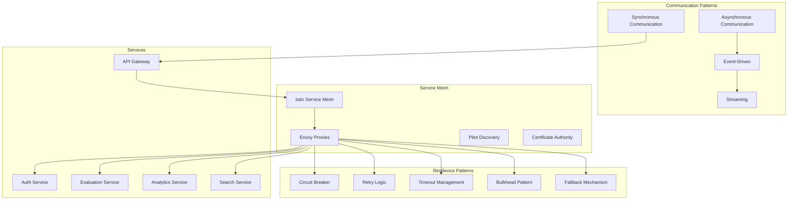

# Inter-Service Communication and Resilience Strategies

## Overview

This document defines the comprehensive inter-service communication patterns and resilience strategies for the Multimodal Enterprise RAG System microservices architecture. The design ensures reliable, performant, and fault-tolerant communication between services while supporting various interaction patterns.

## Communication Architecture



## Communication Patterns

### 1. Synchronous Communication

#### REST/HTTP APIs
**Use Cases:**
- Client-facing operations
- Request/response interactions
- Real-time data retrieval
- CRUD operations

**Implementation:**
```typescript
// Service-to-service HTTP client with resilience
interface ServiceClient {
  request<T>(config: RequestConfig): Promise<T>;
  get<T>(url: string, config?: RequestConfig): Promise<T>;
  post<T>(url: string, data?: any, config?: RequestConfig): Promise<T>;
  put<T>(url: string, data?: any, config?: RequestConfig): Promise<T>;
  delete<T>(url: string, config?: RequestConfig): Promise<T>;
}

class ResilientHttpClient implements ServiceClient {
  constructor(
    private baseUrl: string,
    private circuitBreaker: CircuitBreaker,
    private retryPolicy: RetryPolicy,
    private timeoutPolicy: TimeoutPolicy
  ) {}

  async request<T>(config: RequestConfig): Promise<T> {
    return this.circuitBreaker.execute(async () => {
      return this.retryPolicy.execute(async () => {
        return this.timeoutPolicy.execute(async () => {
          // Implement HTTP request logic
          return this.makeHttpRequest<T>(config);
        });
      });
    });
  }
}
```

#### gRPC
**Use Cases:**
- High-performance internal communication
- Streaming data transfer
- Type-safe service contracts
- Binary protocol efficiency

**Implementation:**
```protobuf
// evaluation_service.proto
syntax = "proto3";

package evaluation.v1;

service EvaluationService {
  rpc CalculateRAGMetrics(CalculateRAGMetricsRequest) returns (CalculateRAGMetricsResponse);
  rpc BatchCalculateMetrics(stream BatchCalculateRequest) returns (stream BatchCalculateResponse);
  rpc GetJobStatus(GetJobStatusRequest) returns (GetJobStatusResponse);
}

message CalculateRAGMetricsRequest {
  string query = 1;
  string answer = 2;
  repeated ContextDocument context = 3;
  EvaluationConfig config = 4;
  string organization_id = 5;
  string user_id = 6;
}

message CalculateRAGMetricsResponse {
  string evaluation_id = 1;
  RAGTriadMetrics metrics = 2;
  double overall_score = 3;
  int64 evaluation_time_ms = 4;
  google.protobuf.Timestamp timestamp = 5;
}
```

### 2. Asynchronous Communication

#### Message Queues
**Use Cases:**
- Decoupled service communication
- Load balancing and buffering
- Reliable message delivery
- Background job processing

**Implementation:**
```typescript
// Message broker client
interface MessageBroker {
  publish(topic: string, message: Message): Promise<void>;
  subscribe(topic: string, handler: MessageHandler): Promise<void>;
  createTopic(name: string, config: TopicConfig): Promise<void>;
  deleteTopic(name: string): Promise<void>;
}

class KafkaMessageBroker implements MessageBroker {
  private producer: Producer;
  private consumer: Consumer;

  async publish(topic: string, message: Message): Promise<void> {
    const kafkaMessage = {
      topic,
      messages: [{
        key: message.key,
        value: JSON.stringify(message.payload),
        headers: message.headers,
        timestamp: Date.now()
      }]
    };

    await this.producer.send(kafkaMessage);
  }

  async subscribe(topic: string, handler: MessageHandler): Promise<void> {
    await this.consumer.subscribe({ topic, fromBeginning: false });

    await this.consumer.run({
      eachMessage: async ({ topic, partition, message }) => {
        try {
          const msg: Message = {
            key: message.key?.toString(),
            payload: JSON.parse(message.value?.toString() || '{}'),
            headers: message.headers,
            timestamp: new Date(message.timestamp || Date.now())
          };

          await handler(msg);
        } catch (error) {
          logger.error(`Error processing message from ${topic}:`, error);
          // Implement dead letter queue logic
        }
      }
    });
  }
}
```

#### Event Sourcing
**Use Cases:**
- Audit logging and compliance
- State reconstruction
- Event replay capabilities
- Temporal queries

**Implementation:**
```typescript
// Event store interface
interface EventStore {
  appendEvent(streamId: string, event: Event): Promise<void>;
  getEvents(streamId: string, fromVersion?: number): Promise<Event[]>;
  getEventsByType(eventType: string, timeRange?: TimeRange): Promise<Event[]>;
  createSnapshot(streamId: string, state: any): Promise<void>;
  getSnapshot(streamId: string): Promise<Snapshot | null>;
}

// Event types
interface Event {
  id: string;
  type: string;
  streamId: string;
  streamVersion: number;
  data: any;
  metadata: Record<string, any>;
  timestamp: Date;
}

// Example events
interface EvaluationCompletedEvent extends Event {
  type: 'EvaluationCompleted';
  data: {
    evaluationId: string;
    userId: string;
    organizationId: string;
    metrics: RAGTriadMetrics;
    query: string;
    responseTime: number;
  };
}

interface QualityThresholdViolatedEvent extends Event {
  type: 'QualityThresholdViolated';
  data: {
    thresholdId: string;
    metricType: string;
    actualValue: number;
    expectedValue: number;
    severity: 'low' | 'medium' | 'high' | 'critical';
    organizationId: string;
  };
}
```

### 3. Streaming Communication

#### Real-time Data Streaming
**Use Cases:**
- Live analytics updates
- Real-time monitoring
- Progress tracking
- Event broadcasting

**Implementation:**
```typescript
// WebSocket manager for real-time updates
class WebSocketManager {
  private connections: Map<string, WebSocket> = new Map();
  private rooms: Map<string, Set<string>> = new Map();

  async handleConnection(ws: WebSocket, userId: string, organizationId: string): Promise<void> {
    this.connections.set(userId, ws);

    ws.on('message', async (data) => {
      try {
        const message = JSON.parse(data.toString());
        await this.handleMessage(userId, message);
      } catch (error) {
        logger.error(`Error handling WebSocket message:`, error);
      }
    });

    ws.on('close', () => {
      this.connections.delete(userId);
      this.leaveAllRooms(userId);
    });

    // Send welcome message
    ws.send(JSON.stringify({
      type: 'connected',
      data: { userId, organizationId }
    }));
  }

  async joinRoom(userId: string, room: string): Promise<void> {
    if (!this.rooms.has(room)) {
      this.rooms.set(room, new Set());
    }
    this.rooms.get(room)!.add(userId);
  }

  async leaveRoom(userId: string, room: string): Promise<void> {
    const roomUsers = this.rooms.get(room);
    if (roomUsers) {
      roomUsers.delete(userId);
      if (roomUsers.size === 0) {
        this.rooms.delete(room);
      }
    }
  }

  async broadcastToRoom(room: string, message: any): Promise<void> {
    const roomUsers = this.rooms.get(room);
    if (!roomUsers) return;

    const messageStr = JSON.stringify(message);

    for (const userId of roomUsers) {
      const ws = this.connections.get(userId);
      if (ws && ws.readyState === WebSocket.OPEN) {
        ws.send(messageStr);
      }
    }
  }
}
```

## Resilience Patterns

### 1. Circuit Breaker Pattern

#### Implementation
```typescript
enum CircuitBreakerState {
  CLOSED = 'CLOSED',
  OPEN = 'OPEN',
  HALF_OPEN = 'HALF_OPEN'
}

interface CircuitBreakerConfig {
  failureThreshold: number;
  recoveryTimeout: number;
  monitoringPeriod: number;
  expectedRecoveryTime: number;
}

class CircuitBreaker {
  private state: CircuitBreakerState = CircuitBreakerState.CLOSED;
  private failureCount: number = 0;
  private lastFailureTime: number = 0;
  private successCount: number = 0;

  constructor(private config: CircuitBreakerConfig) {}

  async execute<T>(operation: () => Promise<T>): Promise<T> {
    if (this.state === CircuitBreakerState.OPEN) {
      if (this.shouldAttemptReset()) {
        this.state = CircuitBreakerState.HALF_OPEN;
        this.successCount = 0;
      } else {
        throw new CircuitBreakerOpenError('Circuit breaker is OPEN');
      }
    }

    try {
      const result = await operation();
      this.onSuccess();
      return result;
    } catch (error) {
      this.onFailure();
      throw error;
    }
  }

  private onSuccess(): void {
    this.failureCount = 0;

    if (this.state === CircuitBreakerState.HALF_OPEN) {
      this.successCount++;
      if (this.successCount >= this.config.expectedRecoveryTime) {
        this.state = CircuitBreakerState.CLOSED;
      }
    }
  }

  private onFailure(): void {
    this.failureCount++;
    this.lastFailureTime = Date.now();

    if (this.failureCount >= this.config.failureThreshold) {
      this.state = CircuitBreakerState.OPEN;
    }
  }

  private shouldAttemptReset(): boolean {
    return Date.now() - this.lastFailureTime >= this.config.recoveryTimeout;
  }

  getState(): CircuitBreakerState {
    return this.state;
  }
}
```

### 2. Retry Pattern

#### Implementation
```typescript
interface RetryConfig {
  maxAttempts: number;
  baseDelay: number;
  maxDelay: number;
  backoffMultiplier: number;
  retryableErrors: string[];
}

class RetryPolicy {
  constructor(private config: RetryConfig) {}

  async execute<T>(operation: () => Promise<T>): Promise<T> {
    let lastError: Error;

    for (let attempt = 1; attempt <= this.config.maxAttempts; attempt++) {
      try {
        return await operation();
      } catch (error) {
        lastError = error as Error;

        if (attempt === this.config.maxAttempts) {
          break;
        }

        if (!this.isRetryableError(error)) {
          break;
        }

        const delay = this.calculateDelay(attempt);
        await this.sleep(delay);
      }
    }

    throw lastError!;
  }

  private isRetryableError(error: Error): boolean {
    if (error instanceof NetworkError) {
      return true;
    }

    if (error instanceof HttpError) {
      return this.config.retryableErrors.includes(error.status.toString());
    }

    return false;
  }

  private calculateDelay(attempt: number): number {
    const delay = this.config.baseDelay * Math.pow(this.config.backoffMultiplier, attempt - 1);
    return Math.min(delay, this.config.maxDelay);
  }

  private sleep(ms: number): Promise<void> {
    return new Promise(resolve => setTimeout(resolve, ms));
  }
}
```

### 3. Timeout Pattern

#### Implementation
```typescript
interface TimeoutConfig {
  timeout: number;
  onTimeout?: () => void;
}

class TimeoutPolicy {
  constructor(private config: TimeoutConfig) {}

  async execute<T>(operation: () => Promise<T>): Promise<T> {
    return Promise.race([
      operation(),
      this.createTimeoutPromise()
    ]);
  }

  private createTimeoutPromise<T>(): Promise<T> {
    return new Promise((_, reject) => {
      setTimeout(() => {
        if (this.config.onTimeout) {
          this.config.onTimeout();
        }
        reject(new TimeoutError(`Operation timed out after ${this.config.timeout}ms`));
      }, this.config.timeout);
    });
  }
}
```

### 4. Bulkhead Pattern

#### Implementation
```typescript
interface BulkheadConfig {
  maxConcurrent: number;
  maxQueueSize: number;
}

class Bulkhead {
  private running = 0;
  private queue: Array<{
    resolve: (value: any) => void;
    reject: (reason: any) => void;
    operation: () => Promise<any>;
  }> = [];

  constructor(private config: BulkheadConfig) {}

  async execute<T>(operation: () => Promise<T>): Promise<T> {
    return new Promise((resolve, reject) => {
      if (this.running < this.config.maxConcurrent) {
        this.executeNow(operation, resolve, reject);
      } else if (this.queue.length < this.config.maxQueueSize) {
        this.queue.push({ resolve, reject, operation });
      } else {
        reject(new BulkheadFullError('Bulkhead queue is full'));
      }
    });
  }

  private async executeNow<T>(
    operation: () => Promise<T>,
    resolve: (value: T) => void,
    reject: (reason: any) => void
  ): Promise<void> {
    this.running++;

    try {
      const result = await operation();
      resolve(result);
    } catch (error) {
      reject(error);
    } finally {
      this.running--;
      this.processQueue();
    }
  }

  private processQueue(): void {
    if (this.queue.length === 0 || this.running >= this.config.maxConcurrent) {
      return;
    }

    const { resolve, reject, operation } = this.queue.shift()!;
    this.executeNow(operation, resolve, reject);
  }
}
```

### 5. Fallback Pattern

#### Implementation
```typescript
interface FallbackConfig<T> {
  fallback: (error: Error) => T | Promise<T>;
  fallbackCondition?: (error: Error) => boolean;
}

class FallbackPolicy<T> {
  constructor(private config: FallbackConfig<T>) {}

  async execute(operation: () => Promise<T>): Promise<T> {
    try {
      return await operation();
    } catch (error) {
      if (this.config.fallbackCondition && !this.config.fallbackCondition(error as Error)) {
        throw error;
      }

      try {
        return await this.config.fallback(error as Error);
      } catch (fallbackError) {
        throw new FallbackFailedError('Both operation and fallback failed', {
          originalError: error,
          fallbackError
        });
      }
    }
  }
}
```

## Service Discovery

### Service Registry
```typescript
interface ServiceRegistry {
  register(service: ServiceRegistration): Promise<void>;
  deregister(serviceId: string): Promise<void>;
  discover(serviceName: string): Promise<ServiceInstance[]>;
  watch(serviceName: string, callback: (instances: ServiceInstance[]) => void): void;
}

interface ServiceRegistration {
  id: string;
  name: string;
  address: string;
  port: number;
  tags: string[];
  metadata: Record<string, string>;
  healthCheck: HealthCheck;
}

interface ServiceInstance {
  id: string;
  name: string;
  address: string;
  port: number;
  tags: string[];
  metadata: Record<string, string>;
  healthy: boolean;
}

class ConsulServiceRegistry implements ServiceRegistry {
  constructor(private consulClient: any) {}

  async register(service: ServiceRegistration): Promise<void> {
    await this.consulClient.agent.service.register({
      id: service.id,
      name: service.name,
      address: service.address,
      port: service.port,
      tags: service.tags,
      meta: service.metadata,
      check: {
        http: `http://${service.address}:${service.port}${service.healthCheck.path}`,
        interval: service.healthCheck.interval,
        timeout: service.healthCheck.timeout
      }
    });
  }

  async discover(serviceName: string): Promise<ServiceInstance[]> {
    const services = await this.consulClient.health.service({
      service: serviceName,
      passing: true
    });

    return services.map((service: any) => ({
      id: service.Service.ID,
      name: service.Service.Service,
      address: service.Service.Address,
      port: service.Service.Port,
      tags: service.Service.Tags || [],
      metadata: service.Service.Meta || {},
      healthy: service.Checks.every((check: any) => check.Status === 'passing')
    }));
  }
}
```

### Load Balancing
```typescript
interface LoadBalancer {
  selectInstance(instances: ServiceInstance[]): ServiceInstance | null;
}

class RoundRobinLoadBalancer implements LoadBalancer {
  private currentIndex = 0;

  selectInstance(instances: ServiceInstance[]): ServiceInstance | null {
    if (instances.length === 0) {
      return null;
    }

    const instance = instances[this.currentIndex % instances.length];
    this.currentIndex++;
    return instance;
  }
}

class WeightedRoundRobinLoadBalancer implements LoadBalancer {
  private currentIndex = 0;
  private currentWeight = 0;

  selectInstance(instances: ServiceInstance[]): ServiceInstance | null {
    if (instances.length === 0) {
      return null;
    }

    // Calculate weights based on metadata or custom logic
    const weights = instances.map(instance =>
      parseInt(instance.metadata.weight || '1')
    );

    const totalWeight = weights.reduce((sum, weight) => sum + weight, 0);

    if (totalWeight === 0) {
      return instances[0];
    }

    while (true) {
      this.currentIndex = (this.currentIndex + 1) % instances.length;

      if (this.currentIndex === 0) {
        this.currentWeight = this.currentWeight - Math.floor(this.currentWeight / totalWeight) * totalWeight;
        if (this.currentWeight <= 0) {
          this.currentWeight = Math.max(...weights);
          if (this.currentWeight === 0) {
            return instances[0];
          }
        }
      }

      this.currentWeight -= weights[this.currentIndex];
      if (this.currentWeight <= 0) {
        return instances[this.currentIndex];
      }
    }
  }
}
```

## Configuration Management

### Service Configuration
```yaml
# service-communication.yml
communication:
  http:
    timeout: 30s
    retry:
      maxAttempts: 3
      baseDelay: 100ms
      maxDelay: 5s
      backoffMultiplier: 2
    circuitBreaker:
      failureThreshold: 5
      recoveryTimeout: 60s
      monitoringPeriod: 10s
    bulkhead:
      maxConcurrent: 100
      maxQueueSize: 500

  grpc:
    timeout: 30s
    retry:
      maxAttempts: 3
      baseDelay: 100ms
      maxDelay: 5s
    keepalive:
      time: 30s
      timeout: 5s
      permitWithoutStream: true

  messaging:
    kafka:
      bootstrapServers: ["kafka-1:9092", "kafka-2:9092", "kafka-3:9092"]
      producer:
        batchSize: 16384
        lingerMs: 5
        compressionType: gzip
        acks: all
        retries: 3
      consumer:
        groupId: "evaluation-service"
        autoOffsetReset: earliest
        enableAutoCommit: false
        sessionTimeoutMs: 30000
        heartbeatIntervalMs: 3000

  websockets:
    heartbeatInterval: 30s
    maxConnections: 10000
    messageQueueSize: 1000

serviceDiscovery:
  type: consul
  consul:
    address: "consul:8500"
    healthCheck:
      interval: 10s
      timeout: 5s
      deregisterCriticalServiceAfter: 30s

resilience:
  timeouts:
    default: 30s
    evaluation: 60s
    analytics: 45s
    search: 10s

  rateLimiting:
    default:
      requestsPerSecond: 100
      burst: 200
    evaluation:
      requestsPerSecond: 50
      burst: 100
    analytics:
      requestsPerSecond: 200
      burst: 400
```

## Monitoring and Observability

### Communication Metrics
```typescript
interface CommunicationMetrics {
  requestCount: Counter;
  requestDuration: Histogram;
  errorCount: Counter;
  circuitBreakerState: Gauge;
  retryCount: Counter;
  timeoutCount: Counter;
}

class CommunicationMonitor {
  constructor(private metrics: CommunicationMetrics) {}

  recordRequest(serviceName: string, method: string, duration: number, success: boolean): void {
    this.metrics.requestCount.inc({
      service: serviceName,
      method: method,
      status: success ? 'success' : 'error'
    });

    this.metrics.requestDuration.observe({
      service: serviceName,
      method: method
    }, duration);

    if (!success) {
      this.metrics.errorCount.inc({
        service: serviceName,
        method: method
      });
    }
  }

  recordCircuitBreakerState(serviceName: string, state: string): void {
    this.metrics.circuitBreakerState.set({
      service: serviceName
    }, state === 'CLOSED' ? 1 : 0);
  }

  recordRetry(serviceName: string, attempt: number): void {
    this.metrics.retryCount.inc({
      service: serviceName,
      attempt: attempt.toString()
    });
  }

  recordTimeout(serviceName: string): void {
    this.metrics.timeoutCount.inc({
      service: serviceName
    });
  }
}
```

## Testing Strategy

### Unit Testing
```typescript
describe('ResilientHttpClient', () => {
  let httpClient: ResilientHttpClient;
  let mockCircuitBreaker: jest.Mocked<CircuitBreaker>;
  let mockRetryPolicy: jest.Mocked<RetryPolicy>;
  let mockTimeoutPolicy: jest.Mocked<TimeoutPolicy>;

  beforeEach(() => {
    mockCircuitBreaker = {
      execute: jest.fn()
    } as any;

    mockRetryPolicy = {
      execute: jest.fn()
    } as any;

    mockTimeoutPolicy = {
      execute: jest.fn()
    } as any;

    httpClient = new ResilientHttpClient(
      'http://test-service',
      mockCircuitBreaker,
      mockRetryPolicy,
      mockTimeoutPolicy
    );
  });

  it('should execute request with all resilience policies', async () => {
    const expectedResponse = { data: 'test' };
    mockTimeoutPolicy.execute.mockResolvedValue(expectedResponse);
    mockRetryPolicy.execute.mockImplementation((fn) => fn());
    mockCircuitBreaker.execute.mockImplementation((fn) => fn());

    const result = await httpClient.get('/test');

    expect(result).toEqual(expectedResponse);
    expect(mockTimeoutPolicy.execute).toHaveBeenCalled();
    expect(mockRetryPolicy.execute).toHaveBeenCalled();
    expect(mockCircuitBreaker.execute).toHaveBeenCalled();
  });

  it('should handle circuit breaker open state', async () => {
    mockCircuitBreaker.execute.mockRejectedValue(new CircuitBreakerOpenError());

    await expect(httpClient.get('/test')).rejects.toThrow(CircuitBreakerOpenError);
  });
});
```

### Integration Testing
```typescript
describe('Service Communication Integration', () => {
  let testContainer: Docker.Container;
  let serviceClient: ResilientHttpClient;

  beforeAll(async () => {
    // Start test dependencies
    testContainer = await startTestService();

    serviceClient = new ResilientHttpClient(
      `http://localhost:${testContainer.getMappedPort(8080)}`,
      new CircuitBreaker({
        failureThreshold: 3,
        recoveryTimeout: 5000,
        monitoringPeriod: 1000,
        expectedRecoveryTime: 2
      }),
      new RetryPolicy({
        maxAttempts: 3,
        baseDelay: 100,
        maxDelay: 1000,
        backoffMultiplier: 2,
        retryableErrors: ['500', '502', '503', '504']
      }),
      new TimeoutPolicy({
        timeout: 5000
      })
    );
  });

  afterAll(async () => {
    await testContainer.stop();
  });

  it('should handle service failures gracefully', async () => {
    // Simulate service failure
    await stopTestService();

    // Should fail after retries and circuit breaker should open
    await expect(serviceClient.get('/health')).rejects.toThrow();

    // Verify circuit breaker is open
    await expect(serviceClient.get('/health')).rejects.toThrow(CircuitBreakerOpenError);
  });

  it('should recover when service comes back online', async () => {
    // Wait for circuit breaker timeout
    await new Promise(resolve => setTimeout(resolve, 6000));

    // Start service again
    await startTestService();

    // Should succeed on first attempt
    const result = await serviceClient.get('/health');
    expect(result).toBeDefined();
  });
});
```

## Best Practices

### Performance Optimization
1. **Connection Pooling**: Reuse HTTP connections
2. **Request Batching**: Batch multiple requests when possible
3. **Compression**: Enable gzip compression for large payloads
4. **Caching**: Cache frequently accessed data
5. **Lazy Loading**: Load data only when needed

### Security Considerations
1. **Mutual TLS**: Encrypt all service-to-service communication
2. **Service Identity**: Use service accounts for authentication
3. **Network Policies**: Implement Kubernetes network policies
4. **API Security**: Validate all inputs and outputs
5. **Secrets Management**: Use centralized secret management

### Reliability Considerations
1. **Idempotency**: Design operations to be idempotent
2. **Transactional Outbox**: Ensure reliable event publishing
3. **Dead Letter Queues**: Handle failed message processing
4. **Graceful Degradation**: Provide fallback functionality
5. **Health Checks**: Implement comprehensive health checks

This comprehensive inter-service communication and resilience strategy ensures that the Multimodal Enterprise RAG System can handle failures gracefully, maintain high availability, and provide consistent performance under varying load conditions.