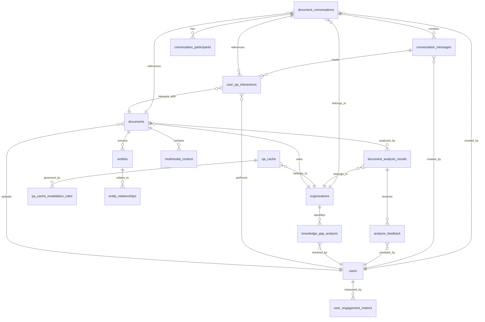

# AI-Powered Document Analysis and Q&A System - Database Design

## Overview

This document describes the comprehensive database schema design for an AI-Powered Document Analysis and Q&A System that seamlessly integrates with the existing RAG system. The design focuses on performance optimization, scalability, and maintaining data integrity while supporting complex conversational AI interactions.

## Entity Relationship Diagram



## Core Tables Description

### 1. Document Q&A Conversation System

#### `document_conversations`
**Purpose**: Manages conversation threads for document-specific Q&A sessions.

**Key Features**:
- Support for multiple conversation types (document_qa, analysis_session, collaborative_discussion)
- AI model configuration per conversation
- Conversation context and scope management
- Participant management with role-based access
- Support for moderated and public conversations

**Performance Optimizations**:
- Composite unique constraint on document_id, title, and created_by_user_id
- Indexes on document_id, organization_id, status, and timestamps
- Row-level security for multi-tenant isolation

#### `conversation_messages`
**Purpose**: Stores individual messages within conversations with rich metadata.

**Key Features**:
- Support for multiple message types (question, answer, clarification, feedback)
- Content type support (text, markdown, HTML)
- Document section and entity references
- AI processing metadata (confidence, processing time)
- User feedback and quality ratings

**Performance Optimizations**:
- Sequential message ordering with unique constraints
- Full-text search indexes on content
- Specialized indexes for message types and confidence scores
- GIN indexes for JSONB fields (referenced sections, entities)

#### `conversation_participants`
**Purpose**: Manages conversation participants with role-based permissions.

**Key Features**:
- Multiple participant roles (owner, moderator, participant, AI_assistant)
- Activity tracking and status management
- Notification and display preferences
- Join/leave timestamps and activity tracking

### 2. AI Analysis Results Storage

#### `document_analysis_results`
**Purpose**: Stores comprehensive AI analysis results for documents.

**Key Features**:
- Multiple analysis types (summary, sentiment, entities, classification)
- Quality metrics (confidence, quality, completeness scores)
- Processing metadata and computational cost tracking
- Validation and verification workflow
- Version control for analysis algorithms

**Performance Optimizations**:
- Unique constraints on document_id, analysis_type, and version
- GIN indexes on JSONB results field
- Time-based indexes for expiration management
- Specialized indexes on quality and confidence metrics

#### `analysis_feedback`
**Purpose**: Tracks user feedback on AI analysis results for continuous improvement.

**Key Features**:
- Multiple feedback types (ratings, corrections, suggestions)
- Structured feedback with corrected data
- Processing workflow for feedback incorporation
- Impact assessment metrics

### 3. Q&A Caching System

#### `qa_cache`
**Purpose**: High-performance caching system for question-answer pairs.

**Key Features**:
- Question normalization and hash-based lookup
- Context-aware caching with document associations
- Multi-dimensional quality metrics
- Usage statistics and performance tracking
- Sophisticated invalidation rules

**Performance Optimizations**:
- SHA-256 hash indexing for O(1) cache lookups
- GIN indexes on context arrays and full-text search
- Time-based indexes for cache expiration
- Hit-count based performance monitoring

#### `qa_cache_invalidation_rules`
**Purpose**: Manages cache invalidation logic and triggers.

**Key Features**:
- Multiple rule types (document changes, time-based, quality thresholds)
- Flexible condition specification with JSONB
- Scope-based rule application
- Rule execution tracking and metrics

### 4. User Interaction Tracking

#### `user_qa_interactions`
**Purpose**: Comprehensive tracking of user interactions with the Q&A system.

**Key Features**:
- Detailed interaction type taxonomy
- Context-aware interaction tracking
- Performance metrics collection
- Client environment capture
- Geographic and temporal context

#### `user_engagement_metrics`
**Purpose**: Aggregated user engagement metrics for analytics.

**Key Features**:
- Time-based aggregation (daily, weekly, monthly, etc.)
- Comprehensive engagement KPIs
- Performance and quality metrics
- Custom metrics support via JSONB

#### `knowledge_gap_analysis`
**Purpose**: Identification and tracking of knowledge gaps.

**Key Features**:
- Multiple gap type classifications
- Impact severity assessment
- Resolution workflow tracking
- Evidence-based gap identification

## Materialized Views for Analytics

### 1. `conversation_summary`
**Purpose**: Provides real-time conversation analytics with latest activity.

**Key Metrics**:
- Message counts by type
- Response quality metrics
- Activity level classification
- Participant information

### 2. `qa_cache_performance`
**Purpose**: Monitors cache effectiveness and performance.

**Key Metrics**:
- Hit rates and cache efficiency
- Quality distribution
- Staleness tracking
- Performance benchmarks

### 3. `user_engagement_dashboard`
**Purpose**: Comprehensive user engagement analytics.

**Key Metrics**:
- Q&A participation metrics
- Conversation ownership
- Document interactions
- Activity timelines

## Indexing Strategy

### Primary Indexes

1. **Conversation Lookup Optimization**
   ```sql
   idx_document_conversations_document_id
   idx_document_conversations_organization_id
   idx_document_conversations_status
   idx_document_conversations_last_activity
   ```

2. **Message Retrieval Optimization**
   ```sql
   idx_conversation_messages_conversation_id
   idx_conversation_messages_sequence
   idx_conversation_messages_type
   idx_conversation_messages_content (full-text)
   ```

3. **Cache Performance Optimization**
   ```sql
   idx_qa_cache_hash (unique)
   idx_qa_cache_normalized_question (full-text)
   idx_qa_cache_context_docs (GIN)
   idx_qa_cache_hit_count (descending)
   ```

### Specialized Indexes

1. **JSONB Field Indexes**
   - GIN indexes on analysis results
   - Array indexes on document contexts
   - Composite indexes on multi-dimensional data

2. **Time-Based Indexes**
   - Partition-friendly timestamp indexes
   - Expiration management indexes
   - Activity timeline indexes

3. **Quality Metric Indexes**
   - Confidence score indexes
   - User rating indexes
   - Performance benchmark indexes

## Data Access Patterns

### 1. Conversation Retrieval Pattern
```sql
-- Get user conversations with latest activity
SELECT cs.* FROM conversation_summary cs
WHERE cs.created_by_user_id = $user_id
AND cs.organization_id = $org_id
ORDER BY cs.last_activity_at DESC
LIMIT 20;
```

### 2. Q&A Cache Lookup Pattern
```sql
-- High-performance cache lookup
SELECT * FROM get_or_create_cached_answer(
    normalized_question,
    original_question,
    context_document_ids,
    organization_id,
    user_id
);
```

### 3. Analytics Query Pattern
```sql
-- User engagement metrics with efficient aggregation
SELECT * FROM user_engagement_dashboard
WHERE organization_id = $org_id
AND last_interaction >= $start_date
ORDER BY satisfaction_score DESC;
```

### 4. Knowledge Gap Analysis Pattern
```sql
-- Identify systematic knowledge gaps
SELECT * FROM identify_knowledge_gaps(
    organization_id,
    analysis_period_days
) ORDER BY frequency DESC, impact_severity DESC;
```

## Performance Considerations

### 1. Partitioning Strategy
- **Time-based partitioning** for user_qa_interactions (monthly)
- **Organization-based partitioning** for large-scale deployments
- **Cache partitioning** by hash buckets for horizontal scaling

### 2. Caching Strategy
- **Materialized views** for analytics queries
- **Application-level caching** for frequently accessed conversations
- **Cache warming** for popular question patterns

### 3. Query Optimization
- **Prepared statements** for parameterized queries
- **Query result pagination** with keyset pagination
- **Batch operations** for bulk data processing

## Integration with Existing RAG System

### 1. Document Integration
- Seamless reference to existing documents table
- Maintains document processing status compatibility
- Preserves existing document access control

### 2. Entity Relationship Integration
- References existing entities and entity relationships
- Maintains knowledge graph compatibility
- Supports multimodal content analysis

### 3. User and Organization Integration
- Leverages existing user management
- Maintains organization-based multi-tenancy
- Preserves existing authentication and authorization

### 4. Real-time Processing Integration
- Compatible with existing WebSocket infrastructure
- Supports real-time conversation updates
- Integrates with existing notification systems

## Scaling Considerations

### 1. Vertical Scaling
- **Memory optimization** for large conversation histories
- **Connection pooling** for high concurrent access
- **Read replicas** for analytics queries

### 2. Horizontal Scaling
- **Database sharding** by organization for multi-tenant isolation
- **Cache distribution** across multiple nodes
- **Message queue integration** for async processing

### 3. Data Lifecycle Management
- **Automatic archiving** for inactive conversations
- **Cache cleanup** for expired entries
- **Data retention policies** for compliance

## Security Considerations

### 1. Data Isolation
- **Row-level security** for multi-tenant data separation
- **Column-level encryption** for sensitive conversation content
- **Access control** based on user roles and conversation participation

### 2. Privacy Protection
- **PII detection** and anonymization
- **GDPR compliance** with right to be forgotten
- **Audit logging** for data access and modifications

### 3. Input Validation
- **SQL injection prevention** with parameterized queries
- **XSS protection** for conversation content
- **Content sanitization** for user-generated content

## Monitoring and Maintenance

### 1. Performance Monitoring
- **Query performance tracking** with pg_stat_statements
- **Index usage monitoring** for optimization
- **Cache hit rate monitoring** for effectiveness

### 2. Data Quality Monitoring
- **Conversation quality metrics** tracking
- **AI analysis accuracy** monitoring
- **User satisfaction** trends

### 3. Automated Maintenance
- **Materialized view refresh scheduling**
- **Cache cleanup automation**
- **Statistics collection** for query optimization

## Migration Strategy

### 1. Phased Deployment
1. **Schema creation** with minimal impact
2. **Data migration** from existing systems
3. **Application integration** with backward compatibility
4. **Feature rollout** with gradual adoption

### 2. Rollback Procedures
- **Schema rollback** scripts for emergency recovery
- **Data backup** procedures before migration
- **Application rollback** capabilities

### 3. Testing Strategy
- **Performance benchmarking** before and after migration
- **Load testing** for high-traffic scenarios
- **Data integrity validation** post-migration

This comprehensive database design provides a robust foundation for an AI-powered document analysis and Q&A system that scales efficiently while maintaining high performance and data integrity.