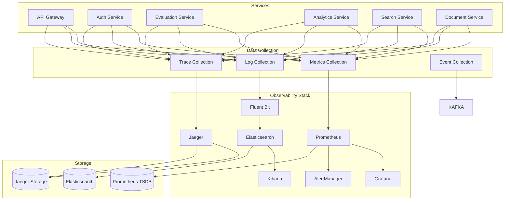

# Observability Framework

## Overview

This document defines the comprehensive observability framework for the Multimodal Enterprise RAG System microservices architecture. The design implements structured logging, comprehensive metrics collection, and distributed tracing to provide deep insights into system behavior, performance, and reliability.

## Observability Architecture



## 1. Structured Logging

### Logging Architecture

#### Log Format Standard
```typescript
interface StructuredLog {
  timestamp: string; // ISO 8601 format
  level: LogLevel;
  service: string;
  version: string;
  environment: string;
  traceId?: string;
  spanId?: string;
  userId?: string;
  organizationId?: string;
  requestId?: string;
  sessionId?: string;
  message: string;
  data?: Record<string, any>;
  error?: ErrorDetails;
  tags?: string[];
  duration?: number; // in milliseconds
  component: string;
}

enum LogLevel {
  DEBUG = 'debug',
  INFO = 'info',
  WARN = 'warn',
  ERROR = 'error',
  FATAL = 'fatal'
}

interface ErrorDetails {
  name: string;
  message: string;
  stack?: string;
  code?: string;
  context?: Record<string, any>;
}
```

#### Logger Implementation
```typescript
class StructuredLogger {
  constructor(
    private serviceName: string,
    private serviceVersion: string,
    private environment: string,
    private output: LogOutput
  ) {}

  debug(message: string, data?: any, context?: LogContext): void {
    this.log(LogLevel.DEBUG, message, data, context);
  }

  info(message: string, data?: any, context?: LogContext): void {
    this.log(LogLevel.INFO, message, data, context);
  }

  warn(message: string, data?: any, context?: LogContext): void {
    this.log(LogLevel.WARN, message, data, context);
  }

  error(message: string, error?: Error, data?: any, context?: LogContext): void {
    const errorDetails = error ? this.formatError(error) : undefined;
    this.log(LogLevel.ERROR, message, data, context, errorDetails);
  }

  fatal(message: string, error?: Error, data?: any, context?: LogContext): void {
    const errorDetails = error ? this.formatError(error) : undefined;
    this.log(LogLevel.FATAL, message, data, context, errorDetails);
  }

  private log(
    level: LogLevel,
    message: string,
    data?: any,
    context?: LogContext,
    error?: ErrorDetails
  ): void {
    const logEntry: StructuredLog = {
      timestamp: new Date().toISOString(),
      level,
      service: this.serviceName,
      version: this.serviceVersion,
      environment: this.environment,
      message,
      component: context?.component || 'unknown',
      data,
      error,
      traceId: context?.traceId,
      spanId: context?.spanId,
      userId: context?.userId,
      organizationId: context?.organizationId,
      requestId: context?.requestId,
      sessionId: context?.sessionId,
      duration: context?.duration,
      tags: context?.tags
    };

    this.output.write(logEntry);
  }

  private formatError(error: Error): ErrorDetails {
    return {
      name: error.name,
      message: error.message,
      stack: error.stack,
      code: (error as any).code,
      context: (error as any).context
    };
  }
}

interface LogContext {
  traceId?: string;
  spanId?: string;
  userId?: string;
  organizationId?: string;
  requestId?: string;
  sessionId?: string;
  component?: string;
  duration?: number;
  tags?: string[];
}

interface LogOutput {
  write(logEntry: StructuredLog): void;
}

class ConsoleLogOutput implements LogOutput {
  write(logEntry: StructuredLog): void {
    console.log(JSON.stringify(logEntry));
  }
}

class FluentBitLogOutput implements LogOutput {
  constructor(private fluentBitEndpoint: string) {}

  write(logEntry: StructuredLog): void {
    // Send to Fluent Bit via HTTP or TCP
    this.sendToFluentBit(logEntry);
  }

  private async sendToFluentBit(logEntry: StructuredLog): Promise<void> {
    // Implementation for sending logs to Fluent Bit
  }
}
```

#### Middleware Integration
```typescript
interface RequestLoggingMiddleware {
  handle(request: Request, response: Response, next: NextFunction): void;
}

class RequestLoggingMiddleware implements RequestLoggingMiddleware {
  constructor(private logger: StructuredLogger) {}

  handle(request: Request, response: Response, next: NextFunction): void {
    const startTime = Date.now();
    const requestId = this.generateRequestId();

    // Add request context to logger
    const context: LogContext = {
      requestId,
      traceId: request.headers['x-trace-id'] as string,
      userId: request.user?.id,
      organizationId: request.user?.organizationId,
      sessionId: request.headers['x-session-id'] as string
    };

    // Log request start
    this.logger.info('Request started', {
      method: request.method,
      url: request.url,
      userAgent: request.headers['user-agent'],
      ip: request.ip
    }, context);

    // Intercept response
    const originalSend = response.send;
    response.send = function(body) {
      const duration = Date.now() - startTime;
      context.duration = duration;

      // Log request completion
      this.logger.info('Request completed', {
        method: request.method,
        url: request.url,
        statusCode: response.statusCode,
        duration: duration
      }, context);

      return originalSend.call(this, body);
    }.bind(this);

    next();
  }

  private generateRequestId(): string {
    return crypto.randomUUID();
  }
}
```

### Log Configuration
```yaml
# logging-config.yml
logging:
  level: info
  format: json
  outputs:
    - type: console
      enabled: true
    - type: fluent-bit
      enabled: true
      endpoint: http://fluent-bit:24224
      tag: multimodal-rag

  formatters:
    json:
      prettyPrint: false
      includeStack: true
    console:
      colors: true
      timestampFormat: 'YYYY-MM-DD HH:mm:ss.SSS'

  loggers:
    root:
      level: info
      handlers: [console, fluent-bit]

    http:
      level: debug
      handlers: [console, fluent-bit]

    security:
      level: warn
      handlers: [console, fluent-bit]

    performance:
      level: info
      handlers: [console, fluent-bit]

  filters:
    sensitiveData:
      enabled: true
      fields:
        - password
        - token
        - apiKey
        - secret
        - creditCard
      replacement: '[REDACTED]'

    rateLimit:
      enabled: true
      maxLogsPerSecond: 1000
      burstSize: 100

  structured:
    include:
      - timestamp
      - level
      - service
      - version
      - environment
      - traceId
      - spanId
      - userId
      - organizationId
      - requestId
      - duration
    customFields:
      - component
      - operation
      - source
```

## 2. Metrics Collection

### Prometheus Metrics

#### Metrics Types
```typescript
// Counter metrics
interface CounterMetric {
  name: string;
  help: string;
  labels?: string[];
}

// Histogram metrics
interface HistogramMetric {
  name: string;
  help: string;
  labels?: string[];
  buckets?: number[];
}

// Gauge metrics
interface GaugeMetric {
  name: string;
  help: string;
  labels?: string[];
}

// Summary metrics
interface SummaryMetric {
  name: string;
  help: string;
  labels?: string[];
  percentiles?: number[];
  ageBuckets?: number;
  maxAgeSeconds?: number;
}

class PrometheusMetricsRegistry {
  private counters = new Map<string, Counter>();
  private histograms = new Map<string, Histogram>();
  private gauges = new Map<string, Gauge>();
  private summaries = new Map<string, Summary>();

  registerCounter(config: CounterMetric): Counter {
    const counter = new promClient.Counter({
      name: config.name,
      help: config.help,
      labelNames: config.labels || []
    });

    this.counters.set(config.name, counter);
    return counter;
  }

  registerHistogram(config: HistogramMetric): Histogram {
    const histogram = new promClient.Histogram({
      name: config.name,
      help: config.help,
      labelNames: config.labels || [],
      buckets: config.buckets || [0.1, 0.5, 1, 2, 5, 10, 30, 60, 120, 300]
    });

    this.histograms.set(config.name, histogram);
    return histogram;
  }

  registerGauge(config: GaugeMetric): Gauge {
    const gauge = new promClient.Gauge({
      name: config.name,
      help: config.help,
      labelNames: config.labels || []
    });

    this.gauges.set(config.name, gauge);
    return gauge;
  }

  registerSummary(config: SummaryMetric): Summary {
    const summary = new promClient.Summary({
      name: config.name,
      help: config.help,
      labelNames: config.labels || [],
      percentiles: config.percentiles || [0.5, 0.9, 0.95, 0.99],
      ageBuckets: config.ageBuckets || 10,
      maxAgeSeconds: config.maxAgeSeconds || 600
    });

    this.summaries.set(config.name, summary);
    return summary;
  }

  getMetrics(): string {
    return promClient.register.metrics();
  }
}
```

#### Service Metrics Definition
```typescript
class ServiceMetrics {
  // HTTP metrics
  httpRequestsTotal: Counter<string>;
  httpRequestDuration: Histogram<string>;
  httpRequestSize: Histogram<string>;
  httpResponseSize: Histogram<string>;

  // Business metrics
  evaluationsTotal: Counter<string>;
  evaluationDuration: Histogram<string>;
  evaluationQualityScore: Histogram<string>;

  // System metrics
  activeConnections: Gauge<string>;
  cacheHitRate: Gauge<string>;
  databaseConnections: Gauge<string>;

  // Error metrics
  errorsTotal: Counter<string>;
  errorRate: Gauge<string>;

  constructor(private registry: PrometheusMetricsRegistry) {
    this.initializeMetrics();
  }

  private initializeMetrics(): void {
    // HTTP metrics
    this.httpRequestsTotal = this.registry.registerCounter({
      name: 'http_requests_total',
      help: 'Total number of HTTP requests',
      labels: ['method', 'route', 'status_code', 'service']
    });

    this.httpRequestDuration = this.registry.registerHistogram({
      name: 'http_request_duration_seconds',
      help: 'HTTP request duration in seconds',
      labels: ['method', 'route', 'service'],
      buckets: [0.005, 0.01, 0.025, 0.05, 0.1, 0.25, 0.5, 1, 2.5, 5, 10]
    });

    // Business metrics
    this.evaluationsTotal = this.registry.registerCounter({
      name: 'evaluations_total',
      help: 'Total number of RAG evaluations',
      labels: ['organization_id', 'user_id', 'evaluation_type']
    });

    this.evaluationDuration = this.registry.registerHistogram({
      name: 'evaluation_duration_seconds',
      help: 'RAG evaluation duration in seconds',
      labels: ['organization_id', 'evaluation_type'],
      buckets: [0.1, 0.5, 1, 2, 5, 10, 30, 60, 120, 300]
    });

    this.evaluationQualityScore = this.registry.registerHistogram({
      name: 'evaluation_quality_score',
      help: 'RAG evaluation quality scores',
      labels: ['organization_id', 'metric_type'],
      buckets: [0.1, 0.2, 0.3, 0.4, 0.5, 0.6, 0.7, 0.8, 0.9, 1.0]
    });

    // System metrics
    this.activeConnections = this.registry.registerGauge({
      name: 'active_connections',
      help: 'Number of active connections',
      labels: ['connection_type']
    });

    this.cacheHitRate = this.registry.registerGauge({
      name: 'cache_hit_rate',
      help: 'Cache hit rate percentage',
      labels: ['cache_type', 'service']
    });

    // Error metrics
    this.errorsTotal = this.registry.registerCounter({
      name: 'errors_total',
      help: 'Total number of errors',
      labels: ['service', 'error_type', 'component']
    });
  }

  recordHttpRequest(
    method: string,
    route: string,
    statusCode: number,
    duration: number,
    service: string
  ): void {
    this.httpRequestsTotal
      .labels(method, route, statusCode.toString(), service)
      .inc();

    this.httpRequestDuration
      .labels(method, route, service)
      .observe(duration / 1000); // Convert ms to seconds
  }

  recordEvaluation(
    organizationId: string,
    userId: string,
    evaluationType: string,
    duration: number,
    qualityScores: Record<string, number>
  ): void {
    this.evaluationsTotal
      .labels(organizationId, userId, evaluationType)
      .inc();

    this.evaluationDuration
      .labels(organizationId, evaluationType)
      .observe(duration / 1000);

    // Record quality scores
    for (const [metricType, score] of Object.entries(qualityScores)) {
      this.evaluationQualityScore
        .labels(organizationId, metricType)
        .observe(score);
    }
  }

  updateCacheHitRate(cacheType: string, service: string, hitRate: number): void {
    this.cacheHitRate
      .labels(cacheType, service)
      .set(hitRate);
  }

  recordError(service: string, errorType: string, component: string): void {
    this.errorsTotal
      .labels(service, errorType, component)
      .inc();
  }
}
```

### Metrics Collection Middleware
```typescript
class MetricsMiddleware {
  constructor(private metrics: ServiceMetrics) {}

  handle(request: Request, response: Response, next: NextFunction): void {
    const startTime = Date.now();
    const route = this.extractRoute(request);

    // Intercept response
    const originalSend = response.send;
    response.send = function(body) {
      const duration = Date.now() - startTime;

      // Record metrics
      this.metrics.recordHttpRequest(
        request.method,
        route,
        response.statusCode,
        duration,
        request.serviceName
      );

      return originalSend.call(this, body);
    }.bind(this);

    next();
  }

  private extractRoute(request: Request): string {
    // Extract route pattern from request
    // This could be enhanced with route parameter extraction
    return request.path || request.url || 'unknown';
  }
}
```

## 3. Distributed Tracing

### OpenTelemetry Integration

#### Tracing Configuration
```typescript
import { NodeSDK } from '@opentelemetry/sdk-node';
import { Resource } from '@opentelemetry/resources';
import { SemanticResourceAttributes } from '@opentelemetry/semantic-conventions';
import { OTLPTraceExporter } from '@opentelemetry/exporter-otlp-http';
import { BatchSpanProcessor } from '@opentelemetry/sdk-trace-base';
import { ExpressInstrumentation } from '@opentelemetry/instrumentation-express';
import { HttpInstrumentation } from '@opentelemetry/instrumentation-http';
import { GrpcInstrumentation } from '@opentelemetry/instrumentation-grpc';
import { IORedisInstrumentation } from '@opentelemetry/instrumentation-ioredis';
import { PgInstrumentation } from '@opentelemetry/instrumentation-pg';

class TracingInitializer {
  private sdk: NodeSDK;

  constructor(serviceName: string, serviceVersion: string, environment: string) {
    this.sdk = new NodeSDK({
      resource: new Resource({
        [SemanticResourceAttributes.SERVICE_NAME]: serviceName,
        [SemanticResourceAttributes.SERVICE_VERSION]: serviceVersion,
        [SemanticResourceAttributes.DEPLOYMENT_ENVIRONMENT]: environment,
      }),
      traceExporter: new OTLPTraceExporter({
        url: process.env.JAEGER_ENDPOINT || 'http://jaeger:4318/v1/traces',
      }),
      spanProcessor: new BatchSpanProcessor(new OTLPTraceExporter({
        url: process.env.JAEGER_ENDPOINT || 'http://jaeger:4318/v1/traces',
      })),
      instrumentations: [
        new ExpressInstrumentation(),
        new HttpInstrumentation(),
        new GrpcInstrumentation(),
        new IORedisInstrumentation(),
        new PgInstrumentation(),
      ],
    });
  }

  start(): void {
    this.sdk.start();
    console.log('OpenTelemetry tracing initialized');
  }

  stop(): Promise<void> {
    return this.sdk.shutdown();
  }
}
```

#### Custom Span Creation
```typescript
import { trace, SpanKind, SpanStatusCode } from '@opentelemetry/api';
import { AttributeNames } from './constants';

class TracingService {
  private tracer = trace.getTracer('multimodal-rag');

  createSpan(
    name: string,
    fn: (span: Span) => Promise<any>,
    attributes?: Record<string, any>,
    kind?: SpanKind
  ): Promise<any> {
    const span = this.tracer.startSpan(name, { kind });

    // Set attributes
    if (attributes) {
      Object.entries(attributes).forEach(([key, value]) => {
        span.setAttribute(key, value);
      });
    }

    return span
      .run(() => fn(span))
      .catch((error) => {
        span.recordException(error);
        span.setStatus({
          code: SpanStatusCode.ERROR,
          message: error.message,
        });
        throw error;
      })
      .finally(() => {
        span.end();
      });
  }

  traceEvaluation(
    evaluationId: string,
    organizationId: string,
    userId: string,
    query: string
  ): Span {
    const span = this.tracer.startSpan('evaluation.process', {
      kind: SpanKind.SERVER,
      attributes: {
        [AttributeNames.EVALUATION_ID]: evaluationId,
        [AttributeNames.ORGANIZATION_ID]: organizationId,
        [AttributeNames.USER_ID]: userId,
        [AttributeNames.QUERY]: query,
        [AttributeNames.OPERATION]: 'rag_evaluation',
      },
    });

    return span;
  }

  traceCacheOperation(
    operation: 'get' | 'set' | 'delete',
    cacheType: string,
    key: string,
    hit?: boolean
  ): Span {
    const span = this.tracer.startSpan(`cache.${operation}`, {
      kind: SpanKind.CLIENT,
      attributes: {
        [AttributeNames.CACHE_TYPE]: cacheType,
        [AttributeNames.CACHE_KEY]: key,
        [AttributeNames.CACHE_HIT]: hit,
        [AttributeNames.OPERATION]: `cache_${operation}`,
      },
    });

    return span;
  }

  traceDatabaseQuery(
    queryType: string,
    table: string,
    duration: number
  ): Span {
    const span = this.tracer.startSpan('database.query', {
      kind: SpanKind.CLIENT,
      attributes: {
        [AttributeNames.DB_TYPE]: 'postgresql',
        [AttributeNames.DB_OPERATION]: queryType,
        [AttributeNames.DB_TABLE]: table,
        [AttributeNames.DB_DURATION]: duration,
      },
    });

    return span;
  }
}

// Attribute names for consistent tracing
enum AttributeNames {
  // Service attributes
  SERVICE_NAME = 'service.name',
  SERVICE_VERSION = 'service.version',
  ENVIRONMENT = 'deployment.environment',

  // Business attributes
  ORGANIZATION_ID = 'organization.id',
  USER_ID = 'user.id',
  SESSION_ID = 'session.id',
  REQUEST_ID = 'request.id',

  // Evaluation attributes
  EVALUATION_ID = 'evaluation.id',
  QUERY = 'evaluation.query',
  EVALUATION_TYPE = 'evaluation.type',
  QUALITY_SCORE = 'evaluation.quality_score',
  RESPONSE_TIME = 'evaluation.response_time',

  // Cache attributes
  CACHE_TYPE = 'cache.type',
  CACHE_KEY = 'cache.key',
  CACHE_HIT = 'cache.hit',
  CACHE_TTL = 'cache.ttl',

  // Database attributes
  DB_TYPE = 'db.type',
  DB_OPERATION = 'db.operation',
  DB_TABLE = 'db.table',
  DB_DURATION = 'db.duration',

  // HTTP attributes
  HTTP_METHOD = 'http.method',
  HTTP_URL = 'http.url',
  HTTP_STATUS_CODE = 'http.status_code',
  HTTP_ROUTE = 'http.route',

  // Generic attributes
  OPERATION = 'operation',
  COMPONENT = 'component',
  ERROR_TYPE = 'error.type',
  ERROR_MESSAGE = 'error.message',
}
```

#### Service Integration Example
```typescript
class EvaluationService {
  constructor(
    private tracingService: TracingService,
    private logger: StructuredLogger,
    private metrics: ServiceMetrics
  ) {}

  async processEvaluation(request: EvaluationRequest): Promise<EvaluationResponse> {
    return this.tracingService.createSpan(
      'evaluation.process',
      async (span) => {
        const evaluationId = request.evaluationId || crypto.randomUUID();

        // Add span attributes
        span.setAttribute(AttributeNames.EVALUATION_ID, evaluationId);
        span.setAttribute(AttributeNames.ORGANIZATION_ID, request.organizationId);
        span.setAttribute(AttributeNames.USER_ID, request.userId);
        span.setAttribute(AttributeNames.QUERY, request.query);

        // Log start
        this.logger.info('Starting RAG evaluation', {
          evaluationId,
          query: request.query
        }, {
          traceId: span.spanContext().traceId,
          spanId: span.spanContext().spanId,
          userId: request.userId,
          organizationId: request.organizationId
        });

        try {
          // Check cache first
          const cacheResult = await this.checkCache(request, span);
          if (cacheResult) {
            span.setAttribute(AttributeNames.CACHE_HIT, true);
            this.logger.info('Evaluation found in cache', { evaluationId });
            return cacheResult;
          }

          // Process evaluation
          const result = await this.performEvaluation(request, span);

          // Store in cache
          await this.storeInCache(evaluationId, result, span);

          // Record metrics
          this.metrics.recordEvaluation(
            request.organizationId,
            request.userId,
            request.evaluationType,
            result.duration,
            result.metrics
          );

          // Log completion
          this.logger.info('Evaluation completed successfully', {
            evaluationId,
            duration: result.duration,
            qualityScore: result.overallScore
          });

          return result;

        } catch (error) {
          // Record error
          span.recordException(error as Error);
          this.metrics.recordError('evaluation-service', 'evaluation_error', 'core');

          // Log error
          this.logger.error('Evaluation failed', error as Error, {
            evaluationId,
            query: request.query
          });

          throw error;
        }
      },
      {
        evaluationId: request.evaluationId,
        organizationId: request.organizationId,
        userId: request.userId,
        operation: 'rag_evaluation'
      }
    );
  }

  private async checkCache(request: EvaluationRequest, parentSpan: Span): Promise<EvaluationResponse | null> {
    return this.tracingService.createSpan(
      'evaluation.check_cache',
      async (span) => {
        const cacheKey = this.generateCacheKey(request);
        span.setAttribute(AttributeNames.CACHE_KEY, cacheKey);

        const result = await this.cache.get(cacheKey);

        span.setAttribute(AttributeNames.CACHE_HIT, !!result);

        return result;
      },
      {
        component: 'cache',
        operation: 'cache_get'
      }
    );
  }

  private async performEvaluation(request: EvaluationRequest, parentSpan: Span): Promise<EvaluationResponse> {
    return this.tracingService.createSpan(
      'evaluation.calculate_metrics',
      async (span) => {
        // Implementation for actual evaluation logic
        const startTime = Date.now();

        // Simulate evaluation work
        await this.calculateRAGMetrics(request, span);

        const duration = Date.now() - startTime;
        span.setAttribute(AttributeNames.RESPONSE_TIME, duration);

        return {
          evaluationId: request.evaluationId,
          metrics: {
            answerRelevancy: 0.85,
            faithfulness: 0.92,
            contextualRelevancy: 0.78,
            overallScore: 0.85
          },
          duration
        };
      },
      {
        component: 'evaluation-engine',
        operation: 'calculate_metrics'
      }
    );
  }

  private async calculateRAGMetrics(request: EvaluationRequest, parentSpan: Span): Promise<void> {
    // Implementation for RAG metrics calculation
    parentSpan.addEvent('Calculating answer relevancy');
    await this.calculateAnswerRelevancy(request);

    parentSpan.addEvent('Calculating faithfulness');
    await this.calculateFaithfulness(request);

    parentSpan.addEvent('Calculating contextual relevancy');
    await this.calculateContextualRelevancy(request);
  }

  private async calculateAnswerRelevancy(request: EvaluationRequest): Promise<number> {
    return this.tracingService.createSpan(
      'evaluation.calculate_answer_relevancy',
      async (span) => {
        // Implementation for answer relevancy calculation
        await new Promise(resolve => setTimeout(resolve, 100)); // Simulate work
        return 0.85;
      }
    );
  }

  private async calculateFaithfulness(request: EvaluationRequest): Promise<number> {
    return this.tracingService.createSpan(
      'evaluation.calculate_faithfulness',
      async (span) => {
        // Implementation for faithfulness calculation
        await new Promise(resolve => setTimeout(resolve, 150)); // Simulate work
        return 0.92;
      }
    );
  }

  private async calculateContextualRelevancy(request: EvaluationRequest): Promise<number> {
    return this.tracingService.createSpan(
      'evaluation.calculate_contextual_relevancy',
      async (span) => {
        // Implementation for contextual relevancy calculation
        await new Promise(resolve => setTimeout(resolve, 80)); // Simulate work
        return 0.78;
      }
    );
  }

  private async storeInCache(evaluationId: string, result: EvaluationResponse, parentSpan: Span): Promise<void> {
    return this.tracingService.createSpan(
      'evaluation.store_cache',
      async (span) => {
        const cacheKey = `evaluation:${evaluationId}`;
        span.setAttribute(AttributeNames.CACHE_KEY, cacheKey);
        span.setAttribute(AttributeNames.CACHE_TTL, 3600); // 1 hour

        await this.cache.set(cacheKey, result, 3600);
      },
      {
        component: 'cache',
        operation: 'cache_set'
      }
    );
  }

  private generateCacheKey(request: EvaluationRequest): string {
    const hash = crypto.createHash('md5');
    hash.update(JSON.stringify({
      query: request.query,
      context: request.context,
      evaluationType: request.evaluationType
    }));
    return `evaluation:${hash.digest('hex')}`;
  }
}
```

## 4. Monitoring and Alerting

### Prometheus Configuration
```yaml
# prometheus-config.yml
global:
  scrape_interval: 15s
  evaluation_interval: 15s
  external_labels:
    cluster: 'multimodal-rag'
    environment: 'production'

rule_files:
  - "alert_rules.yml"
  - "recording_rules.yml"

alerting:
  alertmanagers:
    - static_configs:
        - targets:
          - alertmanager:9093

scrape_configs:
  - job_name: 'kubernetes-pods'
    kubernetes_sd_configs:
      - role: pod
    relabel_configs:
      - source_labels: [__meta_kubernetes_pod_annotation_prometheus_io_scrape]
        action: keep
        regex: true
      - source_labels: [__meta_kubernetes_pod_annotation_prometheus_io_path]
        action: replace
        target_label: __metrics_path__
        regex: (.+)
      - source_labels: [__address__, __meta_kubernetes_pod_annotation_prometheus_io_port]
        action: replace
        regex: ([^:]+)(?::\d+)?;(\d+)
        replacement: $1:$2
        target_label: __address__

  - job_name: 'kubernetes-services'
    kubernetes_sd_configs:
      - role: service
    relabel_configs:
      - source_labels: [__meta_kubernetes_service_annotation_prometheus_io_scrape]
        action: keep
        regex: true

  - job_name: 'node-exporter'
    static_configs:
      - targets: ['node-exporter:9100']

  - job_name: 'redis-exporter'
    static_configs:
      - targets: ['redis-exporter:9121']

  - job_name: 'postgres-exporter'
    static_configs:
      - targets: ['postgres-exporter:9187']

  - job_name: 'kafka-exporter'
    static_configs:
      - targets: ['kafka-exporter:9308']

  - job_name: 'jaeger'
    static_configs:
      - targets: ['jaeger:14269']
```

### Alert Rules
```yaml
# alert_rules.yml
groups:
  - name: system.rules
    rules:
      - alert: HighErrorRate
        expr: rate(errors_total[5m]) / rate(http_requests_total[5m]) > 0.05
        for: 2m
        labels:
          severity: warning
        annotations:
          summary: "High error rate detected"
          description: "Error rate is {{ $value | humanizePercentage }} for service {{ $labels.service }}"

      - alert: HighResponseTime
        expr: histogram_quantile(0.95, rate(http_request_duration_seconds_bucket[5m])) > 2
        for: 5m
        labels:
          severity: warning
        annotations:
          summary: "High response time detected"
          description: "95th percentile response time is {{ $value }}s for service {{ $labels.service }}"

      - alert: ServiceDown
        expr: up == 0
        for: 1m
        labels:
          severity: critical
        annotations:
          summary: "Service is down"
          description: "Service {{ $labels.job }} has been down for more than 1 minute"

  - name: business.rules
    rules:
      - alert: LowEvaluationQuality
        expr: avg_over_time(evaluation_quality_score[15m]) < 0.7
        for: 5m
        labels:
          severity: warning
        annotations:
          summary: "Low evaluation quality detected"
          description: "Average quality score is {{ $value }} for organization {{ $labels.organization_id }}"

      - alert: HighEvaluationLatency
        expr: histogram_quantile(0.95, rate(evaluation_duration_seconds_bucket[5m])) > 30
        for: 5m
        labels:
          severity: warning
        annotations:
          summary: "High evaluation latency detected"
          description: "95th percentile evaluation time is {{ $value }}s"

  - name: infrastructure.rules
    rules:
      - alert: HighCPUUsage
        expr: cpu_usage_percent > 80
        for: 5m
        labels:
          severity: warning
        annotations:
          summary: "High CPU usage detected"
          description: "CPU usage is {{ $value }}% on {{ $labels.instance }}"

      - alert: HighMemoryUsage
        expr: memory_usage_percent > 85
        for: 5m
        labels:
          severity: warning
        annotations:
          summary: "High memory usage detected"
          description: "Memory usage is {{ $value }}% on {{ $labels.instance }}"

      - alert: LowCacheHitRate
        expr: cache_hit_rate < 0.8
        for: 10m
        labels:
          severity: warning
        annotations:
          summary: "Low cache hit rate detected"
          description: "Cache hit rate is {{ $value }} for {{ $labels.cache_type }} cache"

  - name: kafka.rules
    rules:
      - alert: KafkaConsumerLag
        expr: kafka_consumer_lag_sum > 1000
        for: 2m
        labels:
          severity: warning
        annotations:
          summary: "Kafka consumer lag detected"
          description: "Consumer lag is {{ $value }} messages for topic {{ $labels.topic }}"

      - alert: KafkaUnderReplicatedPartitions
        expr: kafka_server_underreplicatedpartitions > 0
        for: 1m
        labels:
          severity: warning
        annotations:
          summary: "Kafka under-replicated partitions"
          description: "{{ $value }} partitions are under-replicated"
```

### Grafana Dashboards

#### System Overview Dashboard
```typescript
interface GrafanaDashboard {
  dashboard: {
    title: string;
    tags: string[];
    timezone: string;
    panels: GrafanaPanel[];
    templating: GrafanaTemplating;
    time: GrafanaTime;
  };
}

class SystemOverviewDashboard {
  createDashboard(): GrafanaDashboard {
    return {
      dashboard: {
        title: 'Multimodal RAG System Overview',
        tags: ['multimodal-rag', 'overview'],
        timezone: 'browser',
        panels: [
          this.createRequestRatePanel(),
          this.createErrorRatePanel(),
          this.createResponseTimePanel(),
          this.createActiveUsersPanel(),
          this.createEvaluationQualityPanel(),
          this.createSystemHealthPanel(),
          this.createResourceUsagePanel()
        ],
        templating: {
          list: [
            {
              name: 'service',
              type: 'query',
              datasource: 'Prometheus',
              query: 'label_values(http_requests_total, service)'
            },
            {
              name: 'organization',
              type: 'query',
              datasource: 'Prometheus',
              query: 'label_values(evaluations_total, organization_id)'
            }
          ]
        },
        time: {
          from: 'now-1h',
          to: 'now'
        }
      }
    };
  }

  private createRequestRatePanel(): GrafanaPanel {
    return {
      title: 'Request Rate',
      type: 'graph',
      targets: [
        {
          expr: 'sum(rate(http_requests_total[5m])) by (service)',
          legendFormat: '{{service}}'
        }
      ],
      gridPos: { h: 8, w: 12, x: 0, y: 0 },
      yAxes: [
        {
          label: 'Requests/sec'
        }
      ]
    };
  }

  private createErrorRatePanel(): GrafanaPanel {
    return {
      title: 'Error Rate',
      type: 'graph',
      targets: [
        {
          expr: 'sum(rate(errors_total[5m])) by (service) / sum(rate(http_requests_total[5m])) by (service)',
          legendFormat: '{{service}}'
        }
      ],
      gridPos: { h: 8, w: 12, x: 12, y: 0 },
      yAxes: [
        {
          label: 'Error Rate',
          max: 1,
          min: 0
        }
      ]
    };
  }

  private createResponseTimePanel(): GrafanaPanel {
    return {
      title: 'Response Time (95th percentile)',
      type: 'graph',
      targets: [
        {
          expr: 'histogram_quantile(0.95, sum(rate(http_request_duration_seconds_bucket[5m])) by (le, service))',
          legendFormat: '{{service}}'
        }
      ],
      gridPos: { h: 8, w: 12, x: 0, y: 8 },
      yAxes: [
        {
          label: 'Seconds'
        }
      ]
    };
  }

  // Additional panel creation methods...
}
```

## Configuration

### Complete Observability Stack
```yaml
# observability-stack.yml
version: '3.8'

services:
  # Prometheus
  prometheus:
    image: prom/prometheus:latest
    ports:
      - "9090:9090"
    volumes:
      - ./monitoring/prometheus.yml:/etc/prometheus/prometheus.yml
      - ./monitoring/alert_rules.yml:/etc/prometheus/alert_rules.yml
      - ./monitoring/recording_rules.yml:/etc/prometheus/recording_rules.yml
      - prometheus_data:/prometheus
    command:
      - '--config.file=/etc/prometheus/prometheus.yml'
      - '--storage.tsdb.path=/prometheus'
      - '--web.console.libraries=/etc/prometheus/console_libraries'
      - '--web.console.templates=/etc/prometheus/consoles'
      - '--storage.tsdb.retention.time=200h'
      - '--web.enable-lifecycle'

  # Grafana
  grafana:
    image: grafana/grafana:latest
    ports:
      - "3001:3000"
    environment:
      - GF_SECURITY_ADMIN_PASSWORD=admin
      - GF_USERS_ALLOW_SIGN_UP=false
    volumes:
      - grafana_data:/var/lib/grafana
      - ./monitoring/grafana/provisioning:/etc/grafana/provisioning
      - ./monitoring/grafana/dashboards:/var/lib/grafana/dashboards

  # Jaeger
  jaeger:
    image: jaegertracing/all-in-one:latest
    ports:
      - "16686:16686"
      - "14268:14268"
      - "4318:4318"
    environment:
      - COLLECTOR_OTLP_ENABLED=true

  # AlertManager
  alertmanager:
    image: prom/alertmanager:latest
    ports:
      - "9093:9093"
    volumes:
      - ./monitoring/alertmanager.yml:/etc/alertmanager/alertmanager.yml
      - alertmanager_data:/alertmanager

  # Elasticsearch
  elasticsearch:
    image: docker.elastic.co/elasticsearch/elasticsearch:8.5.0
    ports:
      - "9200:9200"
    environment:
      - discovery.type=single-node
      - xpack.security.enabled=false
      - "ES_JAVA_OPTS=-Xms512m -Xmx512m"
    volumes:
      - elasticsearch_data:/usr/share/elasticsearch/data

  # Kibana
  kibana:
    image: docker.elastic.co/kibana/kibana:8.5.0
    ports:
      - "5601:5601"
    environment:
      - ELASTICSEARCH_HOSTS=http://elasticsearch:9200
    depends_on:
      - elasticsearch

  # Fluent Bit
  fluent-bit:
    image: fluent/fluent-bit:latest
    ports:
      - "24224:24224"
    volumes:
      - ./monitoring/fluent-bit.conf:/fluent-bit/etc/fluent-bit.conf
      - ./logs:/var/log/containers

  # Node Exporter
  node-exporter:
    image: prom/node-exporter:latest
    ports:
      - "9100:9100"
    volumes:
      - /proc:/host/proc:ro
      - /sys:/host/sys:ro
      - /:/rootfs:ro
    command:
      - '--path.procfs=/host/proc'
      - '--path.rootfs=/rootfs'
      - '--path.sysfs=/host/sys'
      - '--collector.filesystem.mount-points-exclude=^/(sys|proc|dev|host|etc)($$|/)'

volumes:
  prometheus_data:
  grafana_data:
  alertmanager_data:
  elasticsearch_data:
```

## Best Practices

### Logging Best Practices
1. **Structured Logging**: Use consistent JSON format
2. **Log Levels**: Use appropriate log levels
3. **Sensitive Data**: Never log sensitive information
4. **Context**: Include relevant context (trace ID, user ID)
5. **Performance**: Avoid excessive logging in hot paths

### Metrics Best Practices
1. **Naming**: Use consistent naming conventions
2. **Labels**: Use meaningful labels with low cardinality
2. **Histograms**: Use appropriate bucket configurations
3. **Custom Metrics**: Only create metrics that provide actionable insights
4. **Documentation**: Document metric definitions and purposes

### Tracing Best Practices
1. **Span Naming**: Use consistent, descriptive span names
2. **Attributes**: Include relevant business and technical attributes
3. **Sampling**: Use appropriate sampling strategies
4. **Context Propagation**: Ensure proper context propagation
5. **Performance**: Minimize tracing overhead

This comprehensive observability framework provides deep insights into system behavior, enabling effective monitoring, troubleshooting, and optimization of the Multimodal Enterprise RAG System.