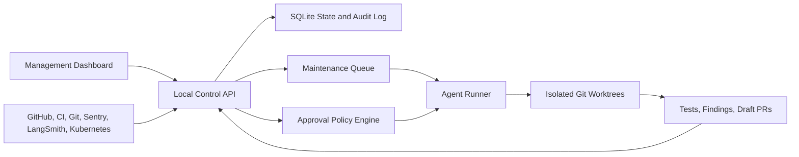
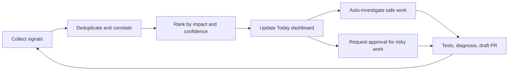

# Project Maintenance OS Design

**Date:** 2026-07-11  
**Status:** Approved  
**Initial scope:** One local RAG_system repository and one operator

## Purpose

Build a dashboard-first, private maintenance control plane for RAG_system. The system acts as a project manager: it collects project signals, maintains priorities, coordinates Codex and Claude workers, preserves evidence, prevents duplicate work, and presents approval requests.

The system may autonomously read state, investigate problems, run tests, and create tested draft pull requests. Merging, deploying, changing infrastructure, or handling secrets requires explicit operator approval.

## Product Direction

Three approaches were considered:

1. A conversation-only agent, which is fast but leaves state scattered across sessions.
2. A dashboard-first platform, which makes durable project state and approval workflows primary.
3. A hybrid control plane, which uses chat as the main interface and adds a secondary dashboard.

The approved direction is dashboard-first. Codex and Claude are workers dispatched by the platform rather than the primary source of project state.

## Deployment Boundary

The first version runs as a private local server bound to `127.0.0.1`. It is separate from the NOUS application backend so application failures cannot disable its manager. It is single-user, single-repository, and not remotely accessible.

Secrets remain in the operating-system keychain or process environment. They are not stored in SQLite and are not added to agent prompts unless a narrowly scoped operation requires them.

## Architecture



### Components

- **Dashboard:** shows project health, priorities, incidents, findings, changes, agent activity, evidence, and approvals.
- **Control API:** reconciles external signals into durable project state and schedules eligible work.
- **SQLite store:** persists signals, work items, claims, investigations, findings, changes, approvals, and append-only audit events.
- **Collectors:** read local Git, GitHub pull requests, CI runs, and later Sentry, LangSmith, and Kubernetes.
- **Policy engine:** authorizes read-only work, investigation, tests, and draft pull requests while blocking restricted mutations without approval.
- **Maintenance queue:** ranks work by impact, urgency, confidence, recency, and blocking relationships.
- **Agent runner:** dispatches Codex or Claude through a common adapter, gives each editing job an isolated worktree, and records progress and evidence.

## Dashboard Information Architecture

The home screen answers:

1. What needs attention now?
2. What is the OS doing about it?
3. What decision does it need from the operator?

### Primary views

- **Today:** production health, red CI, blocked pull requests, recent regressions, active incidents, and pending approvals.
- **Work Queue:** prioritized items with severity, evidence, confidence, owner, state, and next action.
- **Agents:** active and completed investigations, worktrees, resource usage, findings, and generated pull requests.
- **Changes:** commits, pull requests, reviews, CI results, deployment state, and rollback readiness.
- **Incidents:** correlated alerts with a timeline, suspected cause, evidence, and resolution state.
- **Knowledge:** runbooks, audit ledgers, previous fixes, project rules, and relevant wiki context.
- **Activity Log:** every automated decision, command, approval, state transition, and external mutation.

Notifications are reserved for failures, blocked work, and decisions requiring the operator. Routine success remains visible in the dashboard without producing alerts.

## Operating Loop



Each work item supports approve, reject, pause, reprioritize, dismiss, and deeper-investigation actions. Evidence and inference are displayed separately.

## State Model

External data is normalized into this durable chain:

```text
Signal -> Incident or Work Item -> Investigation -> Finding
       -> Proposed Change -> Approval -> Execution -> Verification
```

### Core records

- **Signal:** raw event from Git, GitHub, CI, Sentry, LangSmith, or Kubernetes.
- **Work item:** deduplicated maintenance unit with severity, confidence, evidence, owner, priority, and state.
- **Claim:** exclusive lease that prevents duplicate investigation or fixes.
- **Investigation:** agent assignment, instructions, worktree, progress, and output.
- **Finding:** verified defect or explicitly labeled hypothesis.
- **Change:** branch, commits, tests, draft pull request, risk classification, and rollback notes.
- **Approval:** exact proposed action, evidence snapshot, approver, expiration, and result.
- **Audit event:** immutable record of a decision, command, mutation, or state transition.

### Work-item states

```text
queued -> investigating -> waiting_approval -> executing
       -> verifying -> completed

Any state may become blocked, dismissed, or superseded.
```

## Policy and Safety

- Every external action has an idempotency key.
- An agent must hold an active claim before editing.
- Evidence and inference use separate fields and visual treatments.
- Stale source data is marked and cannot authorize an action.
- Failed or inconclusive tests block completion.
- Agent timeouts preserve partial evidence and safely release claims.
- Worktree conflicts stop the job and compare against the current remote branch before resolution.
- Merge, deployment, infrastructure, and secret operations require a fresh approval tied to an evidence snapshot.
- Collector failure changes that source to `unknown`; it never implies healthy state.
- Destructive operations are never retried automatically.
- Every approval is narrow, attributable, and expires when its evidence or target revision changes.

## Technology Choices

- **Next.js dashboard** for alignment with existing RAG_system frontend skills and patterns.
- **FastAPI control service** for collectors, policy enforcement, subprocess management, Git worktrees, and background jobs.
- **SQLite with migrations** for a durable single-user local store.
- **Server-Sent Events** for agent progress, CI changes, and work-item updates.
- **In-process scheduler** for the MVP; Redis and Celery are unnecessary for one local server.
- **Codex and Claude adapters** behind a shared worker protocol.

## MVP Scope

The first release includes:

1. Today dashboard and project-health summary.
2. Work queue with priorities, claims, and state transitions.
3. Local Git, GitHub pull-request, and CI collectors.
4. Codex and Claude investigation jobs in isolated worktrees.
5. Evidence viewer for commands, tests, diffs, findings, and agent progress.
6. Tested draft-pull-request creation.
7. Approval inbox with enforced mutation boundaries.
8. Append-only activity log.
9. Manual refresh and conservative scheduled scans.

The MVP explicitly defers Sentry, LangSmith, and Kubernetes collectors; production incident correlation; remote access; multiple repositories or users; automatic deployment or rollback; and a generalized plugin system.

## Error Handling

- Collector errors are isolated per source and surfaced with last-success timestamps.
- Invalid or partial responses are stored as failed collection attempts, not project facts.
- Scheduled work uses bounded retries with backoff only for non-destructive, idempotent reads.
- Agent cancellation and timeout preserve logs, partial evidence, and worktree location.
- A failed process restart reconciles claims, running jobs, and worktrees before dispatching new work.
- Duplicate signals merge into an existing work item while preserving their individual provenance.
- Approval execution revalidates the target SHA, policy, claim, and evidence freshness immediately before action.

## Verification Strategy

- State-machine tests cover every legal and illegal transition.
- Policy tests prove restricted actions cannot run without valid approval.
- Collector contract tests use recorded API fixtures.
- Integration tests use temporary Git repositories and worktrees.
- Agent-runner tests cover timeout, cancellation, partial output, and duplicate claims.
- Failure-injection tests cover unavailable GitHub, stale CI, corrupted responses, and interrupted processes.
- Playwright tests cover Today, Work Queue, evidence display, approvals, and activity history.
- The end-to-end acceptance scenario detects a failing test, investigates it, creates a tested draft pull request, and stops for approval before merge.

## Success Criteria

- The operator can understand current project health and required decisions from the Today view in under one minute.
- The system does not create duplicate investigations or pull requests for one finding.
- Every automated conclusion links to concrete evidence and provenance.
- Every restricted operation is impossible without a current, explicit approval.
- A failed collector or agent cannot falsely mark work healthy or complete.
- The complete failing-test-to-tested-draft-PR acceptance scenario works locally without manual state repair.
