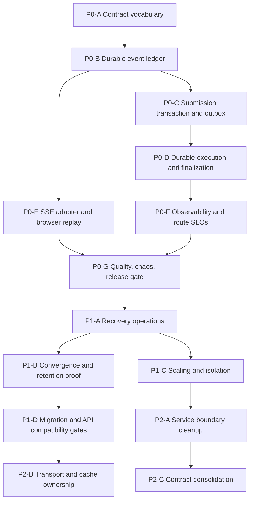

# Agent Audit Master PR Roadmap

> **For Claude:** REQUIRED SUB-SKILL: Use `superpowers:executing-plans` to
> implement this plan task-by-task.
>
> **For OpenCode:** Treat each row in the delivery map as a separate PR unless
> the row explicitly says it is a verification-only gate. Branch every PR from
> the latest `origin/develop`; do not stack sibling PRs unless the dependency
> column requires it.

**Goal:** Convert the agent production audit into an independently mergeable
P0/P1/P2 delivery program with explicit dependencies, evidence, rollout gates,
and ownership boundaries.

**Architecture:** P0 establishes the authoritative durable execution and
streaming contract. P1 operates that contract safely under failure, load, and
multi-store drift. P2 reduces the architectural mechanisms that make future
contract drift and reliability regressions likely. PostgreSQL remains the
source of truth, Redis is a wakeup/cache layer, Celery owns durable execution,
and SSE is a typed projection of the durable event ledger.

**Tech Stack:** FastAPI, Pydantic v2, SQLAlchemy, Alembic, PostgreSQL, Redis,
Celery, LangGraph, Next.js, TypeScript, WHATWG SSE, OpenAPI 3.1, RFC 9457,
OpenTelemetry, LangSmith, Prometheus/Grafana, pytest, Vitest, Playwright, Helm,
ArgoCD.

---

## Source of truth

- Audit baseline: `docs/system-design-audit-2026-07-10.md`.
- Existing P0 implementation detail:
  `docs/plans/2026-07-30-full-agent-p0-implementation.md`.
- P0 PR split: `docs/plans/2026-07-30-agent-audit-p0-pr-plan.md`.
- P1 PR split: `docs/plans/2026-07-30-agent-audit-p1-pr-plan.md`.
- P2 PR split: `docs/plans/2026-07-30-agent-audit-p2-pr-plan.md`.

The 2026-07-10 audit is historical evidence, not current truth. Before changing
code, re-run each plan's preflight against the current `origin/develop` and
record the finding as `closed`, `partial`, `open`, or `regressed`.

## Priority definition

| Tier | Meaning                                                                              | Merge/deploy rule                                     |
| ---- | ------------------------------------------------------------------------------------ | ----------------------------------------------------- |
| P0   | Accepted work, tenant isolation, stream integrity, or release safety can be violated | Blocks agent production promotion                     |
| P1   | Recovery, scaling, observability, or cross-store convergence is incomplete           | Must finish before sustained production traffic       |
| P2   | Maintainability and platform consistency debt increases future failure rate          | Schedule after P0/P1; adopt incrementally where noted |

## Revalidated starting state

| Capability                          | Current state                        | Evidence to re-check in implementation PR                                                     |
| ----------------------------------- | ------------------------------------ | --------------------------------------------------------------------------------------------- |
| `/execute` durable dispatch         | Implemented and enabled in dev       | `backend/src/api/agent/execute.py`, `backend/src/tasks/agent_run_tasks.py`, `values-dev.yaml` |
| Shared-env checkpoint fail-closed   | Implemented and enabled in dev       | `backend/src/services/agent/checkpointer.py`, `values-dev.yaml`                               |
| Dependency-aware readiness          | Implemented                          | Helm backend probes and readiness tests                                                       |
| KEDA worker scaling                 | Implemented and enabled in dev       | `templates/keda-scaledobject.yaml`, `values-dev.yaml`                                         |
| Satellite reconciler                | Implemented and apply-enabled in dev | `backend/src/tasks/reconcile_tasks.py`, `values-dev.yaml`                                     |
| Retention workers                   | Implemented and apply-enabled in dev | `backend/src/tasks/retention_tasks.py`, `values-dev.yaml`                                     |
| `/stream` accepted durability       | Open                                 | `accepted` can precede the complete PostgreSQL submission transaction                         |
| Durable stream event replay         | Partial                              | Redis replay exists; PostgreSQL is not yet the complete authority                             |
| Typed SSE/OpenAPI/RFC 9457 contract | Partial                              | Vocabulary and envelope exist, but schemas and error/terminal rules are incomplete            |
| Full route SLO/quality release gate | Partial                              | Small benchmark exists; 100+ case reliability/quality gate does not                           |

## Delivery map

| PR   | Scope                                                             | Depends on | Primary exit gate                                  |
| ---- | ----------------------------------------------------------------- | ---------- | -------------------------------------------------- |
| P0-A | Freeze lifecycle, SSE, OpenAPI, and Problem Details contracts     | —          | Contract tests reject unknown/malformed events     |
| P0-B | Complete `agent_run_events` authority and terminal DB invariant   | P0-A       | Exactly one logical terminal event                 |
| P0-C | Atomic accepted submission, idempotency, transactional outbox     | P0-B       | Accepted implies committed user/run/event/outbox   |
| P0-D | Celery execution, finalization outbox, checkpoint reconciliation  | P0-C       | Pod-kill tests recover without loss/duplicates     |
| P0-E | Typed SSE projection, heartbeat, `Last-Event-ID`, frontend replay | P0-B       | Disconnect/replay produces ordered exactly-once UI |
| P0-F | OTel/Prometheus/LangSmith correlation and route SLOs              | P0-D       | Privacy-safe p50/p95/p99 by bounded dimensions     |
| P0-G | 100+ case eval, chaos suite, blocking release workflow            | P0-E, P0-F | Every P0 zero-tolerance gate passes                |
| P1-A | Recovery runbooks, sweeper policy, queue/outbox operations        | P0-G       | Recovery drills and alert/runbook pairing pass     |
| P1-B | Satellite, retention, storage, and dual-store convergence         | P1-A       | Injected drift is detected and repaired            |
| P1-C | KEDA burn-in, NetworkPolicy, dependency budgets                   | P1-A       | Load/deny tests pass with rollback evidence        |
| P1-D | Semantic OpenAPI and Alembic execution gates                      | P1-B       | Breaking API/schema changes fail CI                |
| P1-E | Realtime transport and document-progress convergence              | P1-C       | One supported client/router path per concern       |
| P2-A | Agent/tool/message service boundaries                             | P1-D       | Routes are adapters; services own use cases        |
| P2-B | Unit-of-work and session ownership                                | P2-A       | Leaf services flush; use-case boundary commits     |
| P2-C | Route/version/pagination/status consolidation                     | P2-A       | One canonical contract per domain                  |
| P2-D | Dead code/search generation/legacy transport removal              | P2-C       | Import and route inventory contains no losers      |
| P2-E | Neo4j DR/HA decision and derived-data proof                       | P1-B       | Restore/rebuild drill meets documented RTO/RPO     |

## Program rules

1. One behavioral concern per PR; migrations may accompany only the code that
   consumes them.
2. Every PR begins with a failing contract or failure-injection test.
3. Every PR updates its relevant runbook and rollback lever.
4. No PR may weaken organization scoping, the uniform 404 IDOR posture, HITL
   confirmation, or prompt/trace redaction.
5. Every database idempotency rule is enforced by a unique constraint or
   compare-and-swap update, not only application code.
6. Metrics use bounded server-owned labels only. Organization, user, thread,
   message, prompt, document, trace ID, tool arguments, and exception messages
   are forbidden metric labels.
7. Deploy each change to dev through ArgoCD, observe one full synthetic/load
   window, then promote. Do not manually mutate live workloads except an
   explicitly documented emergency rollback.

## Full-program acceptance

- P0 release gate passes with at least 100 representative cases.
- Accepted messages lost: zero.
- Duplicate persisted user/assistant messages: zero.
- Malformed or multiply-terminal SSE streams: zero.
- Resume success: at least 99% by route.
- Fast route accepted p95 is at most 250 ms; TTFT and completion p95 are at
  most 5 seconds for the versioned benchmark corpus.
- Graph/research SLOs are separate and pass their task-specific budgets.
- Injected PostgreSQL, Redis, worker, and pod failures recover according to the
  durable execution contract.
- Every active alert links to a tested runbook and rollback.
- The original audit ledger has a current status and evidence link for all 35
  findings.
