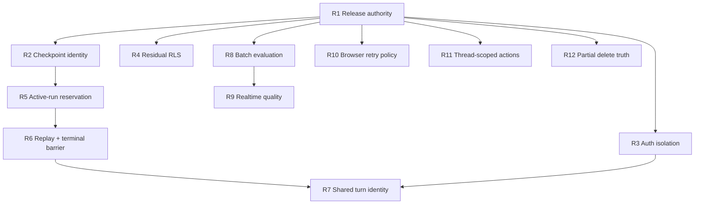

# NOUS Project Audit Remediation PR Plan

> **For implementers:** Treat every delivery row as a separate PR to
> `develop`. Start each branch from a freshly fetched `origin/develop`, write
> the failing regression first, and do not stack sibling PRs unless the
> dependency graph requires it. R1 is the one deliberate exception: its
> repository/workflow PR must land and shadow successfully before a separate,
> explicitly authorized Argo cutover PR.

**Goal:** Close all 17 net-new findings from the 2026-08-04 project
negative-space audit without repeating already shipped RLS, chat, LangSmith,
or agent-platform work.

**Architecture:** Establish an exact-SHA release authority first. Then make
tenant-owned thread identity, authenticated browser state, and public-schema
security fail closed. Agent execution is repaired around one reservation
contract: a logical turn is accepted once, a different active turn conflicts
instead of being silently superseded, replay never executes work, and a
terminal frame is emitted only after terminal state is durable. Evaluation
and frontend repairs preserve the same rule: never present guessed, stale, or
partially failed state as success.

**Baseline:** This plan was written against refreshed `origin/develop` at
`6e618d0fb5874fa262b783345000f1496e52d7c7`. Re-run every preflight because
the branch will move.

**Tech stack:** GitHub Actions, ArgoCD, Helm, PostgreSQL/Supabase, Alembic,
FastAPI, SQLAlchemy, Celery, Redis, LangGraph, LangSmith, Next.js, Zustand,
TanStack Query, Trigger.dev, pytest, Vitest, and Playwright.

---

## Source of truth and deduplication

The evidence ledger is
`/Users/goodwiinz/.audit-ledgers/rag/project-negative-space-2026-08-04.md`.
It records the exact code locations, failure scenarios, live observations,
and clean areas for this program.

Current facts that must not be re-litigated during implementation:

- PR #1342 already secured its eight named internal tables. Live dev had all
  eight at `relrowsecurity=true`, no `anon` or `authenticated` grants, and
  zero present public tables without RLS. R4 is a new, conditional follow-up
  for two omitted tables; it must not edit the applied #1342 migrations.
- `agent_memories` and `search_analytics` were absent in live dev. Report that
  state as absent/not applicable, not as proof that a non-existent table was
  secured.
- The July agent roadmap already shipped the durable run, event ledger,
  outbox, replay, and checkpoint foundations. R5-R7 repair concrete defects in
  those seams; they do not create a second runtime or event store.
- Task 5 in
  `docs/superpowers/plans/2026-08-04-langsmith-audit-hardening.md` already
  plans a shared trace-metadata builder. R6 must reuse that builder. If the
  LangSmith PR lands first, R6 keeps only the HTTP/SSE identity and terminal
  ordering delta. If R6 lands first, remove the duplicate Task 5 work before
  merging the LangSmith PR.
- Existing plans under `docs/plans/2026-07-30-agent-audit-*.md` are
  architectural background. Current code and this audit ledger win where
  those plans describe work that has since shipped or changed.
- The known July CI items listed in the ledger—mutable third-party actions,
  checksumless `yq`, mutable BuildKit, disabled Trivy, and missing post-Argo
  health proof—remain separate known-open work. This plan does not refile
  them.
- The fresh-empty Alembic `processingstage` failure remains known-open.
  Static single-head validation is not runtime migration proof.

### Wiki-derived constraints

The wiki query reused the existing NOUS history, idempotency, request-identity,
CI, and DB-session pages rather than starting a parallel design. Those pages
constrain this plan as follows:

1. A LangGraph checkpoint key comes only from an ownership-verified durable
   thread or a server-generated execution ID. Raw client input is never a
   checkpoint or Redis stream namespace.
2. `client_message_id` is the stable identity of a logical user turn across
   retry, reconnect, transport fallback, and task redelivery.
3. At-least-once work is fenced by a database uniqueness or compare-and-swap
   invariant. A race loser attaches to the winner; it does not take a generic
   fallback path.
4. Async browser work carries an owner epoch/token. Success, error, and
   `finally` all verify ownership before mutating shared state.
5. Background and service code own real DB sessions. FastAPI dependency
   generators are used only at route boundaries.
6. A terminal event carries authoritative state. It is not a promise that
   persistence might complete after the client sees success.
7. The old wiki CI page is stale where it disagrees with current workflows or
   live evidence; repository and current-run evidence take precedence.

## Program invariants

Every PR must preserve all of these:

1. Organization, user, workspace, and thread ownership fail closed. A foreign,
   deleted, malformed, or unresolved thread never reaches LangGraph.
2. Exactly one execution may own a non-terminal run for a thread. This program
   guarantees at-most-one accepted graph execution per stable turn; it does
   not claim exactly-once external tool effects after an ambiguous third-party
   network failure.
3. `Accepted` commits one durable dispatch intent. The relay may publish that
   intent more than once after an ambiguous broker acknowledgement, but the
   run claim permits at most one execution owner. `Replay` attaches to the
   original run. `Conflict` creates no intent and cancels nothing.
4. `cancelled` means the execution owner has stopped and closed its iterator.
   Merely changing a PostgreSQL status is not cancellation.
5. A client sees `done` only after assistant/checkpoint persistence and the
   terminal run plus ledger transaction have committed.
6. User-scoped browser state is synchronously cleared at an authentication
   subject boundary, and stale work cannot repopulate it.
7. No production endpoint returns fabricated evaluation numbers or false
   success.
8. Unsafe HTTP mutations do not retry unless a stable, server-enforced
   idempotency contract is explicit.
9. Security downgrades never disable RLS or restore PostgREST grants.
10. Metrics use bounded server-owned dimensions; never label them with user,
    organization, thread, message, request, prompt, document, or exception
    text.

## Finding-to-PR map

| Finding | Severity | Delivery |
| --- | --- | --- |
| A4-CI1, A4-CI2 | high, medium | R1 exact-SHA release authority |
| A4-SEC1 | high | R2 verified checkpoint identity |
| A4-AUTH1, A4-AUTH2 | high, med-high | R3 authenticated-session isolation |
| A4-RLS1 | med-high | R4 residual public-schema protection |
| A4-AG1, A4-AG2 | high, high | R5 active-run reservation and conflict |
| A4-AG4, A4-OBS1 | medium, medium | R6 run replay, terminal barrier, correlation |
| A4-AG3 | high | R7 shared turn identity and retry safety |
| A4-EVAL1 | medium | R8 batch-evaluation session ownership |
| A4-EVAL2 | medium | R9 truthful realtime quality |
| A4-FE1 | medium | R10 method-aware browser retries |
| A4-FE2, A4-FE3 | medium, medium | R11 thread-scoped citation/project actions |
| A4-FE4 | medium | R12 truthful partial bulk deletion |

## Dependency and merge order



Implementation may proceed in parallel, but merges are constrained:

- Merge and prove R1 before any later PR relies on automated deployment.
- R2, R5, R6, and R7 all touch agent streaming and merge strictly in that
  order.
- R3 lands before R7 because both change `agentChatStore.ts`; R7 must preserve
  the abort-aware reset.
- R8 lands before R9 so realtime evaluation reuses the corrected session and
  persistence boundary.
- R4, R10, R11, and R12 may be developed independently. Rebase and run fresh
  CI before each merge.
- Observe one full dev window after each of R5, R6, and R7. Do not deploy two
  lifecycle-contract changes at once.

---

## R1 — Exact-SHA release authority

**Findings:** A4-CI1, A4-CI2
**Suggested branch:** `fix/ci-exact-sha-release-gate`

### Contract

There is one required check named `Release Gate`. Every declared blocking job
must be exactly `success`. A tested source SHA is built once, the resulting
immutable digest is written to a deployment-only branch, and Argo deploys that
release commit. No workflow may build or deploy merely because `develop` was
pushed.

E2E remains blocking. It currently affects the workflow conclusion even
though `Test Summary` describes it as advisory; removing that effective gate
would be a security/release downgrade. `Release Gate` therefore requires E2E,
the eight other declared lanes, and both lint prerequisites to be exact
successes. Making E2E advisory is a separate risk decision, not part of this
repair.

### Files

- Modify: `.github/workflows/test-pipeline.yml`
- Create: `.github/workflows/release-dev.yml`
- Modify: `.github/workflows/docker-build.yml`
- Modify or retire automatic paths in
  `.github/workflows/gitops-image-update.yml`
- Verify that `.github/workflows/deploy.yml` has no active dev auto-deploy
  path; do not revive its retired staging/production behavior
- Create: `scripts/ci/assert_required_jobs.py`
- Create: `backend/tests/unit/ci/test_release_gate.py`
- Modify only in the later authorized cutover PR:
  `infrastructure/argocd/applications/dev.yaml`
- Modify: `infrastructure/helm/knowledge-graph-analytics/values.yaml`
- Modify: `infrastructure/helm/knowledge-graph-analytics/values-dev.yaml`
- Modify: backend, migration-init, worker, beat, and synthetic-traffic image
  rendering under
  `infrastructure/helm/knowledge-graph-analytics/templates/`
- Modify: `.github/workflows/README.md`

### Tasks

1. Extract the summary decision into `assert_required_jobs.py`. Feed it the
   job-name/result map and fail unless every required result equals
   `success`. Missing, skipped, cancelled, timed out, action-required, and
   failure all block.
2. Include `lint-backend` and `lint-frontend` directly in the summary's
   `needs`. Keep E2E and the eight other existing lanes explicit. Do not infer
   success from a downstream skip.
3. Remove `paths-ignore` from the required workflow before configuring branch
   rules; otherwise Markdown-only PRs never receive the required status.
   Running the full gate for docs-only PRs is the conservative first version.
4. Rename the summary job to `Release Gate` and test every status combination.
5. Make Docker Build reusable/manual-only. It accepts an explicit
   `source_sha`, checks out that SHA, asserts `HEAD`, builds once, pushes an
   full-SHA source/trace tag, and exposes the immutable registry digest. Do not
   call the tag immutable unless registry-side tag immutability is separately
   proven.
6. Create `release-dev.yml` on completed Test Pipeline runs for `develop`.
   It must:
   - verify the source event was a `push` to `develop`;
   - require `workflow_run.conclusion == success` before any build step;
   - bind `workflow_run.run_attempt`, verify it against the producer API, and
     require exactly one successful `Release Gate` from the attempt-specific
     jobs endpoint so a delayed event cannot borrow another rerun's result;
   - use only `workflow_run.head_sha` as the source identity;
   - use one `release-dev` concurrency group with `cancel-in-progress: true`;
   - re-fetch `develop` before building and stop if the source SHA is already
     superseded;
   - call the reusable build with that exact SHA;
   - record `source_sha`, test run ID and attempt, image tag, and digest as an
     artifact and release summary;
   - re-fetch `develop` immediately before promotion and exit without
     deploying if a newer source SHA has superseded it.
7. Replace the current independent Test-Pipeline and Docker-Build develop-push
   triggers plus the downstream Docker → GitOps `workflow_run` with this
   single release owner. Never rebase an old image bump onto newer source.
8. Add a `backend.image.digest` value and one Helm image helper so the backend,
   migration init container, Celery worker, Celery beat, and synthetic traffic
   all render the same `repository@sha256:...` image. The source SHA remains an
   annotation/trace fact, not a mutable deployment tag.
9. Create a restricted `deploy/dev` branch from the tested source tree, change
   only the dev release manifest/digest and release metadata, and update it
   with `force-with-lease`. Mint the token from a dedicated GitHub App; the
   workflow's `GITHUB_TOKEN` remains read-only. GitHub App installation tokens
   are repository-scoped, not branch-scoped: workflow code targets only
   `deploy/dev`, and rulesets deny the App writes/bypass on `develop` and all
   other protected source refs. Do not claim protection for arbitrary
   unprotected refs. If credential-level all-ref isolation is required, put
   the dev release manifest in a dedicated GitOps repository and install the
   App only there.
   Run source-controlled Helm assertions in a separate read-only job. Prepare
   the bounded two-file release commit on a fresh runner with checkout
   credentials disabled, recheck `develop`, and mint the App token only after
   the allowlist and commit are ready. Pass that token only to the final
   `deploy/dev` push; never expose it to repository scripts or persist it in
   checkout configuration.
10. Do not change `dev.yaml` in the workflow PR. Seed `deploy/dev`, merge the
    workflow/Helm changes, and run shadow releases while Argo still tracks
    `develop`. After evidence review and explicit authorization, pause the root
    Argo Application's auto-sync, merge a separate cutover PR changing
    `nous-dev` to `deploy/dev`, manually sync the root Application to that exact
    cutover commit, verify the child Application/revision/pods, then re-enable
    root auto-sync. This prevents the app-of-apps controller from applying an
    unseeded/unproven source as soon as the workflow PR merges.
11. Bootstrap source protection before provisioning the write-capable App
    secret. First configure a `develop` ruleset requiring PRs, approvals, and
    resolved conversations and blocking direct pushes, without yet requiring
    the not-yet-proven `Release Gate`. Seed and protect `deploy/dev`, allowing
    only the release App's required non-fast-forward update. Then provision
    the App secret and run a same-SHA green shadow release. Only after that
    proof, extend the `develop` ruleset with up-to-date branches,
    `Release Gate`, and secret scanning. The release bot needs no `develop`
    bypass.

### Tests and acceptance

Run:

```bash
backend/.venv/bin/python -m pytest -q \
  backend/tests/unit/ci/test_release_gate.py \
  backend/tests/unit/ci/test_release_workflow.py \
  backend/tests/unit/ci/test_migration_check_workflow.py
actionlint
helm lint infrastructure/helm/knowledge-graph-analytics \
  -f infrastructure/helm/knowledge-graph-analytics/values.yaml \
  -f infrastructure/helm/knowledge-graph-analytics/values-dev.yaml
helm template nous-dev infrastructure/helm/knowledge-graph-analytics \
  -f infrastructure/helm/knowledge-graph-analytics/values.yaml \
  -f infrastructure/helm/knowledge-graph-analytics/values-dev.yaml
```

Acceptance evidence:

- Every required-result matrix except all-success exits nonzero.
- A failed lint causing downstream skips leaves `Release Gate` red.
- A docs-only PR receives `Release Gate`.
- A failed or cancelled Test Pipeline produces no image and no `deploy/dev`
  commit. A run detected as superseded before build produces neither; a run
  superseded after an immutable push may leave an unused image, but produces
  no promotion commit once the final check observes supersession.
- In a rapid A→B push drill, the single-writer release queue, pre-build check,
  final HEAD check, and `force-with-lease` prevent a detected stale A release
  from overwriting B. Do not claim that a source-ref check and a different-ref
  update form an atomic transaction; the evidence must state which check won
  any boundary race.
- The evidence chain is one identity:
  Test Pipeline run ID/attempt and source SHA → image digest → `deploy/dev`
  release commit → Argo revision → live backend/worker/beat pod `imageID`.
- A direct user push to `develop` is denied.
- The workflow PR and cutover PR are both recorded. A4-CI1/A4-CI2 remain
  `pr` after only the workflow PR merges and become `merged` only when the
  authorized cutover PR is merged; exact manual-root-sync and live-pod
  evidence is appended afterward.

### Rollout and rollback

Pause the existing auto-promotion path, land the fail-closed gate, and run
`release-dev.yml` in shadow mode. Do not cut Argo over while the known
fresh-empty Alembic runtime failure remains unaccepted; either make those
probes blocking in their own remediation or record explicit risk acceptance.

Rollback pauses `release-dev.yml` and points Argo at the previous immutable
`deploy/dev` release commit. Do not restore independent push-triggered build
and GitOps workflows.

GitHub rulesets, branch creation, pausing/re-enabling root sync, and live Argo
cutover are external state changes and require explicit authorization at
implementation time.

---

## R2 — Verified checkpoint identity

**Finding:** A4-SEC1
**Suggested branch:** `fix/security-agent-thread-boundary`
**Depends on:** R1

### Contract

Public agent routes accept either no thread ID or a UUID naming an
ownership-verified, non-deleted thread. Malformed IDs return 422. Missing,
deleted, and foreign UUIDs share the existing uniform 404 posture. A provided
ID never silently creates a replacement thread. A public request without an
ID creates and resolves an owned durable thread before acceptance; if that is
not possible, it fails closed. LangGraph, HITL, checkpoint resync, durable run
thread FKs, and Redis stream pointers then receive only that thread UUID.

Internal explicitly ephemeral work uses a separate discriminant and the
server-generated `AgentRun.job_id` as its execution/checkpoint key. Its
`AgentRun.thread_id` stays null, its user/organization fields are the durable
owner mapping, and HITL, confirm, and public resume are prohibited. An
ephemeral execution ID is never passed as a Thread foreign key.

The checkpoint-only synthetic canary is a third, trusted internal identity.
It is minted inside the synthetic runner, cannot be supplied through a public
request, creates no `AgentRun.thread_id`, and may auto-resume HITL only inside
that same bounded invocation. Its namespace remains separately recognizable
to retention.

### Files

- Modify: `backend/src/services/agent/schemas.py`
- Create: `backend/src/services/agent/checkpoint_identity.py`
- Modify: `backend/src/services/agent/agent_execution_service.py`
- Modify: `backend/src/api/agent/execute.py`
- Modify: `backend/src/api/agent/streaming.py`
- Modify: `backend/src/services/agent/stream_buffer.py`
- Modify: `backend/scripts/synthetic_traffic.py`
- Modify: `backend/src/tasks/retention_tasks.py`
- Extend: `backend/tests/unit/api/test_agent_execute_request.py`
- Extend: `backend/tests/unit/agent/test_agent_execution_service_seam.py`
- Create: `backend/tests/unit/api/test_agent_checkpoint_identity.py`
- Extend streaming, resume, confirm, and dispatch tests

### Tasks

1. Type `AgentExecuteRequest.thread_id` as optional UUID and regenerate the
   OpenAPI snapshot/frontend types if the wire schema changes.
2. Centralize resolution in `checkpoint_identity.py`. Return a discriminated
   union of `DurableThreadIdentity` (owned Thread plus canonical UUID),
   `EphemeralExecutionIdentity` (server run/execution ID plus durable owner
   fields), and an internal-only `SyntheticCheckpointIdentity`. Do not expose
   a raw-input fallback or a public constructor for the synthetic case.
3. Distinguish “no ID supplied” from “ID supplied but not owned.” Only the
   former may create a new server-owned chat thread under an owned workspace.
   Failure to resolve/create that public durable thread is an error, not an
   ephemeral fallback.
4. Resolve and canonicalize before `/execute` reserves an `agent_runs` row or
   calls Celery. Do the same before `/stream` commits acceptance.
5. Remove broad exception handlers that turn UUID conversion, ownership, or
   resolver failures into “skip persistence and continue graph.” Resolver
   outages fail before `accepted`, dispatch, graph compilation, or tool work.
6. Replace every `request.thread_id or ...` checkpoint/config/buffer expression
   with the identity's checkpoint key. Durable public identities use the
   Thread UUID. Explicit internal ephemeral identities use the run ID, keep
   `AgentRun.thread_id=NULL`, and reject HITL/confirm/resume. Confirm and
   resume must resolve ownership before checkpoint access.
7. Keep valid owned UUID checkpoint keys unchanged so existing durable chat
   and HITL state continues.
8. Change the synthetic runner's internal constructor to mint
   `synthetic-{scenario}-{epoch_ms}-{uuid}` from an allowlisted scenario enum,
   not caller text. Preserve its in-process bounded HITL auto-resume. Update
   retention to recognize both the legacy and new synthetic formats for one
   retention window, then remove the legacy parser after zero observations.

### Compatibility preflight

Inventory the 568 observed non-UUID namespaces by source class, age, and
pending-HITL state without logging checkpoint content. Supported public routes
become strict; do not bulk-rewrite checkpoint tables.

If a non-synthetic namespace has a live pending HITL checkpoint, add only a
temporary internal resume adapter that verifies the snapshot's persisted
`user_id` against the authenticated user before one-time migration/resume.
The adapter is not available to new submissions and is removed after one
retention window with zero use.

### Tests and acceptance

- Same arbitrary string from two users returns 422 twice and invokes no graph.
- A foreign/deleted/missing UUID returns the same 404 and cannot create a new
  thread or read the owner's checkpoint.
- Owned UUID preserves the current checkpoint namespace.
- Public no-thread input creates an owned durable Thread; a creation failure
  emits no acceptance or work.
- An explicit internal ephemeral execution uses its run ID, persists no fake
  Thread FK, and cannot enter HITL or public resume.
- A public `synthetic-*` input still returns 422, while the trusted synthetic
  runner can checkpoint/auto-resume and both old/new namespaces are purged by
  retention at the configured age.
- Resolver/DB failure emits no `accepted`, job, outbox, Redis pointer, or task.
- `/execute`, `/stream`, confirm, and resume share the resolver.
- A two-account canary cannot observe state across a deliberately repeated
  malicious ID.

Rollback is application-only. Do not rewrite or delete historical checkpoint
rows. Prefer holding the rollout or adding the owner-verified adapter over
restoring raw public checkpoint keys.

---

## R3 — Authenticated-session isolation

**Findings:** A4-AUTH1, A4-AUTH2
**Suggested branch:** `fix/auth-user-state-lifecycle`
**Depends on:** R1

### Contract

An authentication subject change synchronously aborts and clears every
user-scoped client owner before the new user can render. A delayed operation
from auth generation N cannot mutate generation N+1.

### Files

- Modify: `frontend/src/stores/authStore.ts`
- Create: `frontend/src/stores/clearAuthenticatedClientState.ts`
- Modify: `frontend/src/store/chat-store.ts`
- Modify: `frontend/src/store/chat/requestCoordinator.ts`
- Modify: conversation/thread request-token slices under
  `frontend/src/store/chat/slices/`
- Modify: `frontend/src/store/chat/slices/workspaceSlice.ts`
- Modify: `frontend/src/store/agentChatStore.ts`
- Modify: `frontend/src/hooks/chat/useChatStreaming.ts`
- Modify: `frontend/src/stores/agentActivityStore.ts`
- Modify: `frontend/src/lib/query-client.ts`
- Extend auth, chat-store, agent-store, and streaming tests

### Tasks

1. Replace global `profileFetchInFlight` with an owner record containing auth
   generation, subject ID, AbortController, and Promise.
2. Advance the generation on explicit sign-out, `SIGNED_OUT`,
   subject-changing `SIGNED_IN`, and a newer interactive sign-in. Guard the
   direct `signIn()` path with the same owner record. A new generation never
   awaits an older promise.
3. Pass the owner signal to `/auth/me`. Before every post-await success,
   error, and `finally` write, confirm the generation and subject still own
   the operation.
4. Add synchronous `clearAuthenticatedClientState()` and call it from both
   sign-out paths before clearing auth, and before adopting a `SIGNED_IN` or
   direct `signIn()` result whose subject differs from the current subject:
   - abort/reset canonical chat, newest-page loads, confirmation, and SSE;
   - abort/reset Global Agent Chat;
   - clear agent activity;
   - cancel and clear the app QueryClient;
   - clear workspace service/disk cache;
   - rotate conversation/thread load epochs.
5. Make `useAgentChatStore.reset()` abort its controller and invalidate
   `threadLoadEpoch`/`loadThreadsToken` before replacing state.
6. Register the canonical hook-local SSE/confirmation controller with the
   request coordinator so logout can abort it; resetting only the deprecated
   store controller is insufficient.
7. Make every user-scoped async store writer capture the auth generation and
   recheck it before success, error, and `finally` mutations. This includes
   conversation/thread loads, `loadWorkspaces()`,
   `initializeDefaultWorkspace()`, bootstrap/default-workspace creation, and
   QueryClient callbacks; reset rotates all corresponding epochs/tokens.

### Tests and acceptance

Add a same-tab integration test:

1. Seed canonical chat, Global Agent Chat, activity, workspace, and query data
   for user A.
2. Start A's delayed `/auth/me`, SSE, and thread loads.
3. Sign out A and sign in user B, where B has zero threads.
4. Resolve every A operation after B is current.
5. Assert B remains current, both chat surfaces are empty, all A signals were
   aborted, and no A cache reappears.

Also cover overlapping direct sign-ins without an intervening sign-out and a
delayed workspace/default-workspace bootstrap. The last authenticated subject
must win and the older completion must be a no-op.

Run focused Vitest tests, `pnpm type-check`, the full frontend suite, and lint
with `corepack pnpm@10.18.2`.

Manual canary uses two real accounts in one browser tab. Rollback is a
frontend deployment rollback; server transcripts are untouched.

---

## R4 — Residual public-schema protection

**Finding:** A4-RLS1
**Suggested branch:** `fix/db-residual-public-rls`
**Depends on:** R1 and merged #1342

### Files

- Create:
  `backend/alembic/versions/<revision>_secure_agent_memory_search_analytics_rls.py`
  with `down_revision = "h8i9j0k1l2m3"`
- Create:
  `supabase/migrations/<timestamp>_secure_agent_memory_search_analytics_rls.sql`
- Extend: `backend/tests/unit/test_internal_agent_tables_rls_migration.py`
- Create: `scripts/ci/check_public_rls_coverage.py`
- Create: static-inventory and PostgreSQL catalog/grant tests

### Tasks

1. Do not amend either applied #1342 migration.
2. In both migration systems, conditionally protect `agent_memories` and
   `search_analytics` when `to_regclass` says they exist:
   enable RLS and revoke all table privileges from `anon` and
   `authenticated`.
3. Create no browser policies; these remain backend-only tables.
4. Keep downgrade a security no-op.
5. Add a static inventory guard that scans public tables created after the
   blanket RLS migration and requires a later protection migration or an
   explicit reviewed exemption. This prevents another hand-list omission.
6. Add a PostgreSQL test proving catalog RLS state and denied
   SELECT/INSERT/UPDATE/DELETE privileges under both PostgREST roles.
7. Verify application/service-role CRUD remains possible through the intended
   owner or `BYPASSRLS` backend role.

### Acceptance and rollback

Run static single-head validation and real PostgreSQL upgrade plus
downgrade/upgrade probes. A Supabase-only reset must also succeed when the two
Alembic-managed tables are absent.

After deploy, query the live catalog:

- if absent, record `absent/not applicable`;
- if present, require `relrowsecurity=true` and no PostgREST grants;
- require zero present public tables without RLS.

Never disable RLS or regrant `anon`/`authenticated` as rollback. If the
backend role is blocked, repair only that backend role or add a reviewed
backend policy.

---

## R5 — Active-run reservation and explicit conflict

**Findings:** A4-AG1, A4-AG2
**Suggested branch:** `fix/agent-active-run-arbitration`
**Depends on:** R2

### Contract

One transaction-scoped reservation primitive is shared by `/stream` and
`/execute`:

```text
Accepted(run_id)  -> commit one outbox intent; execute under one run claim
Replay(run_id)    -> attach/status for the original run; create no intent
Conflict(run_id)  -> HTTP 409 before response headers; cancel nothing
```

A newer turn does not silently supersede an active graph. Genuine cooperative
supersession is deferred; explicit conflict closes A4-AG2 safely.

For `/execute`, broker delivery is at least once, not exactly once: an
ambiguous publish may produce duplicate commands. `claim_execution(run_id)`
is the at-most-one execution fence, and its outbox kind is actively relayed.
`/stream` retains exactly one inline execution owner inside the SSE generator;
its outbox kind is an acceptance/dispatch record and is explicitly excluded
from the broker relay. This PR does not introduce a second worker-owned
streaming runtime.

### Files

- Modify: `backend/src/services/agent/agent_run_service.py`
- Modify: `backend/src/services/agent/agent_submission_service.py`
- Modify: `backend/src/services/agent/_errors.py`
- Modify: `backend/src/api/agent/execute.py`
- Modify: `backend/src/api/agent/streaming.py`
- Modify: `backend/src/services/agent/stream_buffer.py`
- Modify: `backend/src/models/agent_outbox.py`
- Modify: `backend/src/shared/enums.py`
- Modify: `backend/src/tasks/agent_run_tasks.py`
- Create: `backend/src/tasks/agent_outbox_tasks.py`
- Create: `backend/alembic/versions/<revision>_lease_agent_outbox_dispatch.py`
- Modify only if needed: `backend/src/models/agent_run.py`
- Regenerate OpenAPI/frontend types for the conflict envelope
- Extend run-service, submission, dispatch, stream-accept, and worker tests

### Tasks

1. Introduce a typed reservation result. Check same-turn idempotent replay
   before different-turn active conflict.
2. Remove `_supersede_active_runs()`. It must not mark a running iterator
   cancelled.
3. Classify database constraints explicitly:
   - idempotency winner → reread and `Replay`;
   - `uq_agent_runs_active_thread` → `Conflict`;
   - known thread FK failure → fail closed after R2 resolution;
   - unknown integrity error → re-raise.
4. Delete the `IntegrityError` retry that inserts the same run with
   `thread_id=NULL`.
5. Move durable thread resolution and reservation out of the SSE generator
   and into the `/stream` route before constructing `StreamingResponse`.
   Pass a prepared acceptance context into the generator. This is what makes
   a typed HTTP 409 possible before 200 headers are committed.
6. Reserve before Redis job creation, FastAPI BackgroundTasks scheduling, or
   Celery publication. Only `Accepted` inserts an outbox intent.
7. Relay only the `/execute` outbox kind. Claim oldest due `pending` rows with
   a bounded lease/attempt counter, publish the existing worker command keyed
   only by `run_id`, and stamp `dispatched` only after broker acknowledgement.
   A crash after publish but before the stamp leaves the row retryable; the
   duplicate command must lose `claim_execution()` and exit without
   graph/tool work. The relay must never select the `/stream` kind.
8. On exhausted `/execute` delivery, re-read and compare-and-swap the run. Only
   an unchanged `queued`, unclaimed run with no terminal event may transition
   to failed with a terminal ledger event. If a worker is running,
   awaiting-confirmation, or terminal after an ambiguous publish, preserve its
   state and retire the outbox as `reconciled`; never fail live/completed work.
9. Store enough bounded, non-secret execution metadata with an accepted
   `/execute` run to reconstruct dispatch; prompts remain in the owned message
   row. The immediate publisher and periodic relay call the same worker
   dispatcher. `/stream` instead claims inline before classifier/graph work
   and stamps its own record; an unclaimed stream abandoned before execution
   is handled by the existing stale-run sweeper, not the broker relay.
10. Install the minimum immutable `run_id -> stream_id` mapping during
   acceptance. `Replay` may attach only through that mapping. If its buffer is
   unavailable before R6's full replay support lands, return the named run's
   durable status and poll/resume guidance; never follow the mutable thread
   pointer or submit new work.
11. In Celery mode, a storage failure returns 503; it does not fall back to
   in-process execution after an ambiguous durable write.
12. Keep the worker's `claim_execution()` compare-and-swap as the final
   one-executor fence.
13. Return a typed 409 containing bounded
   `code=agent_run_active`, `active_run_id`, `active_status`, and retry
   guidance. Clients present “finish, resume, or stop the current run.”

### Tests and acceptance

- Active unique violation never creates a null-thread row.
- Two concurrent distinct turns yield one Accepted and one Conflict.
- A same-`client_message_id` race yields Accepted plus Replay.
- Conflict writes no Redis job, outbox dispatch, BackgroundTask, or Celery
  message and emits no `accepted` frame.
- An `/execute` crash after acceptance but before direct publication is
  recovered by the relay; a crash after publish may duplicate broker delivery
  but executes the classifier/graph/tools at most once.
- `/stream` is never selected by the relay. Its inline path claims once; an
  abandoned unclaimed stream is reconciled stale rather than executed by a
  competing owner.
- Exhaustion racing a successful publish can fail only an unchanged queued,
  unclaimed run; a running or terminal run is preserved and the outbox is
  reconciled.
- Replay performs no second route, graph, or tool work and never attaches via
  the thread's current-stream pointer.
- `/stream` conflict is an HTTP 409 observed before any SSE response headers.
- A terminal predecessor permits the next turn.
- Two browser tabs cannot execute overlapping turns on one thread.
- An awaiting-confirmation run conflicts until it is resolved or explicitly
  stopped.

The behavior change from silent supersession to 409 is intentional. Rollback
must not restore DB-only cancellation or the null-thread fallback.

---

## R6 — Run-scoped replay, terminal barrier, and correlation

**Findings:** A4-AG4, A4-OBS1
**Suggested branch:** `fix/agent-terminal-replay-correlation`
**Depends on:** R5 and coordination with the LangSmith hardening Task 5

### Files

- Modify: `backend/src/services/agent/stream_buffer.py`
- Modify: `backend/src/services/agent/agent_submission_service.py`
- Modify: `backend/src/api/agent/streaming.py`
- Modify: `backend/src/observability/instrumentation.py`
- Modify: `backend/src/tasks/agent_run_tasks.py`
- Reuse/modify: `backend/src/services/agent/trace_metadata.py` if introduced
  by the LangSmith plan
- Extend persistence-order, fast-path, done, confirmation, buffer, resume,
  middleware, and trace-metadata tests

### Tasks

1. Extend the minimum immutable `run_id -> stream_id` mapping installed by R5
   with tenant-scoped lookup, retention, and completed-run replay. Keep the
   thread pointer only as a legacy/current-run shortcut.
2. Buffer `accepted` as sequence one. Add tenant-scoped resume by run ID and
   keep thread resume during a compatibility window.
3. When acceptance returns `Replay`, skip Luna classification, graph
   compilation, tools, and persistence. Replay the named run or return its
   durable terminal status.
4. Split finalization into strict
   `finalize_submission_or_raise()` for terminal response paths and explicit
   best-effort cleanup for disconnect/error recovery.
5. Enforce this order in every fast, graph, confirm, and nonstreamed path:

```text
assistant/checkpoint persistence
-> AgentRun terminal status + terminal ledger event commit
-> buffer terminal SSE frame
-> yield terminal SSE frame
-> clear active stream ownership
```

6. Commit `awaiting_confirmation` and its ledger event before yielding a
   confirmation frame.
7. If terminal persistence fails, roll back the terminal transaction, emit no
   `done`, and close the stream without pretending failure is durable. Do not
   add an `interrupted` enum: the run deliberately remains in its prior
   non-terminal state (normally `running`). The existing stale-run sweeper is
   the sole reconciler; after its lease/no-progress checks it atomically marks
   the run `failed` and appends `run.failed` with bounded
   `error_code=stale_no_progress`. A terminal error frame is allowed only if a
   separate failure transaction commits first.
8. In observability middleware, select one bounded canonical correlation ID,
   set both `request.state.correlation_id` and the compatibility alias
   `request.state.request_id`, and return it as `x-correlation-id`.
9. Make `_request_trace_id()` prefer that state value, then the correlation
   context, and only then generate a UUID. HTTP logs, SSE envelopes,
   LangSmith metadata, and run-event payloads carry the same value.
10. Reuse the trace metadata builder from the LangSmith plan; do not add a
    competing builder or a second request-ID vocabulary.

### Tests and acceptance

- Once `done` is yielded, a fresh DB transaction sees the assistant row,
  terminal run, and terminal ledger event.
- Finalizer failure yields no `done`.
- A finalizer-failure test leaves the run non-terminal, then drives the stale
  sweeper and observes one durable failed status plus one terminal ledger
  event.
- Confirmation state is durable before the frame.
- A replayed accepted run executes zero classifier/graph/tool calls.
- An old run ID cannot attach to a newer thread pointer.
- Run mapping remains readable after completion for its replay TTL.
- ASGI test proves response `x-correlation-id` equals SSE `trace_id`,
  LangSmith metadata `request_id`, and the terminal run-event request ID.
- Cancellation after a durable terminal cannot downgrade the run.

Rollback preserves the additive run mapping and correlation aliases. Do not
re-enable terminal-before-commit emission.

---

## R7 — Shared turn identity and retry safety

**Finding:** A4-AG3
**Suggested branch:** `fix/agent-turn-idempotency`
**Depends on:** R3 and R6

### Contract

The newest user turn receives one `client_message_id` before the first
request. The ID survives SSE retry, run resume, cross-transport fallback,
Trigger HTTP ambiguity, and Trigger task redelivery. Both server transports
write one versioned idempotency namespace.

### Files

- Modify: `backend/src/api/agent/execute.py`
- Modify: `backend/src/services/agent/agent_submission_service.py`
- Modify: `backend/src/services/agent/agent_run_service.py`
- Modify: `frontend/src/types/agent-chat.ts`
- Modify: `frontend/src/store/agentChatStore.ts`
- Modify: `frontend/src/services/agentChatService.ts`
- Modify: `frontend/app/api/trigger/agent/execute/route.ts`
- Modify: `src/trigger/_lib/schemas.ts`
- Modify: `src/trigger/_lib/backend-client.ts`
- Modify: `src/trigger/agent/execute-agent.ts`
- Create: `scripts/ops/audit_agent_idempotency_prefixes.py`
- Add a real Trigger TypeScript test/type-check target if none exists
- Extend backend, frontend, and Trigger idempotency/reconnect tests

### Tasks

1. Centralize legacy and v2 key derivation. New canonical keys are
   `agent-turn:v2:{user_id}:{client_message_id}`, but the first backend phase
   dual-reads v2 plus both legacy prefixes and continues route-specific legacy
   writes.
2. Acquire a transaction-scoped advisory lock derived from the bounded
   `(user_id, client_message_id)` before the dual read and insert. Reuse the
   existing unique `(user_id, idempotency_key)` index. After every pre-change
   API pod is drained, a server-side write-version flag enables v2 writes.
   Phase-A and phase-B pods both take the same lock and dual-read all prefixes,
   so a rolling flag change cannot create one legacy and one v2 run.
3. Before phase A, inventory users/client IDs that already map to more than one
   legacy run. Do not silently pick whichever query returns first. For an
   inactive set whose owner, durable thread, and originating user-message ID
   all match, select the earliest `(created_at, job_id)` as authoritative and
   annotate later runs `idempotency_alias_of` without deleting history. Any
   active or mismatched set is quarantined for operator review. Dual-read
   returns the annotated authority, or typed
   `idempotency_history_conflict` for an unresolved set, and never inserts a
   third v2 run. Emit a bounded invariant counter and retain the preflight
   report as rollout evidence.
4. Persist `origin_transport` on initial acceptance in
   `AgentRun.run_metadata`; replay never overwrites it. Add additive response
   fields `run_id`, `replayed`, `origin_transport`, and `resume_mode` to the
   `/execute` response and SSE accepted/status envelope, regenerate OpenAPI
   types, and add backend plus Trigger consumer contract tests.
5. In Global Agent Chat, mint `crypto.randomUUID()` before creating the
   optimistic user message. Preserve it on that message and send
   `client_message_id` on the newest user message.
6. Reuse one request object for SSE and any allowed fallback. A typed stream
   result/error records accepted run ID, last sequence, and terminal state.
7. Before `accepted`, retrying or falling back is safe only with the same ID.
   After `accepted` or any authoritative server frame, resume the run; never
   submit `/execute` as a new turn.
8. A truncated response without a terminal frame is interrupted, never
   successful.
9. Carry and validate the same ID through the Next route, Trigger payload,
   Trigger task retry, and backend POST.
10. Trigger's generic client retries GET by default. POST retry is disabled
   unless the caller selects the audited agent-turn contract and supplies its
   stable client-message ID; a key alone is not a retry opt-in.
11. Treat queued, stopping, and cancelled statuses correctly; cancelled is
    terminal.

### Mixed-version rollout

Deploy phase A (advisory lock, dual read, legacy write) first. Drain every
pre-change API and worker pod. Then roll phase B with the server write-version
flag set to v2; mixed phase-A/phase-B pods are safe because both lock and
dual-read. Only after the backend flip is proven deploy Global Agent Chat and
Trigger changes. Keep dual reads for one retention window, then remove legacy
reads in a separately observed cleanup.

### Tests and acceptance

- Stable ID is reused across pre-accept retry, SSE reconnect, Trigger POST
  ambiguity, and task retry.
- Same ID returns the same run from either transport, commits one intent, and
  executes the graph at most once even if broker delivery repeats.
- Distinct same-content user turns receive distinct IDs.
- A historical dual-prefix set resolves only through a verified alias; an
  unresolved/active mismatch returns conflict and creates no v2 run.
- Disconnect immediately after `accepted` resumes; it never calls a second
  execute endpoint.
- Lost `/execute` response causes the retry to attach to the existing run.
- Tool/graph execution is invoked once in every transport-race test.
- Trigger POST does not auto-retry without an idempotency declaration.

Target metrics: duplicate run mappings for one stable ID = zero; replay count
is visible by original/current transport. This closes duplicate graph
execution; external destructive tools still need their own effect-level
idempotency after ambiguous third-party calls.

---

## R8 — Batch-evaluation session ownership

**Finding:** A4-EVAL1
**Suggested branch:** `fix/evaluation-batch-session-ownership`
**Depends on:** R1

### Files

- Modify: `backend/src/services/evaluation/rag_evaluation_service.py`
- Modify: `backend/src/tasks/evaluation_tasks.py`
- Modify: `backend/src/models/evaluation.py`
- Create:
  `backend/alembic/versions/<revision>_add_evaluation_job_items.py`
- Extend: `backend/tests/test_evaluation_getdb_sync.py`
- Create:
  `backend/tests/unit/services/evaluation/test_rag_evaluation_search_pipeline.py`
- Create: `backend/tests/unit/tasks/test_evaluation_batch_task.py`
- Extend evaluation redelivery/idempotency tests

### Tasks

1. Remove every service-layer `next(get_db())`. `get_db` is a FastAPI
   dependency, not a background session factory.
2. Keep the current sync ORM boundary explicit: the Celery task owns one
   `SessionLocal` lifetime and passes its Session plus the real `job_id` to
   input-loading helpers. The service never closes a caller-owned session.
3. Extract a scorer that accepts an already-built evaluation input plus loaded
   weights/threshold configuration and returns a result DTO. It performs no
   ORM writes and owns no session. The Celery task is the sole persistence
   owner.
4. Add `EvaluationJobItem` with job FK, deterministic item key, original index,
   query, status (`pending|running|completed|failed`), bounded error code,
   attempt/lease fields, and timestamps. Enforce unique `(job_id, item_key)`.
   Link new `EvaluationMetric` rows to a nullable item FK and enforce unique
   `(job_item_id, metric_type)` when the item FK is present; historical metric
   rows remain valid. Create all item rows with the batch job transaction.
5. Score outside an open database transaction after atomically claiming an
   item. For each outcome, the task opens a fresh transaction/savepoint: a
   success inserts/upserts that item's metrics and marks it completed; a
   failure records failed plus a bounded error code. A persistence failure
   rolls back only that item. The final job summary and processed/failed counts
   are a separate transaction computed from durable item statuses, not list
   position or an in-memory result list.
6. Preserve query index/key and accurate processed/failed counts under partial
   failure. Zero successful results fails the job. A redelivery skips an item
   whose complete metric set is already durable; an ambiguous external scorer
   response may still be paid twice and must be metered rather than described
   as exactly once.
7. Make other background-callable evaluation methods require an explicit
   session rather than reaching into route dependencies.

### Tests and acceptance

- One mounted batch job persists real metrics with its actual job ID and ends
  completed.
- First query failure plus second success maps metrics to the second query.
- All-failed input ends failed with zero fabricated metrics.
- Redelivery does not duplicate durable metrics and skips already-complete
  items; an injected crash before/after item commit proves the boundary.
- First-query failure is represented by one durable failed item and remains
  counted once across redelivery; no failure is inferred from missing metrics.
- Sessions close at task ownership and no dependency generator is used.

Run focused tests plus the existing evaluation idempotency suite.

---

## R9 — Truthful realtime quality

**Finding:** A4-EVAL2
**Suggested branch:** `fix/evaluation-realtime-truthfulness`
**Depends on:** R8

### Files

- Modify: `backend/src/services/quality/realtime_quality_metrics.py`
- Modify: `backend/src/api/realtime/realtime_quality_metrics.py`
- Modify: `backend/src/tasks/evaluation_tasks.py`
- Modify: `backend/src/models/evaluation.py`
- Create:
  `backend/alembic/versions/<revision>_add_evaluation_delivery_state.py`
- Modify: `backend/src/services/websocket/websocket_manager.py`
- Modify: `frontend/src/services/websocket.ts`
- Create: `frontend/src/services/realtimeQualityService.ts`
- Create: `frontend/src/hooks/useRealtimeQualityWebSocket.ts`
- Modify: `frontend/src/components/metrics/QualityMetricsCard.tsx`
- Modify: `frontend/app/(dashboard)/quality-metrics-demo/page.tsx`
- Add focused realtime-quality API/service, task, WebSocket wire, and component
  contract tests
- Regenerate OpenAPI/frontend types for the durable job/status contract

### Tasks

1. Delete simulated document text, hash-derived scores, invented entity/doc
   counts, and “keep the last good-looking simulated values” fallback. Remove
   the component's random disconnected-WebSocket metrics as well; disconnected
   UI shows unavailable/loading plus the last persisted real result.
2. Broadcast progress as progress/status only. Numeric quality fields appear
   only after real retrieval and scoring.
3. On POST, create and commit a real tenant/user-owned `EvaluationJob` with
   `evaluation_type=real_time_evaluation` plus exactly one pending
   `EvaluationJobItem`; the job UUID is the public `query_id`. Enqueue a
   job-ID-only task after commit. Publish failure durably marks both item and
   job failed and returns an error; the singleton's in-memory maps are no
   longer status/history truth.
4. The task owns `SessionLocal` and atomically claims that item using R8's
   lease/status fence. A live claimant excludes a second scorer. The winner
   loads actual retrieval/generation input, calls R8's pure scorer, links every
   `EvaluationMetric` to the item, and commits item plus job completed in the
   same final transaction. A completed redelivery always skips scoring; it is
   a full no-op only when notification delivery is already terminal, otherwise
   it enters the notification-only path in Task 6. Status/history endpoints
   query durable rows with tenant/user ownership.
5. Retrieval, generation, scorer, or DB failure durably marks the job failed
   and stores no numeric result for that item. Surface a typed error/status
   event only after that failure state commits.
6. Treat notification delivery separately from evaluation truth. Add durable
   item-level delivery status (`pending|delivered|exhausted`), attempt count,
   next-at, and bounded error code. If scoring/persistence commit but WebSocket
   delivery fails, keep the job and numeric history completed. A redelivery or
   scheduled notifier reloads those metrics and retries only the notification,
   never the scorer, until delivered or the bounded attempt budget is
   exhausted; polling always recovers the persisted result.
7. Remove caller-selected quality channels from the public request and
   response. Construct the manager's real `WebSocketMessage` with a declared
   quality message type,
   `data={query_id, status, metrics?}`, and the target organization, then use
   server-owned `broadcast_to_user(current_job.user_id, message)`. Add the enum
   member in `websocket_manager.py`, keep cluster serialization canonical, and
   never pass a JSON string to `broadcast_to_channel`.
8. Make the browser manager parse the backend's canonical `data` field and
   emit that value. Add a dedicated quality hook/client for the enhanced
   `/api/v2/ws/connect` endpoint; do not use the legacy `/ws`
   `SimpleConnectionManager`. Make `QualityMetricsCard` consume
   `{query_id, status, metrics}` directly rather than expecting a second
   `payload` wrapper, with polling as recovery.
9. Replace singleton-backed auxiliary routes: `/stats` reports DB-backed
   realtime job counts scoped to the authenticated user/organization, and the
   user-callable `/cleanup` route is retired. Scheduled retention owns deletion
   of old job/item/metric rows. Cover both API contracts.
10. Wire the demo page's Evaluate action through a typed client to POST the
    query, retain the returned job ID, and pass it to the card for WebSocket
    plus polling recovery. Remove copy promising representative/simulated
    values; expose loading, failed, unavailable, and persisted-completed states.

### Tests and acceptance

- Forced DB/scorer failure produces failed, not completed, and no numeric
  metrics.
- A WebSocket delivery failure after commit leaves the job completed and does
  not invoke the scorer again.
- Completed-task redelivery with pending delivery reloads durable metrics and
  retries only WebSocket notification; delivered/exhausted delivery is a true
  no-op.
- The backend manager receives a typed message for the intended user and
  organization, and an end-to-end `/api/v2/ws/connect` serialized frame
  updates that user's browser component with non-null real metrics.
- The mounted demo starts one real evaluation, tracks its returned job ID, and
  never renders random values when WebSocket is unavailable.
- A deterministic canary query yields realtime/batch score parity.
- No cross-tenant channel receives the event.
- No session leak occurs. A durably completed realtime item is not rescored on
  task redelivery; an ambiguous pre-persist scorer call may repeat and is
  metered explicitly.

Rollback disables the realtime endpoint/worker route. Never restore fabricated
values as a fallback.

---

## R10 — Method-aware browser retry policy

**Finding:** A4-FE1
**Suggested branch:** `fix/frontend-mutation-retry-policy`
**Depends on:** R1

### Files

- Modify: `frontend/src/services/api-client.ts`
- Extend: `frontend/src/services/__tests__/api-client.long-timeout.test.ts`
- Create: `frontend/src/services/__tests__/api-client.retry-policy.test.ts`
- Extend: `frontend/src/services/__tests__/workspaceService.contract.test.ts`

### Tasks

1. Default retries only for GET, HEAD, and OPTIONS.
2. POST, PATCH, PUT, DELETE, and uploads default to zero automatic replays.
3. An unsafe caller requesting retries must select a centralized audited
   contract allowlist entry matching the exact method/route and supply the
   entry's stable idempotency key/header. A caller-supplied key or boolean
   alone cannot opt an endpoint in. Start with no allowlisted mutation unless
   its server uniqueness/replay behavior is proven in this PR.
4. Reject legacy mutation calls that merely set `retries > 0`; do not silently
   honor the old caller-controlled retry count. Inventory every current
   mutation and either remove retries or add both server and client contract
   tests before allowlisting it.
5. Keep caller cancellation as control flow and preserve the existing timeout
   behavior.
6. Thread creation performs one POST. This PR deliberately chooses the
   smallest safe fix rather than adding a new thread idempotency migration.
   If product requirements later demand automatic create retry, add a
   server-unique client request key in a separate PR.

### Tests and acceptance

- GET retries network, 503, and 429 according to policy.
- Every mutation performs one request by default.
- Lost thread-create response issues no second POST.
- Caller abort and timeout do not replay.
- Explicit unsafe retry without a stable key is rejected.
- A POST with only a stable key, or only legacy `retries > 0`, is still sent
  once/rejected unless its method/route contract is allowlisted.

Run focused Vitest, type-check, full frontend tests, and lint with the pinned
pnpm version.

---

## R11 — Thread-scoped citation and project actions

**Findings:** A4-FE2, A4-FE3
**Suggested branch:** `fix/chat-thread-scoped-actions`
**Depends on:** R1

### Files

- Modify: `frontend/src/hooks/chat/useCitationPanel.ts`
- Modify: `frontend/src/hooks/chat/useSlashCommands.ts`
- Modify: `frontend/app/(dashboard)/chat/page.tsx`
- Reuse: `frontend/src/store/projectChatStore.ts`
- Extend citation-panel, slash-command, ChatPage, and project-binding tests

### Tasks

1. Stamp citation panel state with the owner thread ID.
2. Close and clear the panel on thread change. Guard `Cite` again at click time
   so stale rendered UI cannot write into the new composer.
3. For an existing thread, `/projects` calls the same durable
   `linkThreadToProject` store/backend path as the project picker.
4. Capture the initiating thread. After the durable link succeeds, update that
   thread's stored binding. Update the URL and report success only if the
   initiating thread is still current.
5. A failed link leaves its binding and URL unchanged and reports an error. A
   successful response that arrives after the user switches may truthfully
   update thread A's stored binding, but it must not mutate thread B's URL or
   composer and must not announce A's success in B.
6. A brand-new chat may keep URL-only project creation intent because no
   durable thread exists yet.

### Tests and acceptance

- Open citation in A, switch to B: panel closes and stale Cite is a no-op.
- Same-thread Cite still inserts and focuses the composer.
- Existing-thread `/projects` persists the link, updates the store, and sends
  project context on the next turn.
- Link failure does not change URL or claim success.
- Switch-during-link may record the durable binding on A but cannot mutate B's
  URL/composer or announce A's success on B.
- New-chat project intent still creates a project-bound thread.

---

## R12 — Truthful partial bulk deletion

**Finding:** A4-FE4
**Suggested branch:** `fix/chat-partial-bulk-delete`
**Depends on:** R1

### Files

- Modify: `frontend/src/store/chat/slices/threadSlice.ts`
- Modify: `frontend/src/hooks/chat/useChatThreadActions.ts`
- Modify: `frontend/src/components/chat/ChatSidebar.tsx`
- Extend store, hook, sidebar, and cache-cleanup tests

### Tasks

1. Make store selection state canonical after the backend's best-effort
   response.
2. Remove the sidebar's premature selection-mode exit before the request. The
   store/hook applies the backend outcome, and the dialog remains open when
   failed IDs remain.
3. Remove successful IDs and their caches. Retain/reselect failed IDs and stay
   in selection mode while failures remain.
4. On total request failure, preserve all requested selections.
5. Surface an accessible partial-result message with succeeded/failed counts.
6. Retry submits only the retained failed IDs.
7. Clear the active thread only if its delete result succeeded.

### Tests and acceptance

- Two successes plus one failure removes two caches, retains one selection,
  and reports partial failure.
- Total failure preserves all selections.
- Failed active thread remains active.
- Successful active-thread deletion navigates to a new chat.
- Retry payload contains only failed IDs.

---

## Verification and release protocol

Every PR:

1. Fetch `origin/develop` and record the base SHA.
2. Reproduce the ledger finding with a failing test before changing behavior.
3. Run focused tests, formatting, type checks, and the relevant full suite.
4. Open a draft PR to `develop` with only that delivery's files.
5. Require fresh `Release Gate` after every rebase.
6. Merge one PR at a time and capture exact-SHA release evidence.
7. Follow the ledger lifecycle: claim the row before branching, set status
   `pr` when the PR opens, and set `merged` only after merge. Append exact-SHA
   dev acceptance evidence afterward; do not invent a `closed` status or wait
   until acceptance to record ownership.

### Cross-program acceptance

- Zero raw/unowned checkpoint keys reach LangGraph or Redis.
- Same-tab A→logout→B exposes no A user-scoped state.
- Zero present public tables have RLS disabled; absent tables are reported
  honestly.
- One stable user turn maps to one accepted run and at most one graph
  execution; duplicate broker deliveries are harmless and observable.
- A different active turn conflicts; the first iterator is not mislabeled
  cancelled.
- Every observed `done` has an already-durable assistant row, terminal run,
  and terminal event.
- HTTP, SSE, LangSmith, and run-event correlation joins use one ID.
- Batch/realtime evaluation emits no fabricated completion or score.
- Browser mutations do not replay without an explicit idempotency contract.
- Citations, project binding, and partial deletion remain scoped to the
  initiating thread/selection.
- The exact tested SHA is the source of the live immutable digest.

### Observation metrics

Observe at least one full dev traffic window after each agent lifecycle PR:

- invalid/missing/foreign thread rejections by route;
- active-run conflicts by endpoint and active status;
- Accepted/Replay/Conflict counts;
- replay original/current transport;
- one stable ID mapped to multiple runs (target zero);
- terminal persistence failures;
- terminal frame without durable terminal state (target zero);
- auth generation drops/aborts without identifiers;
- batch/realtime evaluation failed/completed counts;
- HTTP/SSE/LangSmith correlation join coverage.

## Deferred work

These are intentionally outside the 12 PRs:

- True cooperative supersession. If product requires it, add a separate
  run-scoped cancel protocol: CAS to `stopping`, signal the execution owner,
  close the iterator, durably acknowledge `cancelled`, then accept the next
  turn. Never use Celery hard termination for running external effects.
- Tenant-namespaced `checkpoint_ns` as defense in depth. It changes resume,
  HITL, retention, and existing checkpoint addressing; consider it only after
  R2 inventory and migration design.
- A thread-creation idempotency schema. R10 closes the concrete automatic
  replay by disabling unsafe retries.
- The ledger's previously known CI supply-chain and post-Argo verification
  items.
- The known fresh-empty Alembic repair and promotion of advisory runtime probes.
- Retired staging/production deployment paths. Dev is the only live target;
  do not use stale manifests as acceptance evidence.

## Definition of done

The program is complete only when:

- all 17 audit rows are `merged` with PR identity and exact acceptance
  evidence appended;
- every PR's regression test runs in the required gate;
- R1's source-SHA/digest/Argo/live-pod chain is proven;
- R2-R12 have passed their named dev canaries;
- no rollback restored a known-unsafe fallback;
- the wiki receives one final consolidated outcome update; the audit ledger is
  updated per row at claim, PR, merge, and exact-SHA acceptance, never with a
  speculative “implemented” claim.
