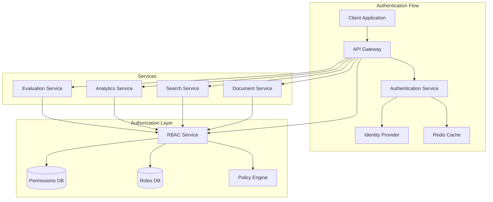
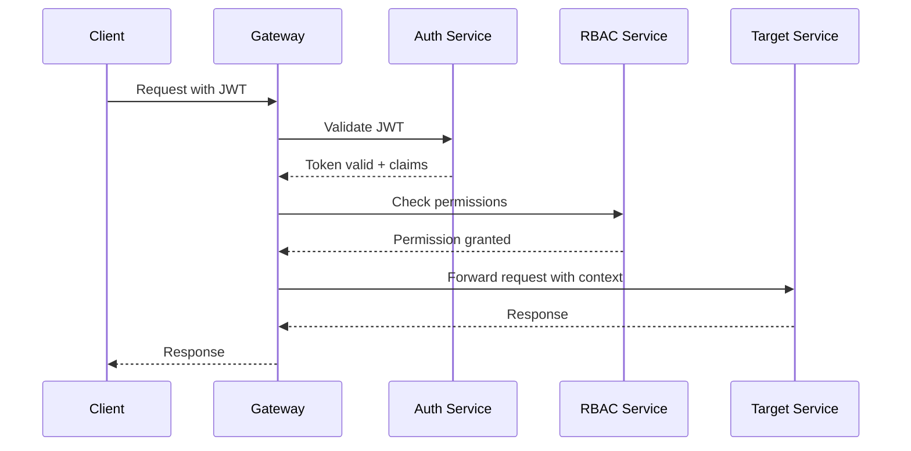
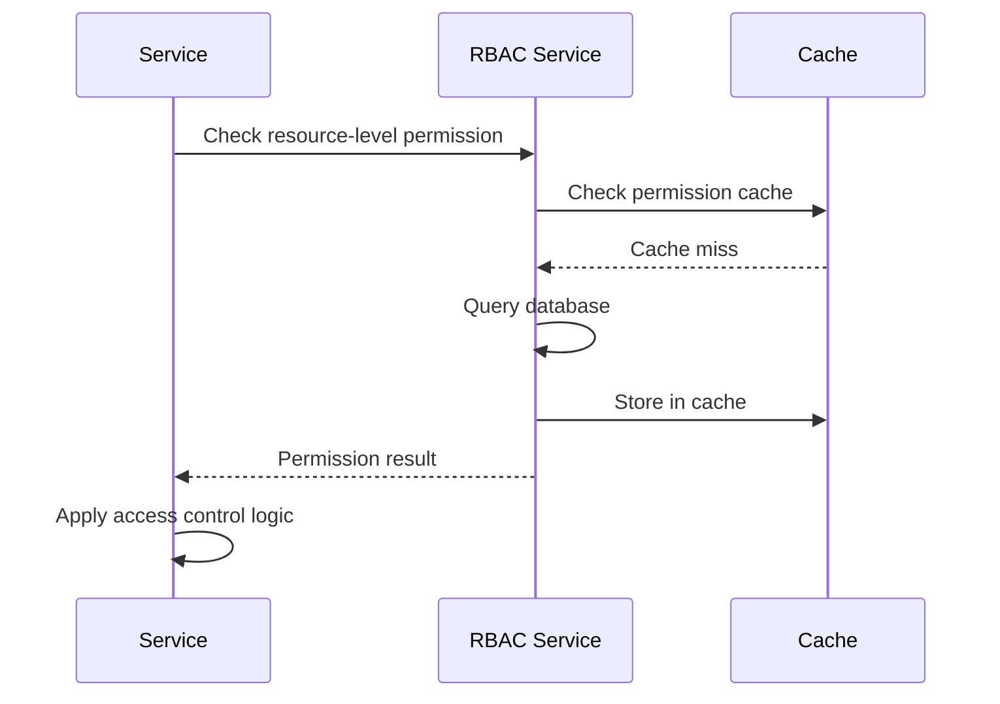

# Authentication and Authorization Strategy

## Overview

This document defines the comprehensive authentication and authorization strategy for the Multimodal Enterprise RAG System microservices architecture. The strategy implements JWT-based authentication with Role-Based Access Control (RBAC) and supports multi-tenancy, fine-grained permissions, and enterprise security requirements.

## Architecture Components



## Authentication Strategy

### JWT Token Structure

#### Access Token
```json
{
  "header": {
    "alg": "RS256",
    "typ": "JWT",
    "kid": "key-id-1"
  },
  "payload": {
    "iss": "https://auth.multimodal-rag.com",
    "aud": ["api-gateway", "evaluation-service", "analytics-service"],
    "sub": "user-uuid",
    "exp": 1640995200,
    "iat": 1640991600,
    "nbf": 1640991600,
    "jti": "token-uuid",
    "scope": ["read:evaluation", "write:analytics"],
    "organization_id": "org-uuid",
    "tenant_id": "tenant-uuid",
    "user_type": "regular",
    "roles": ["analyst", "viewer"],
    "permissions": ["evaluation:read", "analytics:write"],
    "session_id": "session-uuid",
    "auth_method": "password",
    "mfa_verified": true,
    "token_type": "access"
  }
}
```

#### Refresh Token
```json
{
  "header": {
    "alg": "RS256",
    "typ": "JWT",
    "kid": "key-id-2"
  },
  "payload": {
    "iss": "https://auth.multimodal-rag.com",
    "aud": "auth-service",
    "sub": "user-uuid",
    "exp": 1643587200,
    "iat": 1640991600,
    "jti": "refresh-token-uuid",
    "organization_id": "org-uuid",
    "token_type": "refresh",
    "session_id": "session-uuid",
    "device_id": "device-uuid"
  }
}
```

### Token Lifecycle Management

#### Token Issuance Flow
1. **User Authentication**
   - Credentials validation
   - MFA verification (if enabled)
   - Risk assessment
   - Session creation

2. **Token Generation**
   - Access token (15-60 minutes)
   - Refresh token (7-30 days)
   - Session tracking
   - Token signing

3. **Token Storage**
   - Access token: Client memory (SPA) / secure storage (mobile)
   - Refresh token: HttpOnly secure cookie / secure storage
   - Session data: Redis

#### Token Refresh Flow
1. **Client Request**
   - Validate refresh token
   - Check session validity
   - Verify user status

2. **Token Issuance**
   - Generate new access token
   - Optionally rotate refresh token
   - Update session
   - Revoke old tokens

3. **Security Measures**
   - Refresh token rotation
   - Token binding (IP, device)
   - Concurrent session limits
   - Anomaly detection

### Authentication Methods

#### Primary Authentication
- **Email/Password**: Traditional credentials
- **SSO Integration**: SAML, OIDC
- **Social Logins**: Google, Microsoft, GitHub
- **API Keys**: Service-to-service authentication

#### Multi-Factor Authentication (MFA)
- **TOTP**: Time-based one-time passwords
- **SMS**: SMS-based codes
- **Email**: Email-based codes
- **Hardware Keys**: FIDO2/WebAuthn
- **Biometric**: Fingerprint, Face ID (mobile)

#### Risk-Based Authentication
- **Device Fingerprinting**: Browser, OS, location
- **Behavioral Analysis**: Typing patterns, mouse movements
- **Contextual Risk**: Time, location, network
- **Adaptive Authentication**: Step-up authentication based on risk

## Authorization Strategy

### RBAC Model

#### Core Entities

**Users**
```typescript
interface User {
  id: string;
  email: string;
  organization_id: string;
  roles: Role[];
  permissions: Permission[];
  status: 'active' | 'inactive' | 'suspended';
  created_at: Date;
  updated_at: Date;
  last_login: Date;
  mfa_enabled: boolean;
}
```

**Roles**
```typescript
interface Role {
  id: string;
  name: string;
  description: string;
  organization_id: string;
  permissions: Permission[];
  is_system_role: boolean;
  created_at: Date;
  updated_at: Date;
}
```

**Permissions**
```typescript
interface Permission {
  id: string;
  name: string;
  resource: string;
  action: string;
  description: string;
  is_system_permission: boolean;
  created_at: Date;
}
```

**Resource Hierarchy**
```
Organization
├── Evaluation Service
│   ├── Metrics: read, write, delete
│   ├── Reports: read, write, delete, export
│   ├── Thresholds: read, write, delete
│   └── Jobs: read, write, delete
├── Analytics Service
│   ├── Dashboards: read, write, delete, share
│   ├── Reports: read, write, delete, export
│   ├── Insights: read, write, delete
│   └── Events: read, write, delete
├── Search Service
│   ├── Queries: read, write
│   ├── Documents: read, write, delete
│   └── Results: read
└── Document Service
    ├── Upload: write, delete
    ├── Processing: read, write
    └── Metadata: read, write, delete
```

### System Roles

#### Organization-Level Roles
1. **Organization Owner**
   - Full access to all organization resources
   - User and role management
   - Billing and subscription management
   - Organization settings

2. **Administrator**
   - Full access to most resources
   - User management
   - System configuration
   - Monitoring and analytics

3. **Analyst**
   - Read access to all evaluation and analytics
   - Write access to evaluations and reports
   - Dashboard creation and management
   - Export capabilities

4. **Viewer**
   - Read-only access to dashboards and reports
   - Basic search capabilities
   - No write or delete permissions

5. **API User**
   - Service-to-service access
   - Limited to specific endpoints
   - API key-based authentication
   - Rate-limited access

#### Service-Specific Roles
1. **Evaluation Manager**
   - Full access to evaluation features
   - Threshold management
   - Quality metrics configuration

2. **Analytics Manager**
   - Full access to analytics features
   - Dashboard management
   - Custom analytics configuration

3. **Content Manager**
   - Document upload and management
   - Content processing configuration
   - Metadata management

### Permission Model

#### Permission Naming Convention
`{service}:{resource}:{action}`

Examples:
- `evaluation:metrics:read`
- `analytics:dashboard:create`
- `search:query:execute`
- `document:upload:write`

#### Permission Categories

1. **Read Permissions**
   - `:read` - Access to view data
   - `:list` - List resources
   - `:search` - Search resources
   - `:export` - Export data

2. **Write Permissions**
   - `:create` - Create new resources
   - `:update` - Modify existing resources
   - `:delete` - Remove resources
   - `:upload` - Upload files

3. **Management Permissions**
   - `:configure` - Configure settings
   - `:manage` - Manage other resources
   - `:admin` - Administrative access

### Authorization Flow

#### API Gateway Authorization


#### Service-Level Authorization


## Multi-Tenancy Support

### Tenant Isolation Strategies

#### Data Isolation
- **Organization ID**: All data scoped by organization_id
- **Row-Level Security**: Database-level access control
- **Index Separation**: Separate indexes per organization
- **Namespace Isolation**: Kubernetes namespaces per tenant

#### Resource Isolation
- **Rate Limiting**: Per-organization rate limits
- **Quota Management**: Resource quotas per tenant
- **Compute Isolation**: Separate compute pools
- **Storage Isolation**: Separate storage buckets

#### Network Isolation
- **VPC Segmentation**: Network isolation per tenant
- **API Endpoints**: Tenant-specific endpoints
- **DNS Isolation**: Separate DNS zones
- **Firewall Rules**: Tenant-specific firewall rules

## Security Implementation

### Token Security

#### Cryptographic Measures
- **Algorithm**: RS256 for JWT signing
- **Key Rotation**: Automated key rotation every 90 days
- **Key Storage**: Hardware Security Module (HSM) for private keys
- **Token Binding**: Cryptographic binding to client/device

#### Anti-Tampering
- **Signature Verification**: All tokens cryptographically signed
- **Token Integrity**: Tamper-evident tokens
- **Replay Protection**: JTI claim + nonce
- **Token Blacklisting**: Revoked tokens tracking

### Session Security

#### Session Management
- **Session IDs**: Cryptographically secure random session IDs
- **Session Timeout**: Configurable idle timeout
- **Session Fixation**: Regenerate session IDs on login
- **Concurrent Sessions**: Limit concurrent sessions per user

#### Session Storage
- **Redis**: Fast session storage with TTL
- **Encryption**: Session data encrypted at rest
- **Backup**: Session data replicated across Redis cluster
- **Persistence**: Critical sessions persisted to database

### Password Security

#### Password Policies
- **Complexity**: Minimum 12 characters with mixed case, numbers, symbols
- **History**: Prevent reuse of last 12 passwords
- **Expiration**: 90-day password expiration
- **Lockout**: Account lockout after 5 failed attempts

#### Password Storage
- **Hashing**: Argon2id with proper parameters
- **Salting**: Unique salt per password
- **Peppering**: Additional server-side secret
- **Migration**: Secure migration from legacy hashes

### API Security

#### Rate Limiting
- **User-based**: Per-user rate limits
- **Organization-based**: Per-organization limits
- **Endpoint-based**: Different limits per endpoint
- **Burst handling**: Token bucket algorithm

#### Input Validation
- **Schema Validation**: JSON schema validation
- **SQL Injection**: Parameterized queries
- **XSS Prevention**: Input sanitization
- **CSRF Protection**: CSRF tokens

## Implementation Details

### Authentication Service Configuration

#### JWT Configuration
```yaml
jwt:
  access_token:
    expiry: 15m
    algorithm: RS256
    issuer: "https://auth.multimodal-rag.com"
    audience: ["api-gateway"]
  refresh_token:
    expiry: 7d
    algorithm: RS256
    issuer: "https://auth.multimodal-rag.com"
    audience: "auth-service"
  keys:
    rotation_interval: 90d
    storage: hsm
    key_size: 2048
```

#### MFA Configuration
```yaml
mfa:
  totp:
    issuer: "Multimodal RAG"
    window: 1
    digits: 6
    algorithm: SHA1
  sms:
    provider: twilio
    template: "Your code is: {code}"
  email:
    template: "mfa-code"
    expiry: 10m
```

### RBAC Service Configuration

#### Cache Configuration
```yaml
cache:
  permissions:
    ttl: 5m
    max_size: 10000
    backend: redis
  roles:
    ttl: 15m
    max_size: 5000
    backend: redis
  user_sessions:
    ttl: 1h
    max_size: 1000
    backend: redis
```

#### Database Schema
```sql
-- Users table
CREATE TABLE users (
    id UUID PRIMARY KEY DEFAULT gen_random_uuid(),
    email VARCHAR(255) UNIQUE NOT NULL,
    password_hash VARCHAR(255),
    organization_id UUID NOT NULL,
    status VARCHAR(20) NOT NULL DEFAULT 'active',
    mfa_enabled BOOLEAN DEFAULT FALSE,
    created_at TIMESTAMP DEFAULT NOW(),
    updated_at TIMESTAMP DEFAULT NOW(),
    last_login TIMESTAMP,
    FOREIGN KEY (organization_id) REFERENCES organizations(id)
);

-- Roles table
CREATE TABLE roles (
    id UUID PRIMARY KEY DEFAULT gen_random_uuid(),
    name VARCHAR(100) NOT NULL,
    description TEXT,
    organization_id UUID,
    is_system_role BOOLEAN DEFAULT FALSE,
    created_at TIMESTAMP DEFAULT NOW(),
    updated_at TIMESTAMP DEFAULT NOW(),
    FOREIGN KEY (organization_id) REFERENCES organizations(id),
    UNIQUE(name, organization_id)
);

-- Permissions table
CREATE TABLE permissions (
    id UUID PRIMARY KEY DEFAULT gen_random_uuid(),
    name VARCHAR(100) NOT NULL UNIQUE,
    resource VARCHAR(50) NOT NULL,
    action VARCHAR(50) NOT NULL,
    description TEXT,
    is_system_permission BOOLEAN DEFAULT FALSE,
    created_at TIMESTAMP DEFAULT NOW()
);

-- User roles junction table
CREATE TABLE user_roles (
    user_id UUID NOT NULL,
    role_id UUID NOT NULL,
    assigned_at TIMESTAMP DEFAULT NOW(),
    assigned_by UUID,
    PRIMARY KEY (user_id, role_id),
    FOREIGN KEY (user_id) REFERENCES users(id) ON DELETE CASCADE,
    FOREIGN KEY (role_id) REFERENCES roles(id) ON DELETE CASCADE,
    FOREIGN KEY (assigned_by) REFERENCES users(id)
);

-- Role permissions junction table
CREATE TABLE role_permissions (
    role_id UUID NOT NULL,
    permission_id UUID NOT NULL,
    PRIMARY KEY (role_id, permission_id),
    FOREIGN KEY (role_id) REFERENCES roles(id) ON DELETE CASCADE,
    FOREIGN KEY (permission_id) REFERENCES permissions(id) ON DELETE CASCADE
);

-- User-specific permissions (for exceptions)
CREATE TABLE user_permissions (
    user_id UUID NOT NULL,
    permission_id UUID NOT NULL,
    granted_at TIMESTAMP DEFAULT NOW(),
    granted_by UUID,
    PRIMARY KEY (user_id, permission_id),
    FOREIGN KEY (user_id) REFERENCES users(id) ON DELETE CASCADE,
    FOREIGN KEY (permission_id) REFERENCES permissions(id) ON DELETE CASCADE,
    FOREIGN KEY (granted_by) REFERENCES users(id)
);
```

### API Gateway Configuration

#### Authentication Middleware
```typescript
interface AuthMiddlewareConfig {
  jwtVerification: {
    publicKeyPath: string;
    algorithms: string[];
    issuer: string;
    audience: string[];
  };
  tokenValidation: {
    clockSkew: number;
    maxAge: string;
    ignoreExpiration: boolean;
  };
  rateLimiting: {
    windowMs: number;
    maxRequests: number;
    skipSuccessfulRequests: boolean;
  };
}
```

#### RBAC Middleware
```typescript
interface RBACMiddlewareConfig {
  permissionCheck: {
    cacheEnabled: boolean;
    cacheTTL: number;
    fallbackOnError: boolean;
  };
  endpointPermissions: {
    [endpoint: string]: {
      requiredPermissions: string[];
      requireAll: boolean;
    };
  };
  roleHierarchy: {
    [role: string]: string[];
  };
}
```

## Security Best Practices

### Defense in Depth

1. **Network Security**
   - TLS 1.3 for all communication
   - Private networks for internal services
   - Network segmentation and firewalls
   - DDoS protection

2. **Application Security**
   - Input validation and sanitization
   - Output encoding
   - Secure headers (HSTS, CSP, etc.)
   - Error handling without information disclosure

3. **Data Security**
   - Encryption at rest and in transit
   - Key management with HSM
   - Data masking for sensitive information
   - Secure backup and recovery

### Monitoring and Auditing

#### Security Events
- Login attempts (success/failure)
- Permission changes
- Token issuance/revocation
- MFA challenges
- Suspicious activities

#### Audit Logging
```typescript
interface AuditEvent {
  timestamp: Date;
  user_id: string;
  organization_id: string;
  action: string;
  resource_type: string;
  resource_id: string;
  ip_address: string;
  user_agent: string;
  result: 'success' | 'failure';
  details: Record<string, any>;
}
```

#### Security Metrics
- Authentication success rate
- MFA adoption rate
- Password reset frequency
- Permission change frequency
- Suspicious activity detection rate

## Compliance Considerations

### GDPR Compliance
- Right to be forgotten (data deletion)
- Data portability
- Consent management
- Data minimization
- Privacy by design

### SOC 2 Compliance
- Security controls documentation
- Access control reviews
- Incident response procedures
- Change management
- Vendor risk management

### HIPAA Compliance (if applicable)
- PHI protection
- Audit controls
- Access management
- Transmission security
- Data integrity

## Migration Strategy

### Phase 1: Foundation (Weeks 1-2)
- Set up Authentication Service
- Implement JWT token management
- Create user management APIs
- Set up basic RBAC service

### Phase 2: Integration (Weeks 3-4)
- Integrate with API Gateway
- Implement service-to-service auth
- Add MFA support
- Create permission management UI

### Phase 3: Enhancement (Weeks 5-6)
- Implement advanced RBAC features
- Add risk-based authentication
- Create audit logging
- Set up security monitoring

### Phase 4: Production (Weeks 7-8)
- Security testing and validation
- Performance optimization
- Documentation and training
- Production deployment

## Testing Strategy

### Security Testing
- Penetration testing
- Vulnerability scanning
- Token security testing
- RBAC bypass testing
- Rate limiting testing

### Performance Testing
- Authentication load testing
- Token validation performance
- RBAC lookup performance
- Concurrent user testing
- Cache effectiveness testing

### Integration Testing
- End-to-end authentication flows
- Cross-service authorization
- Token refresh scenarios
- MFA integration testing
- Multi-tenancy testing

This comprehensive authentication and authorization strategy provides a secure, scalable, and enterprise-ready foundation for the Multimodal Enterprise RAG System microservices architecture.