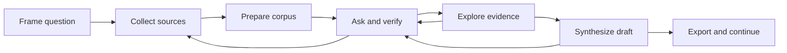

# Full Research Journey Product Design

**Product:** NOUS  
**Surface:** Authenticated desktop web application  
**Audience:** Researchers and academics  
**Status:** Product design specification  
**Date:** 2026-07-23

## Decision summary

NOUS should present research as one continuous, project-centered journey:

1. Frame the research question.
2. Collect and verify sources.
3. Prepare the corpus.
4. Ask grounded questions.
5. Inspect evidence and relationships.
6. Synthesize findings into a draft.
7. Export work with provenance intact.

The project is the durable home for this journey. Documents, chat, evidence,
notes, drafts, and bibliography should feel like connected views of the same
research state, not separate tools that require the researcher to reconstruct
context.

## Product outcome

A researcher can move from an initial question and a set of sources to a
defensible, cited research artifact without losing track of:

- which documents are ready to use;
- what evidence supports each claim;
- what the agent is doing;
- what remains uncertain;
- which actions require confirmation; and
- how a draft changed over time.

The journey succeeds when the researcher trusts the result enough to verify,
edit, and export it.

## Primary user

The primary user is a researcher working in a deep-focus session with a private
or mixed private/public corpus. They understand their field and can tolerate
information density, but they should not need to understand retrieval
infrastructure, agent routing, or indexing internals.

### Core jobs

- Define a focused research question.
- Build a relevant corpus from uploads and public research sources.
- Know when sources are ready for analysis.
- Ask questions across the corpus and inspect citations.
- Compare claims, entities, methods, and disagreements.
- Capture useful findings as notes.
- Produce and revise a literature review or research brief.
- Export the draft and bibliography in a usable format.

## Experience principles

### One project, one research state

Every project-scoped surface uses the same active project, corpus, question,
notes, evidence, and draft state. A researcher should never have to select the
same project repeatedly while moving through the journey.

### Provenance before polish

Answers and drafts lead with readable conclusions, but every material claim can
be traced to a source. Citation access is part of the primary interaction, not a
secondary details screen.

### Progress should describe meaning

Use states such as "Preparing 3 sources" and "Checking project documents."
Avoid infrastructure language such as vector database, graph node, worker, or
fallback unless the researcher opens diagnostics.

### The agent proposes; the researcher decides

The agent may recommend sources, searches, notes, and draft changes. Adding,
removing, ingesting, overwriting, or exporting consequential work remains
explicit and reviewable.

### Preserve focus across views

Moving between sources, chat, evidence, and drafts preserves the current
question, selected citations, comparison set, and scroll position where
practical.

## End-to-end journey

The path is directional, not rigid. Research is iterative: a weak answer can
send the researcher back to source collection, and a draft can expose a gap
that becomes a new question.

## Information architecture

### Global navigation

Keep global navigation focused on durable destinations:

- Overview
- Projects
- Documents
- Search
- Research
- Settings

Chat remains globally available, but project work should open project-scoped
chat by default. Entities, analytics, diagnostics, and other specialist
surfaces can remain accessible without competing with the core journey.

### Project workspace

The project workspace is the center of the experience. Group its existing
capabilities by researcher intent:

| Group | Views | Purpose |
| --- | --- | --- |
| Sources | Documents, bibliography | Build and verify the corpus |
| Investigate | Chat, matrix, knowledge tree | Ask, compare, and inspect evidence |
| Synthesize | Notes, drafts | Capture and communicate findings |
| Configure | Pipeline, skills | Adjust advanced project behavior |

The default project view should be a continuation view rather than a static
dashboard. It answers:

- What is ready?
- What changed?
- What needs attention?
- What is the most useful next action?

## Journey stages

### 1. Frame the research

**User goal:** Turn a broad topic into a workable project.

**Primary surface:** New project flow followed by the project continuation
view.

**Required inputs:**

- Project name
- Research question or objective

**Optional inputs:**

- Description
- Research goals
- Tags
- Deadline
- Preferred output, such as literature review or research brief

**Design behavior:**

- Start with the research question, not configuration.
- Allow a lightweight project to be created immediately.
- Offer an agent-generated blueprint as an editable recommendation.
- Explain that sources and questions can change later.

**Exit condition:** A project exists with a visible research question and a
clear invitation to add sources.

### 2. Collect sources

**User goal:** Build a corpus that is relevant and understandable.

**Primary surface:** Project documents view with a single "Add sources" action.

**Source methods:**

- Upload local files
- Search arXiv
- Search existing organization documents
- Add documents already stored in NOUS

**Design behavior:**

- Present source methods in one chooser instead of separate disconnected flows.
- Preserve the project destination throughout discovery and upload.
- Show title, authors, year, source type, and why a suggested paper is relevant.
- Keep duplicate, unsupported, and access errors attached to the affected
  source.
- Require confirmation before bulk ingestion or project mutation.

**Exit condition:** At least one source belongs to the project and its
preparation state is visible.

### 3. Prepare the corpus

**User goal:** Know which sources can be used and what is blocking the rest.

**Primary surface:** Documents view with a compact corpus-readiness summary.

**Source states:**

- Uploading
- Processing
- Ready
- Needs attention
- Failed

**Design behavior:**

- Show source-level progress without implying that the entire project is
  blocked.
- Separate "available for answers now" from "still processing."
- Provide retry and remove actions at the source level.
- Explain partial readiness: the researcher may begin with ready sources while
  others continue processing.
- Announce state changes accessibly without stealing keyboard focus.

**Exit condition:** The researcher can identify the usable corpus and either
continue or resolve a specific source problem.

### 4. Ask and verify

**User goal:** Get a concise answer grounded in the active project.

**Primary surface:** Project-scoped chat.

**Answer structure:**

1. Direct answer
2. Key evidence
3. Inline citations
4. Uncertainty or corpus limitations
5. One useful next action

**Design behavior:**

- State the active project and number of ready sources near the composer.
- Keep the question visible while the response is generated.
- Show meaningful activity such as "Searching 8 project documents" and
  "Composing answer from 4 sources."
- Stream the answer without moving citations away from the claims they support.
- Open citations in a context panel at the relevant passage.
- Distinguish "no supporting evidence found" from a system error.
- Prevent unrelated external search during a project-only request unless the
  researcher explicitly expands the scope.

**Exit condition:** The researcher can understand the answer, inspect its
evidence, and save or challenge a finding.

### 5. Explore evidence

**User goal:** Understand agreement, conflict, entities, and relationships
across sources.

**Primary surfaces:** Extraction matrix, knowledge tree, and evidence map.

**Design behavior:**

- Enter evidence exploration from a claim, citation, entity, or comparison in
  chat.
- Preserve the originating question and selected evidence.
- Use the matrix for structured comparison and the graph for relationships.
- Keep a textual list alternative for graph content.
- Selecting an entity or relationship reveals its source passages.
- Make inferred relationships visibly different from directly extracted ones.
- Let researchers send selected evidence back to chat, a note, or a draft.

**Exit condition:** The researcher can explain how a conclusion is supported,
where sources disagree, and which evidence should be retained.

### 6. Synthesize and draft

**User goal:** Turn verified findings into an editable research artifact.

**Primary surfaces:** Notes and drafts.

**Design behavior:**

- Allow any answer, citation set, or evidence selection to become a note.
- Start draft generation from purpose, themes, source scope, and writing style.
- Preview the proposed scope before generation.
- Keep generation non-destructive and cancellable.
- Preserve inline citations through editing and export.
- Show draft versions by meaningful change, not only version number.
- Compare versions with additions, removals, and citation changes.
- Mark unsupported claims and missing bibliography entries before export.

**Exit condition:** A researcher has an editable, versioned draft whose claims
remain connected to project evidence.

### 7. Export and continue

**User goal:** Move credible work into the next part of the research process.

**Primary surface:** Draft export action with bibliography options.

**Design behavior:**

- Export the draft and bibliography together by default.
- Support the formats already available to the project.
- Preview warnings before export, including unresolved citations and
  unavailable sources.
- Record the exported version and format in project activity.
- Return the researcher to a continuation view with suggested next steps:
  revise, add sources, investigate a gap, or begin a new question.

**Exit condition:** The exported artifact is usable outside NOUS and its
provenance can still be reconstructed.

## Project continuation view

The project landing state should prioritize continuation over metrics.

### Primary region

- Research question
- Current corpus readiness
- Most recent meaningful work
- One primary action based on state

Examples:

- "Add the first source"
- "Review 2 sources that need attention"
- "Continue asking about evaluation methods"
- "Review literature review draft"

### Supporting region

- Recent evidence and notes
- Draft status
- Open research gaps
- Recent source changes

Counts may support these areas, but they should not become a grid of decorative
metrics.

## Agent interaction contract

### Activity states

The agent should expose a small, stable set of researcher-facing states:

| State | Example copy |
| --- | --- |
| Understanding | "Reading your question" |
| Retrieving | "Searching 8 project documents" |
| Evaluating | "Checking evidence across 4 sources" |
| Acting | "Preparing 3 papers to add" |
| Writing | "Drafting a cited response" |
| Waiting | "Your confirmation is required" |
| Recovering | "Project search is slow; trying another available index" |

The first visible state should appear quickly and remain stable long enough to
read. The interface must not expose a completed state while tools or subgraphs
are still running.

### Human-in-the-loop confirmation

Confirmation must state:

- the proposed action;
- the affected project or sources;
- whether it can be reversed;
- what happens after approval; and
- a clear approve and cancel choice.

Confirmation is embedded in the workflow rather than presented as a generic
warning modal.

### Failure behavior

- Preserve the researcher's question and unsent draft.
- Explain which part failed.
- Show whether partial results are still trustworthy.
- Offer one targeted recovery action.
- Never silently broaden a project-scoped search to unrelated external sources.

## Content and provenance model

The journey depends on consistent links between:

- Project
- Research question
- Document
- Source passage
- Citation
- Entity
- Relationship
- Answer
- Note
- Draft
- Draft version
- Export

Every generated answer, note, or draft should retain project, source, and
version identifiers so provenance survives navigation and export.

## Accessibility requirements

- Meet WCAG 2.1 AA contrast and interaction requirements.
- Support keyboard movement between global navigation, project navigation,
  primary content, context panel, and composer.
- Provide a non-graph representation for evidence relationships.
- Use `aria-live="polite"` for processing and agent activity.
- Use `role="alert"` for failures that block the current action.
- Restore focus after confirmation, dialogs, and context panels close.
- Do not communicate readiness, confidence, or errors by color alone.
- Respect reduced-motion preferences for streaming indicators and graph
  transitions.

## Responsive behavior

The primary target is desktop. Tablet and mobile support continuation and
review rather than the full high-density evidence workspace.

- Collapse project navigation into a labeled switcher.
- Move citation context into a full-height sheet.
- Replace side-by-side comparisons with sequential sections.
- Preserve reading, citation inspection, note capture, and draft review.
- Defer complex graph editing and large extraction matrices to desktop.

## Success measures

### Journey outcomes

- Time from project creation to first ready source
- Time from first ready source to first grounded answer
- Percentage of answers with at least one opened citation
- Percentage of generated drafts edited or exported
- Percentage of exports with no unresolved citation warning
- Return rate to an active project within seven days

### Trust signals

- Citation open rate
- Source passage dwell time
- "Evidence was insufficient" acceptance versus immediate retry
- Unsupported-claim warning resolution rate
- Researcher correction and note-save rate

### Performance experience

Track these as experience targets, not hidden infrastructure metrics:

- Time to first visible agent activity
- Retrieval duration
- Time to first answer token
- Total answer completion time
- Time spent waiting for confirmation
- Recovery rate after source or retrieval failure

## Analytics events

Use a small event vocabulary tied to the journey:

- `research_project_created`
- `research_question_defined`
- `source_add_started`
- `source_ready`
- `source_attention_required`
- `project_question_submitted`
- `citation_opened`
- `evidence_sent_to_note`
- `draft_generation_started`
- `draft_version_created`
- `citation_warning_resolved`
- `research_artifact_exported`

Events must include project scope and workflow stage without capturing document
content or private research text.

## Acceptance criteria

The full journey is product-ready when:

1. A new researcher can create a project, add a source, and ask a grounded
   question without leaving the project context.
2. Source readiness is visible at project and source level.
3. Every grounded answer can expose the passages used to support it.
4. A project-only question cannot silently use unrelated external sources.
5. Evidence can move from answer or exploration into a note or draft.
6. Draft versions preserve citations and can be compared.
7. Export warns about unresolved provenance problems.
8. Destructive or consequential agent actions require explicit confirmation.
9. Loading, partial, empty, error, and recovery states are designed for every
   critical stage.
10. The critical journey is keyboard-accessible and usable without graph-only
    interaction.

## Delivery sequence

### Phase 1: Connect the current journey

- Make the project continuation view the primary entry point.
- Unify add-source entry points.
- Preserve project context through chat, evidence, notes, and drafts.
- Standardize corpus readiness and agent activity states.

### Phase 2: Strengthen provenance

- Add passage-level citation inspection.
- Connect chat evidence to notes and drafts.
- Surface unsupported claims and citation changes.
- Add textual alternatives to graph exploration.

### Phase 3: Improve iteration

- Add research-gap prompts and continuation actions.
- Improve draft comparison and export history.
- Measure journey completion and trust signals.

## Non-goals

- Replacing a full reference manager
- Collaborative document editing in the first release
- Automating final scholarly judgment
- Hiding uncertainty to make answers appear more confident
- Exposing infrastructure controls in the primary research journey
- Treating every project capability as an equal-priority dashboard card

## Open decisions

- Whether the editable research blueprint belongs in the project continuation
  view or remains an advanced research-engine surface
- Which export formats are primary versus secondary
- Whether project-scoped chat and global chat should share thread history
- Which evidence relationships are direct extraction versus model inference
- What minimum corpus-readiness threshold should enable draft generation
