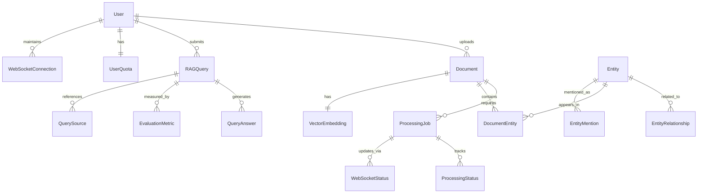

# Data Model: Multimodal Enterprise RAG UI

**Generated**: 2025-10-27
**Based on**: Feature specification and backend architecture analysis
**Storage**: PostgreSQL (primary), Neo4j (knowledge graph), Qdrant (vectors), Redis (cache)

## Entity Relationship Overview



## Core Entities

### 1. User Management

#### User
```sql
CREATE TABLE users (
    id UUID PRIMARY KEY DEFAULT gen_random_uuid(),
    email VARCHAR(255) UNIQUE NOT NULL,
    password_hash VARCHAR(255) NOT NULL,
    first_name VARCHAR(100),
    last_name VARCHAR(100),
    organization_id UUID NOT NULL,
    is_active BOOLEAN DEFAULT true,
    role VARCHAR(50) DEFAULT 'user',
    created_at TIMESTAMP WITH TIME ZONE DEFAULT NOW(),
    updated_at TIMESTAMP WITH TIME ZONE DEFAULT NOW(),
    last_login TIMESTAMP WITH TIME ZONE,

    CONSTRAINT users_email_check CHECK (email ~* '^[A-Za-z0-9._%+-]+@[A-Za-z0-9.-]+\.[A-Za-z]{2,}$'),
    CONSTRAINT users_role_check CHECK (role IN ('admin', 'user', 'viewer'))
);
```

#### UserQuota
```sql
CREATE TABLE user_quotas (
    id UUID PRIMARY KEY DEFAULT gen_random_uuid(),
    user_id UUID NOT NULL REFERENCES users(id) ON DELETE CASCADE,
    storage_quota_mb INTEGER DEFAULT 5120, -- 5GB in MB
    storage_used_mb INTEGER DEFAULT 0,
    max_file_size_mb INTEGER DEFAULT 50,
    document_count_limit INTEGER DEFAULT 1000,
    grace_period_expires_at TIMESTAMP WITH TIME ZONE,
    quota_warnings_sent INTEGER DEFAULT 0,
    created_at TIMESTAMP WITH TIME ZONE DEFAULT NOW(),
    updated_at TIMESTAMP WITH TIME ZONE DEFAULT NOW(),

    CONSTRAINT user_quotas_storage_check CHECK (storage_quota_mb > 0),
    CONSTRAINT user_quotas_usage_check CHECK (storage_used_mb >= 0),
    CONSTRAINT user_quotas_file_size_check CHECK (max_file_size_mb > 0)
);
```

### 2. Document Management

#### Document
```sql
CREATE TABLE documents (
    id UUID PRIMARY KEY DEFAULT gen_random_uuid(),
    user_id UUID NOT NULL REFERENCES users(id) ON DELETE CASCADE,
    title VARCHAR(500) NOT NULL,
    original_filename VARCHAR(255) NOT NULL,
    file_type VARCHAR(10) NOT NULL,
    file_size_bytes BIGINT NOT NULL,
    mime_type VARCHAR(100),
    storage_path VARCHAR(1000) NOT NULL,
    checksum_md5 VARCHAR(32),
    processing_status VARCHAR(20) DEFAULT 'queued',
    processing_error TEXT,
    processing_started_at TIMESTAMP WITH TIME ZONE,
    processing_completed_at TIMESTAMP WITH TIME ZONE,
    retry_count INTEGER DEFAULT 0,
    quality_score DECIMAL(3,2), -- 0.00 to 1.00
    extracted_text_length INTEGER,
    extracted_metadata JSONB,
    is_public BOOLEAN DEFAULT false,
    tags TEXT[],
    created_at TIMESTAMP WITH TIME ZONE DEFAULT NOW(),
    updated_at TIMESTAMP WITH TIME ZONE DEFAULT NOW(),

    CONSTRAINT documents_file_type_check CHECK (file_type IN ('pdf', 'txt', 'jpg', 'jpeg', 'png', 'mp3', 'mp4')),
    CONSTRAINT documents_status_check CHECK (processing_status IN ('queued', 'processing', 'completed', 'failed', 'retrying')),
    CONSTRAINT documents_file_size_check CHECK (file_size_bytes > 0 AND file_size_bytes <= 52428800), -- 50MB
    CONSTRAINT documents_quality_score_check CHECK (quality_score >= 0.00 AND quality_score <= 1.00)
);
```

#### ProcessingJob
```sql
CREATE TABLE processing_jobs (
    id UUID PRIMARY KEY DEFAULT gen_random_uuid(),
    document_id UUID NOT NULL REFERENCES documents(id) ON DELETE CASCADE,
    job_type VARCHAR(50) NOT NULL,
    status VARCHAR(20) DEFAULT 'pending',
    progress_percentage INTEGER DEFAULT 0,
    current_stage VARCHAR(100),
    error_message TEXT,
    started_at TIMESTAMP WITH TIME ZONE,
    completed_at TIMESTAMP WITH TIME ZONE,
    retry_count INTEGER DEFAULT 0,
    max_retries INTEGER DEFAULT 3,
    next_retry_at TIMESTAMP WITH TIME ZONE,
    worker_id VARCHAR(100),
    metadata JSONB,
    created_at TIMESTAMP WITH TIME ZONE DEFAULT NOW(),
    updated_at TIMESTAMP WITH TIME ZONE DEFAULT NOW(),

    CONSTRAINT processing_jobs_type_check CHECK (job_type IN ('ocr', 'transcription', 'embedding', 'entity_extraction', 'thumbnail')),
    CONSTRAINT processing_jobs_status_check CHECK (status IN ('pending', 'running', 'completed', 'failed', 'retrying')),
    CONSTRAINT processing_jobs_progress_check CHECK (progress_percentage >= 0 AND progress_percentage <= 100),
    CONSTRAINT processing_jobs_retry_check CHECK (retry_count >= 0 AND retry_count <= max_retries)
);
```

### 3. Search and Query System

#### RAGQuery
```sql
CREATE TABLE rag_queries (
    id UUID PRIMARY KEY DEFAULT gen_random_uuid(),
    user_id UUID NOT NULL REFERENCES users(id) ON DELETE CASCADE,
    query_text TEXT NOT NULL,
    query_type VARCHAR(50) DEFAULT 'semantic',
    answer_text TEXT,
    answer_confidence DECIMAL(3,2),
    total_execution_time_ms INTEGER,
    vector_search_time_ms INTEGER,
    graph_search_time_ms INTEGER,
    llm_generation_time_ms INTEGER,
    sources_count INTEGER DEFAULT 0,
    entities_found INTEGER DEFAULT 0,
    feedback_rating INTEGER, -- 1-5 stars
    feedback_comment TEXT,
    is_bookmarked BOOLEAN DEFAULT false,
    created_at TIMESTAMP WITH TIME ZONE DEFAULT NOW(),

    CONSTRAINT rag_queries_type_check CHECK (query_type IN ('semantic', 'keyword', 'hybrid', 'graph_lookup', 'reasoning')),
    CONSTRAINT rag_queries_confidence_check CHECK (answer_confidence >= 0.00 AND answer_confidence <= 1.00),
    CONSTRAINT rag_queries_feedback_check CHECK (feedback_rating >= 1 AND feedback_rating <= 5)
);

-- Automatic cleanup of queries older than 30 days
CREATE INDEX idx_rag_queries_created_at ON rag_queries(created_at);
```

#### QuerySource
```sql
CREATE TABLE query_sources (
    id UUID PRIMARY KEY DEFAULT gen_random_uuid(),
    query_id UUID NOT NULL REFERENCES rag_queries(id) ON DELETE CASCADE,
    document_id UUID NOT NULL REFERENCES documents(id) ON DELETE CASCADE,
    relevance_score DECIMAL(3,2) NOT NULL,
    text_snippet TEXT NOT NULL,
    page_number INTEGER,
    start_char INTEGER,
    end_char INTEGER,
    source_type VARCHAR(50),
    media_timestamp INTEGER, -- For audio/video
    created_at TIMESTAMP WITH TIME ZONE DEFAULT NOW(),

    CONSTRAINT query_sources_relevance_check CHECK (relevance_score >= 0.00 AND relevance_score <= 1.00)
);
```

### 4. Knowledge Graph Entities

#### Entity
```sql
CREATE TABLE entities (
    id UUID PRIMARY KEY DEFAULT gen_random_uuid(),
    name VARCHAR(500) NOT NULL,
    entity_type VARCHAR(100) NOT NULL,
    canonical_form VARCHAR(500),
    description TEXT,
    confidence_score DECIMAL(3,2),
    source_count INTEGER DEFAULT 1,
    first_seen_at TIMESTAMP WITH TIME ZONE DEFAULT NOW(),
    last_seen_at TIMESTAMP WITH TIME ZONE DEFAULT NOW(),
    metadata JSONB,
    created_at TIMESTAMP WITH TIME ZONE DEFAULT NOW(),
    updated_at TIMESTAMP WITH TIME ZONE DEFAULT NOW(),

    CONSTRAINT entities_type_check CHECK (entity_type IN ('PERSON', 'ORGANIZATION', 'LOCATION', 'CONCEPT', 'PRODUCT', 'EVENT', 'DATE', 'MONEY', 'PHONE', 'EMAIL', 'URL', 'CUSTOM')),
    CONSTRAINT entities_confidence_check CHECK (confidence_score >= 0.00 AND confidence_score <= 1.00)
);
```

#### EntityRelationship
```sql
CREATE TABLE entity_relationships (
    id UUID PRIMARY KEY DEFAULT gen_random_uuid(),
    source_entity_id UUID NOT NULL REFERENCES entities(id) ON DELETE CASCADE,
    target_entity_id UUID NOT NULL REFERENCES entities(id) ON DELETE CASCADE,
    relationship_type VARCHAR(100) NOT NULL,
    confidence_score DECIMAL(3,2) NOT NULL,
    context TEXT,
    document_count INTEGER DEFAULT 1,
    first_seen_at TIMESTAMP WITH TIME ZONE DEFAULT NOW(),
    last_seen_at TIMESTAMP WITH TIME ZONE DEFAULT NOW(),
    metadata JSONB,
    created_at TIMESTAMP WITH TIME ZONE DEFAULT NOW(),

    CONSTRAINT entity_relationships_type_check CHECK (relationship_type IN ('WORKS_FOR', 'LOCATED_IN', 'RELATED_TO', 'PART_OF', 'KNOWN_FOR', 'MEMBER_OF', 'FOUNDED', 'COLLABORATES_WITH', 'REPORTS_TO', 'OWNS', 'CUSTOM')),
    CONSTRAINT entity_relationships_confidence_check CHECK (confidence_score >= 0.00 AND confidence_score <= 1.00),
    CONSTRAINT entity_relationships_no_self_ref CHECK (source_entity_id != target_entity_id)
);
```

#### DocumentEntity
```sql
CREATE TABLE document_entities (
    id UUID PRIMARY KEY DEFAULT gen_random_uuid(),
    document_id UUID NOT NULL REFERENCES documents(id) ON DELETE CASCADE,
    entity_id UUID NOT NULL REFERENCES entities(id) ON DELETE CASCADE,
    mention_count INTEGER DEFAULT 1,
    confidence_score DECIMAL(3,2) NOT NULL,
    first_mention_char INTEGER,
    last_mention_char INTEGER,
    mentions JSONB, -- Array of mention objects with position and context
    created_at TIMESTAMP WITH TIME ZONE DEFAULT NOW(),

    CONSTRAINT document_entities_confidence_check CHECK (confidence_score >= 0.00 AND confidence_score <= 1.00),
    CONSTRAINT document_entities_unique_document_entity UNIQUE (document_id, entity_id)
);
```

### 5. Evaluation and Metrics

#### EvaluationMetric
```sql
CREATE TABLE evaluation_metrics (
    id UUID PRIMARY KEY DEFAULT gen_random_uuid(),
    query_id UUID NOT NULL REFERENCES rag_queries(id) ON DELETE CASCADE,
    metric_type VARCHAR(50) NOT NULL,
    metric_value DECIMAL(5,2) NOT NULL,
    threshold_value DECIMAL(5,2),
    passed_threshold BOOLEAN,
    measurement_details JSONB,
    created_at TIMESTAMP WITH TIME ZONE DEFAULT NOW(),

    CONSTRAINT evaluation_metrics_type_check CHECK (metric_type IN ('answer_relevancy', 'faithfulness', 'contextual_relevancy', 'precision', 'recall', 'f1_score', 'response_time', 'user_satisfaction')),
    CONSTRAINT evaluation_metrics_value_check CHECK (metric_value >= 0.00 AND metric_value <= 100.00)
);
```

### 6. Real-time Communications

#### WebSocketConnection
```sql
CREATE TABLE websocket_connections (
    id UUID PRIMARY KEY DEFAULT gen_random_uuid(),
    user_id UUID NOT NULL REFERENCES users(id) ON DELETE CASCADE,
    connection_id VARCHAR(255) UNIQUE NOT NULL,
    connection_status VARCHAR(20) DEFAULT 'connected',
    client_info JSONB,
    connected_at TIMESTAMP WITH TIME ZONE DEFAULT NOW(),
    last_activity TIMESTAMP WITH TIME ZONE DEFAULT NOW(),
    disconnected_at TIMESTAMP WITH TIME ZONE,

    CONSTRAINT websocket_connections_status_check CHECK (connection_status IN ('connected', 'disconnected', 'error', 'timeout'))
);
```

#### WebSocketStatus
```sql
CREATE TABLE websocket_status_updates (
    id UUID PRIMARY KEY DEFAULT gen_random_uuid(),
    connection_id UUID NOT NULL,
    user_id UUID NOT NULL REFERENCES users(id) ON DELETE CASCADE,
    update_type VARCHAR(100) NOT NULL,
    entity_type VARCHAR(50) NOT NULL,
    entity_id UUID NOT NULL,
    status_data JSONB NOT NULL,
    created_at TIMESTAMP WITH TIME ZONE DEFAULT NOW(),

    CONSTRAINT websocket_status_type_check CHECK (update_type IN ('processing_update', 'query_completed', 'error_occurred', 'notification')),
    CONSTRAINT websocket_status_entity_type_check CHECK (entity_type IN ('document', 'query', 'job', 'system'))
);
```

## Indexing Strategy

### Primary Performance Indexes

```sql
-- User and Authentication
CREATE INDEX idx_users_email ON users(email);
CREATE INDEX idx_users_organization_id ON users(organization_id);
CREATE INDEX idx_users_active ON users(is_active);

-- Document Management
CREATE INDEX idx_documents_user_id ON documents(user_id);
CREATE INDEX idx_documents_status ON documents(processing_status);
CREATE INDEX idx_documents_file_type ON documents(file_type);
CREATE INDEX idx_documents_created_at ON documents(created_at);
CREATE INDEX idx_documents_user_status ON documents(user_id, processing_status);
CREATE INDEX idx_documents_composite ON documents(user_id, file_type, processing_status);

-- Processing Jobs
CREATE INDEX idx_processing_jobs_document_id ON processing_jobs(document_id);
CREATE INDEX idx_processing_jobs_status ON processing_jobs(status);
CREATE INDEX idx_processing_jobs_retry_at ON processing_jobs(next_retry_at) WHERE next_retry_at IS NOT NULL;

-- Search and Queries
CREATE INDEX idx_rag_queries_user_id ON rag_queries(user_id);
CREATE INDEX idx_rag_queries_created_at ON rag_queries(created_at);
CREATE INDEX idx_query_sources_query_id ON query_sources(query_id);
CREATE INDEX idx_query_sources_document_id ON query_sources(document_id);
CREATE INDEX idx_query_sources_relevance ON query_sources(relevance_score DESC);

-- Knowledge Graph
CREATE INDEX idx_entities_name ON documents USING gin(to_tsvector('english', name));
CREATE INDEX idx_entities_type ON entities(entity_type);
CREATE INDEX idx_entities_confidence ON entities(confidence_score DESC);
CREATE INDEX idx_entity_relationships_source ON entity_relationships(source_entity_id);
CREATE INDEX idx_entity_relationships_target ON entity_relationships(target_entity_id);
CREATE INDEX idx_document_entities_document_id ON document_entities(document_id);
CREATE INDEX idx_document_entities_entity_id ON document_entities(entity_id);

-- Evaluation Metrics
CREATE INDEX idx_evaluation_metrics_query_id ON evaluation_metrics(query_id);
CREATE INDEX idx_evaluation_metrics_type ON evaluation_metrics(metric_type);

-- WebSocket and Real-time
CREATE INDEX idx_websocket_connections_user_id ON websocket_connections(user_id);
CREATE INDEX idx_websocket_connections_status ON websocket_connections(connection_status);
CREATE INDEX idx_websocket_status_user_id ON websocket_status_updates(user_id);
CREATE INDEX idx_websocket_status_created_at ON websocket_status_updates(created_at);
```

### Time-based Partitioning

```sql
-- Partition rag_queries by month for 30-day retention management
CREATE TABLE rag_queries_y2024m01 PARTITION OF rag_queries
    FOR VALUES FROM ('2024-01-01') TO ('2024-02-01');

-- Partition evaluation_metrics by quarter
CREATE TABLE evaluation_metrics_y2024q1 PARTITION OF evaluation_metrics
    FOR VALUES FROM ('2024-01-01') TO ('2024-04-01');
```

## Data Validation Rules

### Application-Level Validation

```python
from pydantic import BaseModel, validator
from typing import Optional, List, Dict, Any
from datetime import datetime, timedelta
from enum import Enum

class FileType(str, Enum):
    PDF = "pdf"
    TXT = "txt"
    JPG = "jpg"
    JPEG = "jpeg"
    PNG = "png"
    MP3 = "mp3"
    MP4 = "mp4"

class ProcessingStatus(str, Enum):
    QUEUED = "queued"
    PROCESSING = "processing"
    COMPLETED = "completed"
    FAILED = "failed"
    RETRYING = "retrying"

class DocumentCreate(BaseModel):
    title: str
    original_filename: str
    file_type: FileType
    file_size_bytes: int
    mime_type: Optional[str]

    @validator('title')
    def title_must_not_be_empty(cls, v):
        if not v.strip():
            raise ValueError('Title cannot be empty')
        return v.strip()

    @validator('file_size_bytes')
    def file_size_within_limits(cls, v):
        if v <= 0:
            raise ValueError('File size must be positive')
        if v > 52428800:  # 50MB
            raise ValueError('File size exceeds 50MB limit')
        return v

    @validator('original_filename')
    def filename_must_be_valid(cls, v):
        if not v or len(v.strip()) == 0:
            raise ValueError('Filename cannot be empty')
        # Check for invalid characters
        invalid_chars = ['<', '>', ':', '"', '|', '?', '*']
        if any(char in v for char in invalid_chars):
            raise ValueError('Filename contains invalid characters')
        return v.strip()

class QueryCreate(BaseModel):
    query_text: str
    query_type: str = "semantic"

    @validator('query_text')
    def query_must_not_be_empty(cls, v):
        if not v.strip():
            raise ValueError('Query text cannot be empty')
        if len(v.strip()) < 3:
            raise ValueError('Query too short (minimum 3 characters)')
        if len(v) > 1000:
            raise ValueError('Query too long (maximum 1000 characters)')
        return v.strip()

    @validator('query_type')
    def query_type_must_be_valid(cls, v):
        valid_types = ['semantic', 'keyword', 'hybrid', 'graph_lookup', 'reasoning']
        if v not in valid_types:
            raise ValueError(f'Query type must be one of: {valid_types}')
        return v

class UserQuotaUpdate(BaseModel):
    storage_quota_mb: Optional[int] = None
    max_file_size_mb: Optional[int] = None

    @validator('storage_quota_mb')
    def storage_quota_must_be_positive(cls, v):
        if v is not None and v <= 0:
            raise ValueError('Storage quota must be positive')
        return v

    @validator('max_file_size_mb')
    def max_file_size_must_be_positive(cls, v):
        if v is not None and v <= 0:
            raise ValueError('Max file size must be positive')
        return v
```

### Database Constraints and Triggers

```sql
-- Trigger to update user's storage usage when document is added/updated
CREATE OR REPLACE FUNCTION update_user_storage_usage()
RETURNS TRIGGER AS $$
BEGIN
    IF TG_OP = 'INSERT' THEN
        UPDATE user_quotas
        SET storage_used_mb = storage_used_mb + (NEW.file_size_bytes / 1024 / 1024)::INTEGER,
            updated_at = NOW()
        WHERE user_id = NEW.user_id;
        RETURN NEW;
    ELSIF TG_OP = 'UPDATE' THEN
        IF OLD.file_size_bytes != NEW.file_size_bytes THEN
            UPDATE user_quotas
            SET storage_used_mb = storage_used_mb + ((NEW.file_size_bytes - OLD.file_size_bytes) / 1024 / 1024)::INTEGER,
                updated_at = NOW()
            WHERE user_id = NEW.user_id;
        END IF;
        RETURN NEW;
    ELSIF TG_OP = 'DELETE' THEN
        UPDATE user_quotas
        SET storage_used_mb = storage_used_mb - (OLD.file_size_bytes / 1024 / 1024)::INTEGER,
            updated_at = NOW()
        WHERE user_id = OLD.user_id;
        RETURN OLD;
    END IF;
    RETURN NULL;
END;
$$ LANGUAGE plpgsql;

CREATE TRIGGER trigger_update_user_storage_usage
    AFTER INSERT OR UPDATE OR DELETE ON documents
    FOR EACH ROW EXECUTE FUNCTION update_user_storage_usage();

-- Trigger to enforce 30-day query retention
CREATE OR REPLACE FUNCTION cleanup_old_queries()
RETURNS void AS $$
BEGIN
    DELETE FROM rag_queries
    WHERE created_at < NOW() - INTERVAL '30 days';

    DELETE FROM evaluation_metrics
    WHERE query_id NOT IN (SELECT id FROM rag_queries);

    DELETE FROM query_sources
    WHERE query_id NOT IN (SELECT id FROM rag_queries);
END;
$$ LANGUAGE plpgsql;

-- Schedule to run daily (requires pg_cron extension)
SELECT cron.schedule('cleanup-old-queries', '0 2 * * *', 'SELECT cleanup_old_queries();');
```

## Security and Privacy

### Row-Level Security

```sql
-- Enable row-level security
ALTER TABLE documents ENABLE ROW LEVEL SECURITY;
ALTER TABLE rag_queries ENABLE ROW LEVEL SECURITY;
ALTER TABLE user_quotas ENABLE ROW LEVEL SECURITY;
ALTER TABLE websocket_connections ENABLE ROW LEVEL SECURITY;

-- Users can only access their own documents
CREATE POLICY user_documents_policy ON documents
    FOR ALL TO authenticated_users
    USING (user_id = current_setting('app.current_user_id')::UUID);

-- Users can only access their own queries
CREATE POLICY user_queries_policy ON rag_queries
    FOR ALL TO authenticated_users
    USING (user_id = current_setting('app.current_user_id')::UUID);

-- Users can only access their own quota information
CREATE POLICY user_quota_policy ON user_quotas
    FOR ALL TO authenticated_users
    USING (user_id = current_setting('app.current_user_id')::UUID);
```

### Data Encryption

```sql
-- Extension for data encryption
CREATE EXTENSION IF NOT EXISTS pgcrypto;

-- Encrypt sensitive data at rest
CREATE OR REPLACE FUNCTION encrypt_sensitive_data(data TEXT)
RETURNS TEXT AS $$
BEGIN
    RETURN encode(encrypt(data::bytea, current_setting('app.encryption_key'), 'aes'), 'base64');
END;
$$ LANGUAGE plpgsql SECURITY DEFINER;

CREATE OR REPLACE FUNCTION decrypt_sensitive_data(encrypted_data TEXT)
RETURNS TEXT AS $$
BEGIN
    RETURN convert_from(decrypt(decode(encrypted_data, 'base64'), current_setting('app.encryption_key'), 'aes'), 'UTF8');
END;
$$ LANGUAGE plpgsql SECURITY DEFINER;
```

## Performance Considerations

### Connection Pooling

```python
# Database connection configuration
DATABASE_CONFIG = {
    "pool_size": 20,
    "max_overflow": 30,
    "pool_timeout": 30,
    "pool_recycle": 3600,
    "pool_pre_ping": True
}
```

### Caching Strategy

```sql
-- Materialized views for analytics
CREATE MATERIALIZED VIEW user_document_stats AS
SELECT
    u.id as user_id,
    u.email,
    COUNT(d.id) as total_documents,
    SUM(d.file_size_bytes) as total_storage_used,
    COUNT(CASE WHEN d.processing_status = 'completed' THEN 1 END) as processed_documents,
    COUNT(CASE WHEN d.processing_status = 'failed' THEN 1 END) as failed_documents,
    AVG(d.quality_score) as avg_quality_score
FROM users u
LEFT JOIN documents d ON u.id = d.user_id
GROUP BY u.id, u.email;

CREATE UNIQUE INDEX idx_user_document_stats_user_id ON user_document_stats(user_id);

-- Refresh strategy
CREATE OR REPLACE FUNCTION refresh_user_document_stats()
RETURNS void AS $$
BEGIN
    REFRESH MATERIALIZED VIEW CONCURRENTLY user_document_stats;
END;
$$ LANGUAGE plpgsql;

-- Schedule refresh every hour
SELECT cron.schedule('refresh-user-stats', '0 * * * *', 'SELECT refresh_user_document_stats();');
```

## Monitoring and Maintenance

### Performance Monitoring Queries

```sql
-- Monitor storage usage by user
SELECT
    u.email,
    uq.storage_used_mb,
    uq.storage_quota_mb,
    ROUND((uq.storage_used_mb::FLOAT / uq.storage_quota_mb) * 100, 2) as usage_percentage,
    COUNT(d.id) as document_count
FROM users u
JOIN user_quotas uq ON u.id = uq.user_id
JOIN documents d ON u.id = d.user_id
GROUP BY u.id, u.email, uq.storage_used_mb, uq.storage_quota_mb
ORDER BY usage_percentage DESC;

-- Monitor processing performance
SELECT
    DATE_TRUNC('hour', created_at) as hour,
    job_type,
    COUNT(*) as total_jobs,
    COUNT(CASE WHEN status = 'completed' THEN 1 END) as completed_jobs,
    COUNT(CASE WHEN status = 'failed' THEN 1 END) as failed_jobs,
    AVG(EXTRACT(EPOCH FROM (completed_at - started_at))) as avg_duration_seconds
FROM processing_jobs
WHERE created_at >= NOW() - INTERVAL '24 hours'
GROUP BY DATE_TRUNC('hour', created_at), job_type
ORDER BY hour DESC;

-- Monitor query performance
SELECT
    DATE_TRUNC('day', created_at) as day,
    COUNT(*) as total_queries,
    AVG(total_execution_time_ms) as avg_execution_time_ms,
    AVG(answer_confidence) as avg_confidence,
    COUNT(CASE WHEN feedback_rating >= 4 THEN 1 END) as satisfied_users
FROM rag_queries
WHERE created_at >= NOW() - INTERVAL '7 days'
GROUP BY DATE_TRUNC('day', created_at)
ORDER BY day DESC;
```

This comprehensive data model provides the foundation for a scalable, secure, and performant Multimodal Enterprise RAG System with proper multi-tenant isolation, real-time capabilities, and enterprise-grade features.